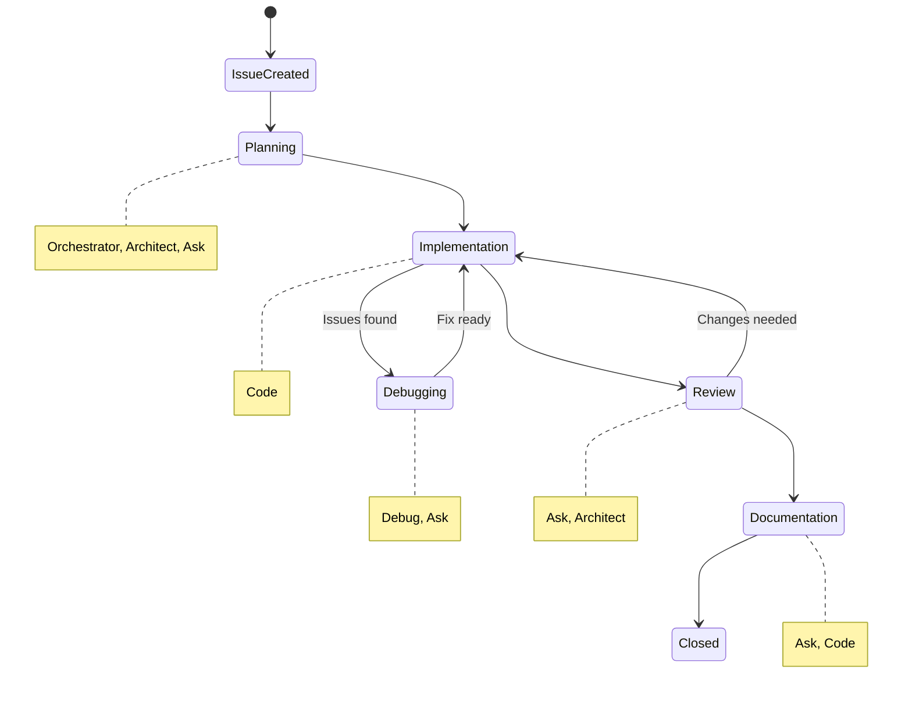
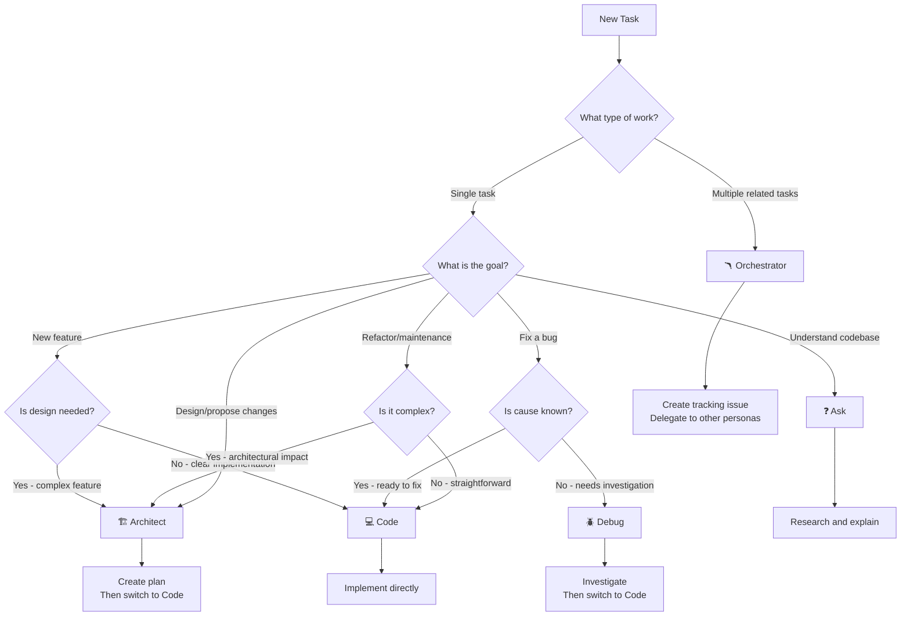
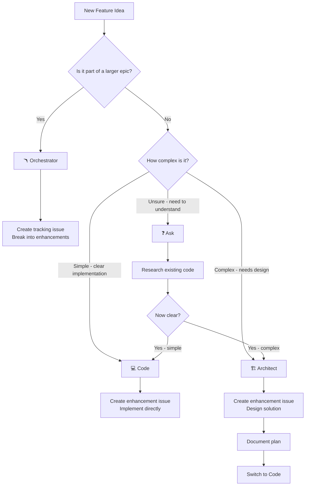
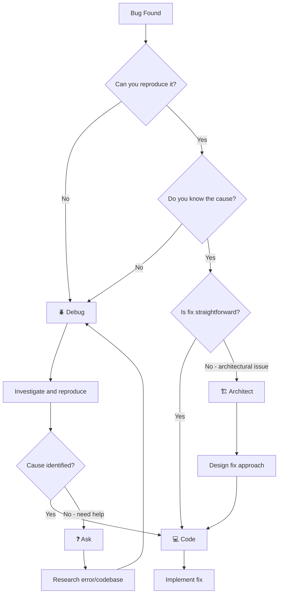
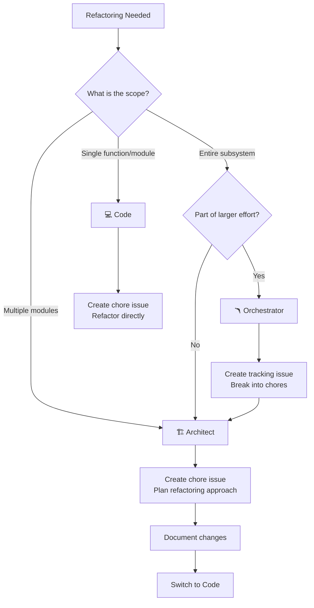
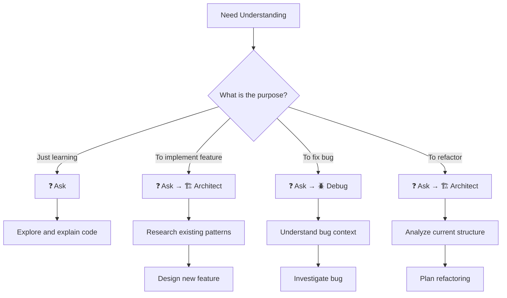

# Roo AI Workflow Scheme

**Integration of AI Personas with GitHub Issue Types and Development Workflow**

This document defines how Roo AI personas map to the GitHub issue types established in [`doc/ways-of-working.md`](doc/ways-of-working.md), providing clear guidance on persona selection, workflow stages, and handoff protocols.

---

## Table of Contents

1. [Persona-to-Issue-Type Mapping](#1-persona-to-issue-type-mapping)
2. [Workflow Stages](#2-workflow-stages)
3. [Handoff Protocols](#3-handoff-protocols)
4. [Decision Trees](#4-decision-trees)
5. [Best Practices](#5-best-practices)
6. [Examples](#6-examples)

---

## 1. Persona-to-Issue-Type Mapping

### Primary Persona Assignments

| Issue Type | Icon | Primary Persona | Secondary Personas | Rationale |
|------------|------|-----------------|-------------------|-----------|
| **Tracking Issue** | 📍 | 🪃 Orchestrator | 🏗️ Architect | Coordinates multiple sub-issues, delegates work, manages dependencies |
| **Enhancement** | ✨ | 🏗️ Architect → 💻 Code | ❓ Ask, 🪲 Debug | Requires planning before implementation; may need debugging |
| **Chore** | 🛠️ | 💻 Code | 🏗️ Architect, 🪲 Debug | Direct technical work; complex chores may need architecture planning |
| **Bug** | 🐛 | 🪲 Debug → 💻 Code | ❓ Ask | Investigation first, then fix; may need codebase understanding |
| **Discussion** | 🔍 | 🏗️ Architect | ❓ Ask, 🪃 Orchestrator | Strategic planning and design; may need research or coordination |

### Detailed Persona Capabilities by Issue Type

#### 📍 Tracking Issue → 🪃 Orchestrator

**Why Orchestrator?**

- Manages complex, multi-step projects requiring coordination
- Breaks down epics into manageable sub-issues
- Delegates specialized work to appropriate personas
- Tracks progress across multiple related issues

**When to use:**

- Creating a new tracking issue with multiple sub-tasks
- Managing dependencies between enhancement, chore, and bug issues
- Coordinating work that spans multiple domains (frontend, backend, infrastructure)

**Workflow:**

```
Orchestrator creates tracking issue
    ↓
Orchestrator delegates to Architect for planning sub-issues
    ↓
Orchestrator delegates to Code for implementation
    ↓
Orchestrator coordinates reviews and updates tracking issue
```

---

#### ✨ Enhancement → 🏗️ Architect → 💻 Code

**Why Architect first?**

- Enhancements require design and planning before implementation
- Acceptance criteria need to be analyzed and broken down
- Technical approach must be validated against existing architecture

**When to use Architect:**

- New feature proposals requiring design decisions
- Enhancements with complex acceptance criteria
- Features that impact multiple system components
- When technical approach is unclear

**When to transition to Code:**

- Design is approved and documented
- Acceptance criteria are clear and actionable
- Technical approach is validated
- Dependencies are identified

**Workflow:**

```
Architect analyzes enhancement requirements
    ↓
Architect designs solution and creates implementation plan
    ↓
Architect documents approach in issue or plan file
    ↓
Code implements according to plan
    ↓
Debug (if issues arise during implementation)
```

---

#### 🛠️ Chore → 💻 Code (or 🏗️ Architect for complex chores)

**Why Code primarily?**

- Chores are typically well-defined technical tasks
- Implementation is usually straightforward
- Less design work required compared to enhancements

**When to use Architect first:**

- Refactoring that impacts system architecture
- Dependency upgrades with breaking changes
- CI/CD pipeline redesign
- Database schema migrations

**When to use Code directly:**

- Dependency updates (non-breaking)
- Code formatting and linting fixes
- Documentation updates
- Simple refactoring within a module

**Workflow (Simple Chore):**

```
Code implements technical task
    ↓
Code verifies completion
```

**Workflow (Complex Chore):**

```
Architect plans refactoring approach
    ↓
Code implements changes
    ↓
Debug (if issues arise)
```

---

#### 🐛 Bug → 🪲 Debug → 💻 Code

**Why Debug first?**

- Bugs require investigation before fixing
- Root cause analysis prevents incomplete fixes
- Systematic debugging identifies related issues

**When to use Debug:**

- Reproducing the bug
- Analyzing logs and error messages
- Identifying root cause
- Determining scope of fix

**When to transition to Code:**

- Root cause is identified
- Fix approach is clear
- No further investigation needed

**When to use Ask:**

- Understanding unfamiliar code areas
- Researching error messages
- Learning about system behavior

**Workflow:**

```
Debug reproduces and investigates bug
    ↓
Debug identifies root cause
    ↓
Debug documents findings in issue
    ↓
Code implements fix
    ↓
Debug verifies fix (optional)
```

---

#### 🔍 Discussion → 🏗️ Architect (or ❓ Ask)

**Why Architect?**

- Discussions involve architectural decisions and design proposals
- Requires strategic thinking and system-level understanding
- Creates RFC-style documentation

**When to use Architect:**

- Proposing architectural changes
- Designing new system components
- Evaluating technical alternatives
- Creating technical specifications

**When to use Ask:**

- Researching existing implementations
- Understanding current architecture
- Gathering information before proposing changes
- Explaining concepts to stakeholders

**Workflow:**

```
Ask researches current state (optional)
    ↓
Architect proposes solution with alternatives
    ↓
Architect documents impact and trade-offs
    ↓
Community provides feedback
    ↓
Architect refines proposal
```

---

## 2. Workflow Stages

### Issue Lifecycle with Persona Transitions



### Stage 1: Issue Creation and Planning

**Personas:** 🪃 Orchestrator, 🏗️ Architect, ❓ Ask

**Activities:**

- Analyze issue requirements
- Research existing codebase (Ask)
- Design solution approach (Architect)
- Break down into actionable tasks (Orchestrator/Architect)
- Create implementation plan

**Outputs:**

- Updated issue with clear acceptance criteria
- Implementation plan (in issue or separate plan file)
- Identified dependencies and risks

**Persona Selection:**

- **Tracking Issue:** Orchestrator creates task breakdown
- **Enhancement:** Architect designs solution
- **Chore (complex):** Architect plans approach
- **Chore (simple):** Skip to Implementation
- **Bug:** Debug investigates (see Stage 2.5)
- **Discussion:** Architect creates proposal

---

### Stage 2: Implementation

**Persona:** 💻 Code

**Activities:**

- Write new code or modify existing code
- Follow implementation plan from Planning stage
- Create tests
- Update related documentation
- Commit changes with clear messages

**Outputs:**

- Working code implementation
- Tests covering new functionality
- Updated inline documentation

**When to stay in Code:**

- Implementation is straightforward
- No unexpected issues arise
- Plan is clear and complete

**When to switch:**

- To Debug: Unexpected errors or test failures
- To Ask: Need to understand existing code
- To Architect: Implementation reveals design issues

---

### Stage 2.5: Debugging (as needed)

**Persona:** 🪲 Debug

**Activities:**

- Reproduce issues
- Analyze error messages and logs
- Add diagnostic logging
- Identify root cause
- Determine fix approach

**Outputs:**

- Root cause analysis
- Fix strategy
- Updated issue with findings

**When to enter:**

- Tests fail unexpectedly
- Bug reports during implementation
- Unclear error messages
- Performance issues

**When to exit:**

- Root cause identified → return to Code
- Need architectural changes → escalate to Architect

---

### Stage 3: Review and Refinement

**Personas:** ❓ Ask, 🏗️ Architect

**Activities:**

- Review implementation against acceptance criteria
- Verify code quality and best practices (Ask)
- Assess architectural impact (Architect)
- Identify improvements or issues

**Outputs:**

- Review feedback
- List of refinements needed
- Approval to proceed or return to Implementation

**Persona Selection:**

- **Ask:** Code review, explaining implementation
- **Architect:** Architectural review, design validation

---

### Stage 4: Documentation and Closure

**Personas:** ❓ Ask, 💻 Code

**Activities:**

- Update user-facing documentation
- Create or update technical documentation
- Update CHANGES.md or changelog
- Close issue with summary

**Outputs:**

- Updated documentation
- Closed issue
- Updated tracking issue (if applicable)

**Persona Selection:**

- **Ask:** Writing explanatory documentation
- **Code:** Updating technical docs and closing issue

---

## 3. Handoff Protocols

### When and How to Transition Between Personas

#### 🪃 Orchestrator → 🏗️ Architect

**When:**

- Tracking issue requires detailed planning for sub-issues
- Multiple enhancements need coordinated design
- Complex dependencies require architectural oversight

**Handoff Information:**

- List of sub-issues to be planned
- Dependencies between issues
- Overall goals and constraints
- Timeline or milestone information

**Example:**

```
Orchestrator: "I've created tracking issue #123 for the device discovery feature.
Please use Architect mode to design the approach for enhancement #124
(Zeroconf discovery) considering the existing discovery API."
```

---

#### 🏗️ Architect → 💻 Code

**When:**

- Design is complete and documented
- Implementation plan is clear
- Acceptance criteria are actionable
- Technical approach is validated

**Handoff Information:**

- Implementation plan (in issue or plan file)
- Key design decisions and rationale
- Files to be modified or created
- Testing requirements
- Acceptance criteria checklist

**Example:**

```
Architect: "Design complete for enhancement #124. See plans/discovery-implementation.md
for the implementation approach. Please use Code mode to implement the ZeroconfDiscovery
struct in src/discovery/zeroconf_impl.rs following the plan."
```

---

#### 💻 Code → 🪲 Debug

**When:**

- Tests fail with unclear cause
- Unexpected runtime errors occur
- Performance issues need investigation
- Bug reports arise during implementation

**Handoff Information:**

- Error messages or stack traces
- Steps to reproduce the issue
- Expected vs. actual behavior
- Recent changes that may be related

**Example:**

```
Code: "Implementation of #124 is failing integration tests with a connection timeout.
Please use Debug mode to investigate why the Zeroconf service discovery is timing out
in tests/discovery_tests.rs."
```

---

#### 🪲 Debug → 💻 Code

**When:**

- Root cause is identified
- Fix approach is clear
- No further investigation needed

**Handoff Information:**

- Root cause analysis
- Recommended fix approach
- Files to modify
- Test cases to verify fix

**Example:**

```
Debug: "Root cause identified: Zeroconf service wasn't being properly initialized
in test harness. Fix needed in tests/harness/server.rs to call start_service()
before running discovery tests. Please use Code mode to implement the fix."
```

---

#### Any Persona → ❓ Ask

**When:**

- Need to understand existing code
- Require explanation of concepts or patterns
- Want to research best practices
- Need documentation written or explained

**Handoff Information:**

- Specific questions to answer
- Code areas to explain
- Documentation to create or update

**Example:**

```
Code: "Before implementing #124, I need to understand the existing discovery API.
Please use Ask mode to explain how src/discovery/api.rs works and how the
DiscoveryStrategy trait is intended to be used."
```

---

#### ❓ Ask → 🏗️ Architect

**When:**

- Research is complete
- Understanding is sufficient to design
- Ready to create proposals or plans

**Handoff Information:**

- Research findings
- Current state analysis
- Questions answered
- Recommendations for design

**Example:**

```
Ask: "I've analyzed the discovery API. The DiscoveryStrategy trait provides
a clean extension point. Please use Architect mode to design how Zeroconf
discovery will implement this trait for enhancement #124."
```

---

## 4. Decision Trees

### Decision Tree 1: Starting a New Task



---

### Decision Tree 2: "I Have a New Feature Idea"



---

### Decision Tree 3: "I Found a Bug"



---

### Decision Tree 4: "I Need to Refactor"



---

### Decision Tree 5: "I Want to Understand the Codebase"



---

## 5. Best Practices

### When to Stay in One Persona

**Stay in 💻 Code when:**

- Implementation is straightforward and matches the plan
- No unexpected issues arise
- Acceptance criteria are clear
- You're making good progress

**Stay in 🪲 Debug when:**

- Still gathering diagnostic information
- Root cause is not yet clear
- Need to try multiple investigation approaches
- Reproducing intermittent issues

**Stay in 🏗️ Architect when:**

- Design is still evolving
- Evaluating multiple alternatives
- Documenting complex decisions
- Creating comprehensive plans

**Stay in ❓ Ask when:**

- Exploring multiple code areas
- Building comprehensive understanding
- Writing extensive documentation
- Answering related questions

**Stay in 🪃 Orchestrator when:**

- Managing multiple parallel work streams
- Coordinating between different personas
- Tracking progress on complex initiatives
- Handling dependencies between issues

---

### When to Switch Personas

**Switch from Architect to Code when:**

- ✅ Design is documented and approved
- ✅ Implementation plan is clear
- ✅ Technical approach is validated
- ✅ Acceptance criteria are actionable

**Switch from Code to Debug when:**

- ❌ Tests fail with unclear errors
- ❌ Unexpected runtime behavior occurs
- ❌ Performance issues need investigation
- ❌ Implementation reveals hidden bugs

**Switch from Debug to Code when:**

- ✅ Root cause is identified and documented
- ✅ Fix approach is clear
- ✅ No further investigation needed

**Switch to Ask when:**

- ❓ Need to understand unfamiliar code
- ❓ Researching error messages or patterns
- ❓ Writing documentation
- ❓ Explaining implementation to others

**Switch to Orchestrator when:**

- 🔄 Work involves multiple related issues
- 🔄 Need to coordinate different work streams
- 🔄 Managing complex dependencies
- 🔄 Breaking down large initiatives

---

### How to Structure Work for Optimal Persona Usage

#### 1. Start with Planning (Architect/Orchestrator)

**For Enhancements:**

```
1. Create enhancement issue with clear goal
2. Use Architect to design solution
3. Document plan in issue or separate file
4. Switch to Code for implementation
```

**For Tracking Issues:**

```
1. Create tracking issue with high-level goals
2. Use Orchestrator to break down into sub-issues
3. Delegate each sub-issue to appropriate persona
4. Track progress and coordinate handoffs
```

#### 2. Implement Incrementally (Code)

**Best Practices:**

- Implement one acceptance criterion at a time
- Run tests frequently
- Commit working code regularly
- Switch to Debug at first sign of trouble

#### 3. Debug Systematically (Debug)

**Best Practices:**

- Document reproduction steps
- Add diagnostic logging
- Test hypotheses methodically
- Document findings before switching to Code

#### 4. Document Continuously (Ask/Code)

**Best Practices:**

- Update documentation as you implement
- Use Ask to write user-facing docs
- Use Code to update technical docs
- Keep CHANGES.md current

---

### Common Anti-Patterns to Avoid

#### ❌ Anti-Pattern 1: Skipping Planning for Complex Features

**Problem:**

```
User: "Implement Zeroconf discovery"
→ Immediately uses Code mode
→ Implementation is incomplete or wrong
→ Requires significant rework
```

**Solution:**

```
User: "Implement Zeroconf discovery"
→ Uses Architect to design approach
→ Creates implementation plan
→ Switches to Code with clear direction
→ Implementation is correct first time
```

---

#### ❌ Anti-Pattern 2: Staying in Debug Too Long

**Problem:**

```
Debug identifies root cause
→ Continues investigating related issues
→ Spends time on tangential problems
→ Original fix is delayed
```

**Solution:**

```
Debug identifies root cause
→ Documents findings
→ Switches to Code to implement fix
→ Creates separate issues for related problems
```

---

#### ❌ Anti-Pattern 3: Using Code for Architectural Decisions

**Problem:**

```
User: "Should we use trait objects or generics?"
→ Uses Code mode
→ Gets implementation-focused answer
→ Misses architectural trade-offs
```

**Solution:**

```
User: "Should we use trait objects or generics?"
→ Uses Architect mode
→ Gets analysis of trade-offs
→ Makes informed decision
→ Switches to Code for implementation
```

---

#### ❌ Anti-Pattern 4: Not Using Orchestrator for Complex Initiatives

**Problem:**

```
User: "Implement device discovery system"
→ Uses Architect to plan everything
→ Creates massive plan
→ Implementation is overwhelming
```

**Solution:**

```
User: "Implement device discovery system"
→ Uses Orchestrator to break down
→ Creates tracking issue with sub-issues
→ Delegates each sub-issue appropriately
→ Manages progress incrementally
```

---

#### ❌ Anti-Pattern 5: Forgetting to Use Ask

**Problem:**

```
User encounters unfamiliar code
→ Uses Code to modify it anyway
→ Breaks existing functionality
→ Requires debugging and fixes
```

**Solution:**

```
User encounters unfamiliar code
→ Uses Ask to understand it first
→ Learns patterns and constraints
→ Switches to Code with understanding
→ Implementation respects existing design
```

---

## 6. Examples

### Example 1: Enhancement - New Feature Implementation

**Issue:** #124 ✨ Enhancement: Implement Zeroconf Discovery

**Scenario:** Add Zeroconf/mDNS service discovery to the discovery API.

#### Stage 1: Planning (Architect)

```
User: "I need to implement Zeroconf discovery for issue #124.
The enhancement requires implementing the DiscoveryStrategy trait."

Architect:
1. Analyzes existing discovery API in src/discovery/api.rs
2. Reviews DiscoveryStrategy trait requirements
3. Researches Zeroconf/mDNS libraries (mdns-sd crate)
4. Designs ZeroconfDiscovery implementation
5. Creates plans/discovery-implementation.md with:
   - Architecture overview
   - Implementation steps
   - Testing strategy
   - Dependencies to add
6. Updates issue #124 with implementation plan
```

#### Stage 2: Implementation (Code)

```
User: "Please implement the Zeroconf discovery according to the plan."

Code:
1. Adds mdns-sd dependency to Cargo.toml
2. Creates src/discovery/zeroconf_impl.rs
3. Implements ZeroconfDiscovery struct
4. Implements DiscoveryStrategy trait
5. Adds unit tests
6. Updates src/discovery/mod.rs to export new module
7. Commits changes
```

#### Stage 3: Testing Issues (Debug)

```
User: "Integration tests are failing with timeout errors."

Debug:
1. Reproduces test failure in tests/discovery_tests.rs
2. Adds diagnostic logging to ZeroconfDiscovery
3. Identifies issue: test harness not starting mDNS service
4. Documents root cause in issue #124
5. Recommends fix: update test harness initialization
```

#### Stage 4: Fix Implementation (Code)

```
User: "Please implement the fix identified by Debug."

Code:
1. Updates tests/harness/server.rs
2. Adds mDNS service initialization
3. Verifies tests now pass
4. Commits fix
```

#### Stage 5: Documentation (Ask)

```
User: "Please document the Zeroconf discovery feature."

Ask:
1. Adds documentation to src/discovery/zeroconf_impl.rs
2. Creates example in examples/zeroconf_discovery.rs
3. Updates README.md with Zeroconf feature
4. Updates CHANGES.md
5. Closes issue #124
```

---

### Example 2: Bug - Investigation and Fix

**Issue:** #145 🐛 Bug: Connection timeout in discovery tests

**Scenario:** Tests intermittently fail with connection timeouts.

#### Stage 1: Investigation (Debug)

```
User: "Tests are failing intermittently with timeouts. See issue #145."

Debug:
1. Reproduces failure by running tests multiple times
2. Analyzes test logs and error messages
3. Adds diagnostic logging to discovery code
4. Identifies race condition in service initialization
5. Documents findings:
   - Service starts asynchronously
   - Tests don't wait for service to be ready
   - Timeout occurs when test runs before service is ready
6. Recommends fix: add health check before running tests
```

#### Stage 2: Fix Implementation (Code)

```
User: "Please implement the fix for the race condition."

Code:
1. Adds health_check() method to test harness
2. Updates test setup to wait for service ready
3. Adds retry logic with exponential backoff
4. Verifies tests pass consistently (runs 100 times)
5. Commits fix
6. Closes issue #145
```

---

### Example 3: Chore - Complex Refactoring

**Issue:** #156 🛠️ Chore: Refactor discovery API for better extensibility

**Scenario:** Current discovery API is difficult to extend with new strategies.

#### Stage 1: Planning (Architect)

```
User: "The discovery API needs refactoring. See issue #156."

Architect:
1. Analyzes current API in src/discovery/api.rs
2. Identifies pain points:
   - Tight coupling between strategies
   - Difficult to add new discovery methods
   - No clear lifecycle management
3. Designs improved architecture:
   - Builder pattern for configuration
   - Lifecycle hooks for strategies
   - Better error handling
4. Creates plans/discovery-refactoring.md
5. Documents migration path for existing code
6. Updates issue #156 with plan
```

#### Stage 2: Implementation (Code)

```
User: "Please implement the refactoring according to the plan."

Code:
1. Creates new builder module
2. Refactors DiscoveryStrategy trait
3. Updates existing implementations
4. Migrates tests to new API
5. Updates examples
6. Ensures backward compatibility
7. Commits changes incrementally
```

#### Stage 3: Documentation (Ask)

```
User: "Please document the refactored API."

Ask:
1. Updates API documentation
2. Creates migration guide
3. Updates examples with new patterns
4. Documents breaking changes in CHANGES.md
5. Closes issue #156
```

---

### Example 4: Tracking Issue - Multi-Component Feature

**Issue:** #100 📍 Tracking: Device Discovery System

**Scenario:** Implement complete device discovery system with multiple strategies.

#### Stage 1: Coordination (Orchestrator)

```
User: "I want to implement a complete device discovery system.
This includes Zeroconf, manual configuration, and auto-discovery."

Orchestrator:
1. Creates tracking issue #100
2. Breaks down into sub-issues:
   - #101 🔍 Discussion: Discovery API design
   - #102 ✨ Enhancement: Core discovery API
   - #103 ✨ Enhancement: Zeroconf discovery
   - #104 ✨ Enhancement: Manual configuration
   - #105 ✨ Enhancement: Auto-discovery
   - #106 🛠️ Chore: Integration tests
   - #107 🛠️ Chore: Documentation
3. Identifies dependencies:
   - #101 must complete before #102
   - #102 must complete before #103-105
   - #103-105 can be parallel
   - #106 requires #103-105
4. Updates tracking issue with task list
5. Delegates #101 to Architect
```

#### Stage 2: Design Discussion (Architect)

```
Orchestrator delegates to Architect for issue #101

Architect:
1. Creates discussion issue #101
2. Proposes discovery API design
3. Documents alternatives considered
4. Gathers feedback
5. Finalizes design
6. Closes #101
7. Reports back to Orchestrator
```

#### Stage 3: Core Implementation (Architect → Code)

```
Orchestrator delegates to Architect for issue #102

Architect:
1. Designs core discovery API based on #101
2. Creates implementation plan
3. Switches to Code

Code:
1. Implements core API
2. Adds tests
3. Closes #102
4. Reports back to Orchestrator
```

#### Stage 4: Parallel Feature Development

```
Orchestrator delegates #103, #104, #105 in parallel

For each enhancement:
  Architect designs approach
  → Code implements
  → Debug fixes issues (if needed)
  → Closes issue
  → Reports to Orchestrator

Orchestrator tracks progress and manages dependencies
```

#### Stage 5: Integration and Documentation

```
Orchestrator delegates #106 to Code
Orchestrator delegates #107 to Ask

Code: Implements integration tests
Ask: Creates comprehensive documentation

Both report completion to Orchestrator
Orchestrator closes tracking issue #100
```

---

### Example 5: Discussion - Architectural Proposal

**Issue:** #178 🔍 Discussion: Should we support JSON protocol?

**Scenario:** Proposal to add JSON protocol support alongside XML.

#### Stage 1: Research (Ask)

```
User: "I want to understand if we should support JSON protocol.
What does the current protocol implementation look like?"

Ask:
1. Explains current XML protocol in src/protocol.rs
2. Shows how protocol is used in client/server
3. Identifies extension points
4. Researches JSON protocol specifications
5. Provides summary of current state
```

#### Stage 2: Proposal (Architect)

```
User: "Based on that research, please create a proposal for JSON support."

Architect:
1. Creates discussion issue #178
2. Proposes JSON protocol implementation:
   - Protocol negotiation mechanism
   - JSON message format
   - Backward compatibility approach
3. Documents alternatives:
   - JSON-only (breaking change)
   - Dual protocol support (proposed)
   - Plugin architecture
4. Analyzes impact:
   - Performance implications
   - Compatibility considerations
   - Implementation complexity
5. Recommends dual protocol approach
6. Gathers community feedback
```

#### Stage 3: Refinement (Architect)

```
Community provides feedback on #178

Architect:
1. Addresses feedback
2. Refines proposal
3. Updates impact analysis
4. Creates implementation roadmap
5. Proposal is approved
```

#### Stage 4: Implementation Planning (Orchestrator)

```
User: "The proposal is approved. Let's implement it."

Orchestrator:
1. Creates tracking issue #180 for JSON protocol
2. Breaks down into enhancements:
   - #181
