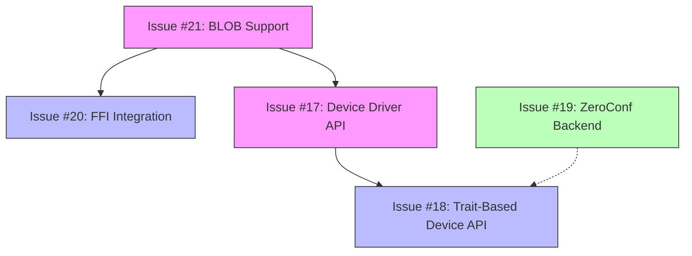

# Phase 2 Implementation Plan: Core Features

**Date**: 2026-03-09
**Status**: 📋 PLANNED
**Phase**: Core Features (Issues #17–#21)
**Prerequisite**: Phase 1 ✅ COMPLETE

---

## Table of Contents

1. [Executive Summary](#executive-summary)
2. [Dependency Analysis](#dependency-analysis)
3. [Issue #21: BLOB Sending/Receiving](#issue-21-implement-blob-sendingreceiving-in-pure-rust)
4. [Issue #20: FFI Integration](#issue-20-complete-ffi-integration-with-c-indigo-library)
5. [Issue #19: ZeroConf Backend](#issue-19-complete-zeroconf-backend-with-full-mdns-integration)
6. [Issue #17: Device Driver API](#issue-17-implement-device-driver-api)
7. [Issue #18: Trait-Based Device API](#issue-18-implement-trait-based-device-api)
8. [Implementation Order](#implementation-order)
9. [Cross-Cutting Concerns](#cross-cutting-concerns)
10. [Milestones](#milestones)

---

## Executive Summary

Phase 2 delivers five core features that transform libindigo from a basic client library into a full-featured INDIGO platform. The issues span four areas: **protocol completeness** (BLOB support), **FFI integration** (C library bridge), **network discovery** (ZeroConf/mDNS), and **device abstractions** (driver SPI + trait-based API).

### Key Design Principle

The workspace is organized as four crates:

| Crate | Purpose | Key Files |
|-------|---------|-----------|
| [`libindigo`](../Cargo.toml) | Core types, traits, error handling | [`src/`](../src/) |
| [`libindigo-rs`](../rs/Cargo.toml) | Pure Rust protocol + transport | [`rs/src/`](../rs/src/) |
| [`libindigo-ffi`](../ffi/Cargo.toml) | FFI bridge to C INDIGO library | [`ffi/src/`](../ffi/src/) |
| `libindigo-sys` | Raw FFI bindings (auto-generated) | [`sys/`](../sys/) |

Phase 2 touches all four crates. The plan orders work to minimize blocking dependencies and maximize parallelization.

---

## Dependency Analysis



### Dependency Matrix

| Issue | Depends On | Blocks | Can Parallelize With |
|-------|-----------|--------|---------------------|
| **#21** (BLOB) | None — protocol layer already has stubs | #20, #17 | #19 |
| **#20** (FFI) | #21 partially — needs BLOB types | — | #19 |
| **#19** (ZeroConf) | None — discovery module already exists | — | #21, #20, #17 |
| **#17** (Device Driver) | #21 partially — BLOB types in core | #18 | #19, #20 |
| **#18** (Trait-Based API) | #17 — builds on device driver SPI | — | #19 |

### Critical Path

```
#21 BLOB ──→ #17 Device Driver ──→ #18 Trait-Based API
```

**#19 ZeroConf** and **#20 FFI** are independent of the critical path and can proceed in parallel at any time.

---

## Issue #21: Implement BLOB Sending/Receiving in Pure Rust

**Priority**: High
**Crates**: `libindigo` (core types), `libindigo-rs` (protocol/transport)

### Current State

- [`PropertyValue::Blob`](../src/types/value.rs:37) variant exists with `data: Vec<u8>`, `format: String`, `size: usize`
- [`OneBLOB`](../rs/src/protocol.rs:269) protocol struct exists with base64-encoded `value: String`
- [`SetBLOBVector`](../rs/src/protocol.rs:419) parsing reads base64 data inline (line 1111)
- [`NewBLOBVector`](../rs/src/protocol.rs:470) serialization writes base64 inline (line 1887)
- [`convert_from_property()`](../rs/src/client.rs:692) returns `NotSupported` for BLOB type
- [`EnableBLOB`](../rs/src/protocol.rs:494) protocol message exists but is never sent by the client
- [`ClientStrategy`](../src/client/strategy.rs:86) has a TODO comment for `enable_blob` method
- JSON BLOB support in [`protocol_json.rs`](../rs/src/protocol_json.rs) is incomplete
- Transport [`MAX_BUFFER_SIZE`](../rs/src/transport.rs:58) is 10 MB — may be too small for astronomical images

### Target State

- **BLOB receiving**: Decode base64 BLOBs from `setBLOBVector` messages, handle large payloads via streaming decode
- **BLOB sending**: Encode binary data as base64 in `newBLOBVector` messages
- **enableBLOB control**: Client sends `enableBLOB` to opt in/out of BLOB transfers per device/property
- **Streaming support**: Large BLOBs decoded in chunks to avoid holding full base64 + decoded in memory
- **JSON BLOB support**: URL-based BLOB references in JSON protocol
- **Memory safety**: Configurable maximum BLOB size, backpressure for slow consumers

### Files to Create/Modify

| File | Action | Changes |
|------|--------|---------|
| [`src/client/strategy.rs`](../src/client/strategy.rs) | Modify | Add `enable_blob()` method to `ClientStrategy` trait |
| [`src/types/value.rs`](../src/types/value.rs) | Modify | Add `BlobTransferMode` enum, enhance `PropertyValue::Blob` |
| [`src/error.rs`](../src/error.rs) | Modify | Add `BlobError` variants (TooLarge, DecodeFailed, TransferFailed) |
| [`rs/src/client.rs`](../rs/src/client.rs) | Modify | Implement `enable_blob()`, fix `convert_from_property()` for BLOB |
| [`rs/src/transport.rs`](../rs/src/transport.rs) | Modify | Add streaming BLOB handling, configurable buffer limits |
| `rs/src/blob.rs` | **Create** | BLOB encoding/decoding utilities, streaming base64 |
| [`rs/src/protocol.rs`](../rs/src/protocol.rs) | Modify | Optimize BLOB parsing for large payloads |
| [`rs/src/protocol_json.rs`](../rs/src/protocol_json.rs) | Modify | Add JSON BLOB URL support |

### New Types and APIs

```rust
// src/types/value.rs
/// Controls how BLOBs are transferred to/from the server.
#[derive(Debug, Clone, Copy, PartialEq, Eq)]
pub enum BlobTransferMode {
    /// Never send BLOBs to this client.
    Never,
    /// Send BLOBs alongside other properties.
    Also,
    /// Only send BLOBs, suppress other property updates.
    Only,
}

// src/client/strategy.rs — new method on ClientStrategy
/// Enables or disables BLOB transfers for a device.
async fn enable_blob(
    &mut self,
    device: &str,
    name: Option<&str>,
    mode: BlobTransferMode,
) -> Result<()>;

// rs/src/blob.rs — new module
/// Encodes binary data to base64 for BLOB transmission.
pub fn encode_blob(data: &[u8]) -> String;

/// Decodes base64 BLOB data, returning raw bytes.
pub fn decode_blob(base64_data: &str) -> Result<Vec<u8>>;

/// Streaming base64 decoder for large BLOBs.
pub struct StreamingBlobDecoder { /* ... */ }

impl StreamingBlobDecoder {
    pub fn new(expected_size: usize) -> Self;
    pub fn feed(&mut self, chunk: &[u8]) -> Result<()>;
    pub fn finish(self) -> Result<Vec<u8>>;
}
```

### Implementation Steps

1. **Add `BlobTransferMode` enum** to [`src/types/value.rs`](../src/types/value.rs) and `BlobError` variants to [`src/error.rs`](../src/error.rs)
2. **Add `enable_blob()` to `ClientStrategy`** trait in [`src/client/strategy.rs`](../src/client/strategy.rs)
3. **Create `rs/src/blob.rs`** with base64 encode/decode utilities and streaming decoder
4. **Implement BLOB sending** in [`rs/src/client.rs`](../rs/src/client.rs) — update `convert_from_property()` to serialize `PropertyValue::Blob` as `NewBLOBVector`
5. **Implement `enable_blob()`** in `RsClientStrategy` — serialize and send `EnableBLOB` message
6. **Optimize BLOB receiving** in [`rs/src/protocol.rs`](../rs/src/protocol.rs) — use streaming base64 decode for `oneBLOB` elements
7. **Increase/configure buffer limits** in [`rs/src/transport.rs`](../rs/src/transport.rs) — make `MAX_BUFFER_SIZE` configurable
8. **Add JSON BLOB URL support** in [`rs/src/protocol_json.rs`](../rs/src/protocol_json.rs)
9. **Write unit tests** for encode/decode, round-trip BLOB transfer
10. **Write integration test** — send/receive a synthetic FITS image header through a real server

### Acceptance Criteria

- [ ] `enable_blob()` method available on `ClientStrategy` and implemented in `RsClientStrategy`
- [ ] BLOB properties can be sent via `send_property()` — base64-encoded `newBLOBVector`
- [ ] Received `setBLOBVector` messages decoded correctly into `PropertyValue::Blob`
- [ ] BLOBs up to 50 MB handled without OOM (streaming decode)
- [ ] JSON protocol supports BLOB URL references
- [ ] Unit tests for encode/decode with various sizes (0 bytes, 1 byte, 1 KB, 1 MB, 10 MB)
- [ ] Integration test with real INDIGO server transferring a simulated FITS file

### Risks & Blockers

| Risk | Mitigation |
|------|-----------|
| Large BLOBs cause OOM | Streaming base64 decoder; configurable max size |
| Base64 encoding overhead (33% size increase) | Document limitation; INDIGO protocol requires base64 for XML |
| JSON BLOB URL format underdocumented | Reference INDIGO C source for URL format; test against server |
| Transport buffer too small for large images | Make buffer size configurable; default to 100 MB for BLOB-enabled connections |

---

## Issue #20: Complete FFI Integration with C INDIGO Library

**Priority**: High
**Crates**: `libindigo-ffi`, `libindigo-sys`

### Current State

- [`FfiClientStrategy`](../ffi/src/ffi.rs:39) is a stub — all methods return `NotSupported`
- [`AsyncFfiStrategy`](../ffi/src/async_ffi.rs:36) is a stub — wraps the non-existent sync strategy
- [`PropertyStream`](../ffi/src/async_ffi.rs:166) struct exists but has no `Stream` impl
- [`libindigo-sys`](../sys/Cargo.toml) crate exists with `build.rs` for bindgen
- The C INDIGO library is a git submodule at [`sys/externals/indigo/`](../sys/externals/)
- Phase 1 fixed the tokio runtime nesting pattern (`spawn_blocking`)
- The [`ffi/Cargo.toml`](../ffi/Cargo.toml) already depends on `libindigo-sys`

### Target State

- **Working `FfiClientStrategy`**: Connect, disconnect, enumerate properties, send properties via C library
- **Async wrapper**: `AsyncFfiStrategy` wraps sync FFI calls with `spawn_blocking`
- **Property streaming**: `PropertyStream` implements `futures::Stream<Item = Property>`
- **Callback bridge**: C library callbacks forwarded to Rust channels
- **Memory safety**: All C allocations properly freed, no leaks
- **Error mapping**: C error codes mapped to `IndigoError` variants

### Files to Create/Modify

| File | Action | Changes |
|------|--------|---------|
| [`ffi/src/ffi.rs`](../ffi/src/ffi.rs) | **Rewrite** | Full FFI client implementation |
| [`ffi/src/async_ffi.rs`](../ffi/src/async_ffi.rs) | **Rewrite** | Async wrapper with spawn_blocking |
| `ffi/src/callback.rs` | **Create** | C callback → Rust channel bridge |
| `ffi/src/convert.rs` | **Create** | Type conversions between C and Rust |
| `ffi/src/safety.rs` | **Create** | Memory safety wrappers, RAII guards for C allocations |
| [`ffi/src/lib.rs`](../ffi/src/lib.rs) | Modify | Export new modules |
| [`ffi/Cargo.toml`](../ffi/Cargo.toml) | Modify | Add `futures` dependency for Stream |

### New Types and APIs

```rust
// ffi/src/ffi.rs
pub struct FfiClientStrategy {
    /// Handle to the C INDIGO client struct.
    client: *mut indigo_client,
    /// Property update channel sender.
    property_tx: Arc<Mutex<Option<mpsc::UnboundedSender<Property>>>>,
    /// Connection state.
    connected: bool,
}

// ffi/src/callback.rs
/// Registers Rust callbacks with the C INDIGO client.
///
/// The C library calls these function pointers when properties change.
/// We forward them through an mpsc channel to the async layer.
pub unsafe fn register_callbacks(
    client: *mut indigo_client,
    tx: mpsc::UnboundedSender<Property>,
) -> Result<()>;

/// C-compatible callback for property definitions.
unsafe extern "C" fn on_define_property(
    client: *const indigo_client,
    device: *const indigo_device,
    property: *const indigo_property,
    message: *const c_char,
);

// ffi/src/convert.rs
/// Converts a C indigo_property to a Rust Property.
pub unsafe fn property_from_c(prop: *const indigo_property) -> Result<Property>;

/// Converts a Rust Property to a C indigo_property.
pub unsafe fn property_to_c(prop: &Property) -> Result<*mut indigo_property>;

/// Frees a C indigo_property allocated by property_to_c.
pub unsafe fn free_c_property(prop: *mut indigo_property);
```

### Implementation Steps

1. **Verify `libindigo-sys` bindings** — ensure `sys/build.rs` generates usable bindings for `indigo_client`, `indigo_property`, `indigo_device`
2. **Create `ffi/src/convert.rs`** — implement bidirectional type conversion (C ↔ Rust) for properties, values, states
3. **Create `ffi/src/safety.rs`** — RAII wrappers (`CPropertyGuard`, `CStringGuard`) to prevent leaks
4. **Create `ffi/src/callback.rs`** — implement C callback functions that forward to Rust `mpsc::UnboundedSender`
5. **Rewrite `ffi/src/ffi.rs`** — implement `FfiClientStrategy` with real C library calls:
   - `connect()`: Call `indigo_connect_server()`
   - `disconnect()`: Call `indigo_disconnect_server()`
   - `enumerate_properties()`: Call `indigo_enumerate_properties()`
   - `send_property()`: Convert property and call appropriate `indigo_change_xxx_property()`
   - `enable_blob()`: Call `indigo_enable_blob()` (after #21 adds the trait method)
6. **Rewrite `ffi/src/async_ffi.rs`** — wrap each sync method with `spawn_blocking`, implement `PropertyStream` with `futures::Stream`
7. **Write unit tests** — test type conversions with known values
8. **Write integration tests** — connect to real INDIGO server via FFI, enumerate properties, send a switch change

### Acceptance Criteria

- [ ] `FfiClientStrategy::new()` succeeds (no longer returns `NotSupported`)
- [ ] Can connect to INDIGO server, enumerate properties, and receive property updates
- [ ] Can send property changes (switch, number, text) through FFI
- [ ] `AsyncFfiStrategy` wraps all calls with `spawn_blocking` — no runtime nesting
- [ ] `PropertyStream` implements `futures::Stream<Item = Property>`
- [ ] No memory leaks (verify with valgrind or ASan on Linux)
- [ ] C library errors mapped to `IndigoError` variants
- [ ] Feature parity with `RsClientStrategy` for connect/disconnect/enumerate/send

### Risks & Blockers

| Risk | Mitigation |
|------|-----------|
| C library thread safety — callbacks from C threads | Use `std::sync::mpsc` (not tokio) for C→Rust; forward to tokio channel in async layer |
| Memory leaks across FFI boundary | RAII guards for all C allocations; test with ASan |
| C library initialization is global/singleton | Use `Once` or `OnceLock` for initialization; document single-instance limitation |
| Platform-specific build issues (macOS frameworks) | CI testing on macOS; conditional compilation for platform differences |
| `libindigo-sys` bindings may be incomplete | Audit bindings against required C functions; add manual bindings if needed |

---

## Issue #19: Complete ZeroConf Backend with Full mDNS Integration

**Priority**: Critical
**Crates**: `libindigo-rs` (discovery module), `libindigo` (core types)

### Current State

- [`DiscoveredServer`](../rs/src/discovery/mod.rs:71) struct exists with all needed fields
- [`DiscoveryConfig`](../rs/src/discovery/mod.rs:137) builder exists with timeout, filter, mode
- [`ServerDiscoveryApi`](../rs/src/discovery/api.rs:24) provides `discover()` and `start_continuous()`
- [`mdns_impl.rs`](../rs/src/discovery/mdns_impl.rs) uses `mdns-sd` crate for actual mDNS
- One-shot and continuous discovery both implemented and tested (compile-only tests)
- Discovery errors defined in [`error.rs`](../rs/src/discovery/error.rs)
- Examples exist: [`discover_servers.rs`](../examples/discover_servers.rs), [`continuous_discovery.rs`](../examples/continuous_discovery.rs), [`discovery_with_filter.rs`](../examples/discovery_with_filter.rs)
- Discovery is behind `discovery` feature flag in [`rs/Cargo.toml`](../rs/Cargo.toml:18)

### Gaps to Fill

1. **No service announcement** — only discovery, can't advertise a device server
2. **No IPv6 handling** — `DiscoveredServer.addresses` stores `IpAddr` but no preference logic
3. **No integration with client** — discovery finds servers but doesn't auto-connect
4. **Error handling uses `Box<dyn Error>`** — should use `IndigoError` or `DiscoveryError`
5. **No connection URL preference** — should prefer IPv4, fallback to IPv6, use hostname as last resort
6. **No re-export from `libindigo`** — discovery types only available from `libindigo-rs`
7. **No health check after discovery** — discovered servers may be unreachable

### Target State

- **Service announcement**: Register an INDIGO server/device on the network via mDNS
- **IPv6 support**: Prefer IPv4, fallback to IPv6, configurable preference
- **Auto-connect integration**: `DiscoveryConfig` can optionally auto-connect to discovered servers
- **Unified error handling**: Discovery errors integrate with `IndigoError`
- **Re-export in core**: Discovery types available from `libindigo` when feature enabled
- **Health verification**: Optional connectivity check before returning discovered servers
- **Cross-platform validation**: Tested on macOS, Linux; documented for Windows

### Files to Create/Modify

| File | Action | Changes |
|------|--------|---------|
| [`rs/src/discovery/mod.rs`](../rs/src/discovery/mod.rs) | Modify | Add `ServiceAnnouncement`, address preference logic |
| [`rs/src/discovery/api.rs`](../rs/src/discovery/api.rs) | Modify | Add `announce()`, auto-connect option, health checks |
| [`rs/src/discovery/mdns_impl.rs`](../rs/src/discovery/mdns_impl.rs) | Modify | Add service registration, IPv6 handling |
| [`rs/src/discovery/error.rs`](../rs/src/discovery/error.rs) | Modify | Integrate with `IndigoError` |
| `rs/src/discovery/announce.rs` | **Create** | Service announcement implementation |
| `rs/src/discovery/health.rs` | **Create** | Post-discovery health verification |
| [`src/error.rs`](../src/error.rs) | Modify | Add `DiscoveryError` variant to `IndigoError` |
| [`src/lib.rs`](../src/lib.rs) | Modify | Re-export discovery types with feature gate |

### New Types and APIs

```rust
// rs/src/discovery/mod.rs — new types
/// Address selection preference for connecting to discovered servers.
#[derive(Debug, Clone, Copy, PartialEq, Eq)]
pub enum AddressPreference {
    /// Prefer IPv4, fallback to IPv6.
    PreferIPv4,
    /// Prefer IPv6, fallback to IPv4.
    PreferIPv6,
    /// Use hostname (requires DNS resolution).
    Hostname,
}

/// Configuration for service announcement.
pub struct AnnouncementConfig {
    pub service_name: String,
    pub port: u16,
    pub txt_records: HashMap<String, String>,
}

// rs/src/discovery/api.rs — new methods
impl ServerDiscoveryApi {
    /// Discovers servers and verifies connectivity.
    pub async fn discover_verified(
        config: DiscoveryConfig,
    ) -> Result<Vec<DiscoveredServer>>;

    /// Announces an INDIGO service on the local network.
    pub async fn announce(
        config: AnnouncementConfig,
    ) -> Result<ServiceAnnouncement>;
}

impl DiscoveredServer {
    /// Returns the best connection URL based on address preference.
    pub fn connection_url(&self, pref: AddressPreference) -> String;
}

// rs/src/discovery/announce.rs
/// Handle for an active service announcement.
/// Drop to stop announcing.
pub struct ServiceAnnouncement {
    mdns: ServiceDaemon,
    fullname: String,
}

impl ServiceAnnouncement {
    /// Updates TXT records for the announcement.
    pub fn update_txt(&self, records: HashMap<String, String>) -> Result<()>;

    /// Stops the announcement.
    pub async fn stop(self) -> Result<()>;
}
```

### Implementation Steps

1. **Integrate `DiscoveryError` with `IndigoError`** — add variant in [`src/error.rs`](../src/error.rs), implement `From<DiscoveryError>`
2. **Add `AddressPreference`** and `connection_url()` to [`DiscoveredServer`](../rs/src/discovery/mod.rs:71)
3. **Create `rs/src/discovery/health.rs`** — TCP connectivity check for discovered servers
4. **Add `discover_verified()`** to [`ServerDiscoveryApi`](../rs/src/discovery/api.rs:24) — discover then health-check
5. **Create `rs/src/discovery/announce.rs`** — mDNS service registration using `mdns-sd`
6. **Add `announce()`** to `ServerDiscoveryApi`
7. **Re-export discovery types from `libindigo`** behind `discovery` feature
8. **Update examples** — update existing examples, add `announce` example
9. **Write integration tests** — discover + verify + announce round-trip (on loopback)
10. **Cross-platform testing** — verify on macOS and Linux; document Windows caveats

### Acceptance Criteria

- [ ] `discover_verified()` returns only reachable servers
- [ ] `announce()` registers an INDIGO service visible via `discover()`
- [ ] `connection_url()` respects `AddressPreference` (IPv4/IPv6/hostname)
- [ ] `DiscoveryError` is a variant of `IndigoError`
- [ ] Discovery types re-exported from `libindigo` when `discovery` feature enabled
- [ ] Round-trip test: announce → discover → verify → connect succeeds
- [ ] Works on macOS and Linux; Windows behavior documented

### Risks & Blockers

| Risk | Mitigation |
|------|-----------|
| mDNS requires multicast — may not work in CI containers | Use loopback-only tests; mark network tests as `#[ignore]` in CI |
| `mdns-sd` crate platform differences | Test on macOS + Linux; document known issues |
| Service announcement conflicts with existing server | Use unique service names with random suffix in tests |
| IPv6 link-local addresses need scope ID | Handle `%scope` syntax in address formatting |

---

## Issue #17: Implement Device Driver API

**Priority**: Critical
**Crates**: `libindigo` (core), `libindigo-rs` (server-side protocol)

### Current State

- [`Device`](../src/types/device.rs:1) struct exists as a simple container with `name`, `version`, `interface`
- [`DeviceInfo`](../src/types/device.rs) has basic metadata
- No server-side protocol handling — the crate is client-only
- [`ClientStrategy`](../src/client/strategy.rs:44) exists as the client-side SPI pattern
- The `device` feature flag is a stub in both [`rs/Cargo.toml`](../rs/Cargo.toml:17) and [`ffi/Cargo.toml`](../ffi/Cargo.toml:17)
- [`plans/trait-based-device-api-v3.md`](../plans/trait-based-device-api-v3.md) provides the architectural design
- No property registration mechanism exists
- No device lifecycle management

### Target State

- **`DeviceDriver` trait**: Core SPI for writing INDIGO device drivers in Rust
- **Property management**: Register, define, update, and delete properties from device side
- **Lifecycle management**: Attach, detach, connect, disconnect lifecycle hooks
- **Server-side protocol**: Send `defXXXVector` and `setXXXVector` messages as device
- **Property change callbacks**: Receive `newXXXVector` from clients
- **Device registration**: Register device with INDIGO server/bus

### Files to Create/Modify

| File | Action | Changes |
|------|--------|---------|
| `src/device/mod.rs` | **Create** | Module root, re-exports |
| `src/device/driver.rs` | **Create** | `DeviceDriver` trait (core SPI) |
| `src/device/property_manager.rs` | **Create** | Property registration and state management |
| `src/device/lifecycle.rs` | **Create** | Device lifecycle state machine |
| [`src/types/device.rs`](../src/types/device.rs) | Modify | Enhance `Device` struct, add `DeviceInterface` enum |
| [`src/types/property.rs`](../src/types/property.rs) | Modify | Add `PropertyDefinition` for server-side property declaration |
| [`src/lib.rs`](../src/lib.rs) | Modify | Add `device` module behind feature gate |
| [`src/error.rs`](../src/error.rs) | Modify | Add `DeviceError` variants |
| `rs/src/device/mod.rs` | **Create** | Pure Rust device hosting implementation |
| `rs/src/device/server.rs` | **Create** | TCP server accepting client connections |
| `rs/src/device/protocol_handler.rs` | **Create** | Handle incoming `newXXXVector` messages for devices |

### New Types and APIs

```rust
// src/device/driver.rs — The core device driver SPI

/// The central trait for implementing INDIGO device drivers in Rust.
///
/// Implement this trait to create a device driver that can be registered
/// with an INDIGO server bus. The trait provides lifecycle hooks and
/// property change callbacks.
#[async_trait]
pub trait DeviceDriver: Send + Sync {
    /// Returns the device name.
    fn name(&self) -> &str;

    /// Returns the device version string.
    fn version(&self) -> &str;

    /// Returns the device interface mask.
    fn interface(&self) -> DeviceInterface;

    /// Called when the device is attached to the server bus.
    ///
    /// Use this to define initial properties via the PropertyManager.
    async fn on_attach(&mut self, pm: &mut PropertyManager) -> Result<()>;

    /// Called when the device is detached from the server bus.
    async fn on_detach(&mut self, pm: &mut PropertyManager) -> Result<()>;

    /// Called when a client requests property enumeration.
    async fn on_enumerate_properties(
        &mut self,
        pm: &mut PropertyManager,
        device: Option<&str>,
        name: Option<&str>,
    ) -> Result<()>;

    /// Called when a client sends a property change request.
    async fn on_change_property(
        &mut self,
        pm: &mut PropertyManager,
        property: &Property,
    ) -> Result<()>;

    /// Called when the BLOB mode changes for this device.
    async fn on_enable_blob(
        &mut self,
        pm: &mut PropertyManager,
        device: &str,
        name: Option<&str>,
        mode: BlobTransferMode,
    ) -> Result<()> {
        // Default: no-op
        Ok(())
    }
}

// src/device/property_manager.rs

/// Manages properties for a device driver.
///
/// Provides methods to define, update, and delete properties.
/// Changes are automatically sent to connected clients.
pub struct PropertyManager {
    device_name: String,
    properties: HashMap<String, Property>,
    sender: Box<dyn PropertySender>,
}

impl PropertyManager {
    /// Defines a new property and sends defXXXVector to clients.
    pub async fn define_property(&mut self, property: Property) -> Result<()>;

    /// Updates a property value and sends setXXXVector to clients.
    pub async fn update_property(
        &mut self,
        name: &str,
        items: HashMap<String, PropertyValue>,
        state: PropertyState,
    ) -> Result<()>;

    /// Deletes a property and sends delProperty to clients.
    pub async fn delete_property(&mut self, name: &str) -> Result<()>;

    /// Deletes all properties for this device.
    pub async fn delete_all_properties(&mut self) -> Result<()>;

    /// Gets the current value of a property.
    pub fn get_property(&self, name: &str) -> Option<&Property>;

    /// Lists all defined properties.
    pub fn properties(&self) -> Vec<&Property>;
}

/// Trait for sending property updates to clients.
/// Implemented differently by RS and FFI backends.
#[async_trait]
pub trait PropertySender: Send + Sync {
    async fn send_define(&self, property: &Property) -> Result<()>;
    async fn send_update(&self, property: &Property) -> Result<()>;
    async fn send_delete(&self, device: &str, name: Option<&str>) -> Result<()>;
}

// src/device/lifecycle.rs

/// Device lifecycle states.
#[derive(Debug, Clone, Copy, PartialEq, Eq)]
pub enum DeviceState {
    /// Device created but not attached.
    Created,
    /// Device attached to server bus.
    Attached,
    /// Device connected and operational.
    Connected,
    /// Device detaching from server bus.
    Detaching,
}

// src/types/device.rs — enhanced

/// INDIGO device interface flags.
///
/// These correspond to the INDIGO_INTERFACE_* constants in the C library.
#[derive(Debug, Clone, Copy, PartialEq, Eq)]
pub enum DeviceInterface {
    Camera,
    Mount,
    Focuser,
    FilterWheel,
    Dome,
    Gps,
    Guider,
    Ao,
    Rotator,
    Aux,
    /// Custom interface with raw flags.
    Custom(u32),
}
```

### Implementation Steps

1. **Add `DeviceError` variants** to [`src/error.rs`](../src/error.rs) — `PropertyNotFound`, `PropertyAlreadyDefined`, `InvalidState`, `DriverError`
2. **Enhance `Device` struct** in [`src/types/device.rs`](../src/types/device.rs) — add `DeviceInterface` enum, `DeviceState`
3. **Create `src/device/driver.rs`** — define the `DeviceDriver` trait
4. **Create `src/device/property_manager.rs`** — implement `PropertyManager` and `PropertySender` trait
5. **Create `src/device/lifecycle.rs`** — implement state machine for device lifecycle
6. **Create `src/device/mod.rs`** — wire up module exports
7. **Update `src/lib.rs`** — add `device` module behind feature gate
8. **Create `rs/src/device/mod.rs`** — pure Rust device hosting
9. **Create `rs/src/device/server.rs`** — simple TCP server that accepts client connections and dispatches to device drivers
10. **Create `rs/src/device/protocol_handler.rs`** — translate incoming protocol messages into `DeviceDriver` callbacks
11. **Write unit tests** — test property manager operations, lifecycle state transitions
12. **Write integration test** — create a mock device driver, attach it, connect a client, verify property enumeration works

### Acceptance Criteria

- [ ] `DeviceDriver` trait defined with all lifecycle hooks
- [ ] `PropertyManager` can define, update, and delete properties
- [ ] Device lifecycle state machine correctly transitions between states
- [ ] `PropertySender` trait allows backend-agnostic property sending
- [ ] A simple mock device driver compiles and can be instantiated
- [ ] Integration test: mock device attached → client connects → client sees device properties
- [ ] Feature-gated behind `device` feature flag in `libindigo`

### Risks & Blockers

| Risk | Mitigation |
|------|-----------|
| Server-side protocol is complex (need TCP server) | Start with single-client, single-device; expand later |
| INDIGO bus model is sophisticated | Implement simplified version first; document limitations |
| C INDIGO server may have undocumented behaviors | Test against C server; reference C source code |
| Concurrent client access to device properties | Use `Arc<RwLock<>>` for property state; document thread safety |

---

## Issue #18: Implement Trait-Based Device API

**Priority**: Critical (Tracking Issue)
**Crates**: `libindigo` (traits), `libindigo-rs` (implementations)

### Current State

- [`plans/trait-based-device-api-v3.md`](../plans/trait-based-device-api-v3.md) provides detailed architecture
- No device-specific traits exist — only generic `Property` handling
- `PropertyValue` variants (Number, Text, Switch, Light, Blob) exist
- INDIGO property names defined in [`src/constants.rs`](../src/constants.rs) — standard property names for cameras, mounts, etc.
- No concept of "typed device" — all devices accessed through generic property API

### Target State

- **High-level device traits**: `Camera`, `Mount`, `Focuser`, `FilterWheel`, `Dome`, `Guider`, `Rotator`, `Aux`
- **Common `IndigoDevice` base trait**: Connection management, property enumeration
- **Type-safe property access**: `camera.exposure()` instead of `get_property("CCD_EXPOSURE")`
- **Builder patterns**: Construct device proxies from a connected client
- **Property change observation**: Watch for device state changes with typed events
- **Auto-detection**: Detect device type from INDIGO interface properties

### Files to Create/Modify

| File | Action | Changes |
|------|--------|---------|
| `src/device/traits/mod.rs` | **Create** | Trait module root |
| `src/device/traits/base.rs` | **Create** | `IndigoDevice` base trait |
| `src/device/traits/camera.rs` | **Create** | `Camera` trait |
| `src/device/traits/mount.rs` | **Create** | `Mount` trait |
| `src/device/traits/focuser.rs` | **Create** | `Focuser` trait |
| `src/device/traits/filter_wheel.rs` | **Create** | `FilterWheel` trait |
| `src/device/traits/dome.rs` | **Create** | `Dome` trait |
| `src/device/traits/guider.rs` | **Create** | `Guider` trait |
| `src/device/traits/rotator.rs` | **Create** | `Rotator` trait |
| `src/device/traits/aux.rs` | **Create** | `Aux` trait |
| `src/device/proxy.rs` | **Create** | Generic `DeviceProxy` connecting traits to client |
| `src/device/detect.rs` | **Create** | Device type auto-detection from properties |
| [`src/constants.rs`](../src/constants.rs) | Reference | Use standard property names from constants |

### New Types and APIs

```rust
// src/device/traits/base.rs

/// Base trait for all INDIGO device types.
///
/// Provides common functionality shared by all devices.
#[async_trait]
pub trait IndigoDevice: Send + Sync {
    /// Returns the device name.
    fn name(&self) -> &str;

    /// Returns the device interface type.
    fn device_type(&self) -> DeviceInterface;

    /// Returns the connection state.
    async fn is_connected(&self) -> Result<bool>;

    /// Connects the device.
    async fn connect(&self) -> Result<()>;

    /// Disconnects the device.
    async fn disconnect(&self) -> Result<()>;

    /// Returns all properties for this device.
    async fn properties(&self) -> Result<Vec<Property>>;

    /// Returns a specific property by name.
    async fn property(&self, name: &str) -> Result<Option<Property>>;

    /// Waits for a property to reach a specific state.
    async fn wait_for_property(
        &self,
        name: &str,
        predicate: impl Fn(&Property) -> bool + Send,
        timeout: Duration,
    ) -> Result<Property>;

    /// Subscribes to property change events for this device.
    async fn subscribe(&self) -> Result<DeviceEventStream>;
}

// src/device/traits/camera.rs

/// Trait for CCD/CMOS camera devices.
#[async_trait]
pub trait Camera: IndigoDevice {
    /// Starts an exposure with the given duration in seconds.
    async fn expose(&self, duration: f64) -> Result<()>;

    /// Aborts the current exposure.
    async fn abort_exposure(&self) -> Result<()>;

    /// Returns the current exposure state.
    async fn exposure_state(&self) -> Result<ExposureState>;

    /// Returns the last captured image as BLOB data.
    async fn image(&self) -> Result<BlobData>;

    /// Sets the CCD temperature target.
    async fn set_cooler_temperature(&self, celsius: f64) -> Result<()>;

    /// Returns the current CCD temperature.
    async fn cooler_temperature(&self) -> Result<f64>;

    /// Enables or disables the cooler.
    async fn set_cooler_enabled(&self, enabled: bool) -> Result<()>;

    /// Sets the camera gain.
    async fn set_gain(&self, gain: f64) -> Result<()>;

    /// Sets the camera offset.
    async fn set_offset(&self, offset: f64) -> Result<()>;

    /// Sets binning.
    async fn set_binning(&self, x: u32, y: u32) -> Result<()>;

    /// Sets the region of interest (subframe).
    async fn set_frame(&self, x: u32, y: u32, width: u32, height: u32) -> Result<()>;

    /// Returns camera information (sensor size, pixel size, etc.).
    async fn info(&self) -> Result<CameraInfo>;
}

/// Camera exposure state.
#[derive(Debug, Clone)]
pub enum ExposureState {
    Idle,
    Exposing { remaining: f64 },
    Downloading,
    Complete,
    Error(String),
}

/// Camera sensor information.
#[derive(Debug, Clone)]
pub struct CameraInfo {
    pub width: u32,
    pub height: u32,
    pub pixel_width: f64,
    pub pixel_height: f64,
    pub bits_per_pixel: u32,
    pub max_binning_x: u32,
    pub max_binning_y: u32,
}

// src/device/traits/mount.rs

/// Trait for telescope mount devices.
#[async_trait]
pub trait Mount: IndigoDevice {
    /// Slews to equatorial coordinates (J2000).
    async fn slew_to(&self, ra: f64, dec: f64) -> Result<()>;

    /// Aborts the current slew.
    async fn abort_slew(&self) -> Result<()>;

    /// Returns current equatorial coordinates.
    async fn coordinates(&self) -> Result<Coordinates>;

    /// Parks the mount.
    async fn park(&self) -> Result<()>;

    /// Unparks the mount.
    async fn unpark(&self) -> Result<()>;

    /// Returns the tracking state.
    async fn is_tracking(&self) -> Result<bool>;

    /// Enables or disables tracking.
    async fn set_tracking(&self, enabled: bool) -> Result<()>;

    /// Sets the tracking rate.
    async fn set_tracking_rate(&self, rate: TrackingRate) -> Result<()>;

    /// Sends a guide pulse.
    async fn guide(&self, direction: GuideDirection, duration_ms: u32) -> Result<()>;
}

/// Equatorial coordinates.
#[derive(Debug, Clone, Copy)]
pub struct Coordinates {
    pub ra: f64,   // hours
    pub dec: f64,  // degrees
}

/// Tracking rate presets.
#[derive(Debug, Clone, Copy, PartialEq, Eq)]
pub enum TrackingRate {
    Sidereal,
    Solar,
    Lunar,
    Custom,
}

// src/device/traits/focuser.rs

/// Trait for focuser devices.
#[async_trait]
pub trait Focuser: IndigoDevice {
    /// Moves to an absolute position.
    async fn move_to(&self, position: u32) -> Result<()>;

    /// Moves by a relative amount.
    async fn move_by(&self, steps: i32) -> Result<()>;

    /// Aborts the current move.
    async fn abort(&self) -> Result<()>;

    /// Returns the current position.
    async fn position(&self) -> Result<u32>;

    /// Returns whether the focuser is moving.
    async fn is_moving(&self) -> Result<bool>;

    /// Sets the temperature compensation mode.
    async fn set_temperature_compensation(&self, enabled: bool) -> Result<()>;

    /// Returns the focuser temperature.
    async fn temperature(&self) -> Result<f64>;
}

// src/device/traits/filter_wheel.rs

/// Trait for filter wheel devices.
#[async_trait]
pub trait FilterWheel: IndigoDevice {
    /// Moves to a specific filter slot (1-based).
    async fn move_to_slot(&self, slot: u32) -> Result<()>;

    /// Returns the current slot number.
    async fn current_slot(&self) -> Result<u32>;

    /// Returns the number of filter slots.
    async fn slot_count(&self) -> Result<u32>;

    /// Returns filter names.
    async fn filter_names(&self) -> Result<Vec<String>>;

    /// Sets filter names.
    async fn set_filter_names(&self, names: Vec<String>) -> Result<()>;
}

// src/device/proxy.rs

/// A device proxy that connects high-level traits to a client connection.
///
/// The proxy translates trait method calls into INDIGO property operations
/// and vice versa.
pub struct DeviceProxy {
    device_name: String,
    client: Arc<Mutex<Box<dyn ClientStrategy>>>,
    property_rx: mpsc::UnboundedReceiver<Property>,
    property_cache: Arc<RwLock<HashMap<String, Property>>>,
}

impl DeviceProxy {
    /// Creates a new device proxy for the named device.
    pub async fn new(
        device_name: &str,
        client: Arc<Mutex<Box<dyn ClientStrategy>>>,
    ) -> Result<Self>;

    /// Returns a typed Camera interface if the device is a camera.
    pub fn as_camera(&self) -> Option<impl Camera + '_>;

    /// Returns a typed Mount interface if the device is a mount.
    pub fn as_mount(&self) -> Option<impl Mount + '_>;

    /// Returns a typed Focuser interface if the device is a focuser.
    pub fn as_focuser(&self) -> Option<impl Focuser + '_>;

    /// Returns a typed FilterWheel interface.
    pub fn as_filter_wheel(&self) -> Option<impl FilterWheel + '_>;
}

// src/device/detect.rs

/// Detects the device type from its properties.
pub fn detect_device_type(properties: &[Property]) -> DeviceInterface;
```

### Implementation Steps

1. **Create `src/device/traits/base.rs`** — define `IndigoDevice` base trait with common operations
2. **Create `src/device/traits/camera.rs`** — define `Camera` trait with standard CCD properties from [`constants.rs`](../src/constants.rs)
3. **Create `src/device/traits/mount.rs`** — define `Mount` trait with equatorial/alt-az coordinates
4. **Create `src/device/traits/focuser.rs`** — define `Focuser` trait
5. **Create `src/device/traits/filter_wheel.rs`** — define `FilterWheel` trait
6. **Create remaining trait files** — `dome.rs`, `guider.rs`, `rotator.rs`, `aux.rs` (initially with minimal methods)
7. **Create `src/device/proxy.rs`** — implement `DeviceProxy` that maps trait methods to property operations
8. **Implement `IndigoDevice` for `DeviceProxy`** — property caching, subscription, wait_for_property
9. **Implement `Camera` for `DeviceProxy`** — map `expose()` → `CCD_EXPOSURE` property, etc.
10. **Implement `Mount` for `DeviceProxy`** — map `slew_to()` → `MOUNT_EQUATORIAL_COORDINATES`, etc.
11. **Implement remaining traits** for `DeviceProxy`
12. **Create `src/device/detect.rs`** — device type detection from DRIVER_INFO property
13. **Write unit tests** — test property mapping, type detection
14. **Write integration test** — connect to CCD Simulator, use Camera trait to take an exposure
15. **Write example** — `examples/camera_control.rs` demonstrating typed device API

### Acceptance Criteria

- [ ] `IndigoDevice` base trait defined with connection, property, and subscription methods
- [ ] `Camera` trait defined with expose, cooler, gain, binning, frame methods
- [ ] `Mount` trait defined with slew, park, track, guide methods
- [ ] `Focuser` trait defined with move, position, temperature methods
- [ ] `FilterWheel` trait defined with slot selection and naming methods
- [ ] `DeviceProxy` implements all traits via property mapping
- [ ] Device type auto-detection from DRIVER_INFO properties
- [ ] Integration test with CCD Simulator using `Camera` trait
- [ ] Example `camera_control.rs` compiles and demonstrates the API
- [ ] All trait methods documented with examples

### Risks & Blockers

| Risk | Mitigation |
|------|-----------|
| Property names may vary across INDIGO versions | Use constants from `constants.rs`; test against INDIGO 2.0 |
| Async traits add complexity | Use `async_trait` crate consistently; document patterns |
| Trait object limitations in Rust | Use `impl Trait` returns where possible; document limitations |
| Large API surface — many device types | Implement Camera and Mount first as reference; community can add others |
| Property caching consistency | Use event-driven updates from subscription; document staleness window |

---

## Implementation Order

### Recommended Sequence

```mermaid
gantt
    title Phase 2 Implementation Sequence
    dateFormat X
    axisFormat %s

    section Track A - Protocol
    21 BLOB Support           :a1, 0, 3
    20 FFI Integration        :a2, after a1, 4

    section Track B - Discovery
    19 ZeroConf Backend       :b1, 0, 3

    section Track C - Device API
    17 Device Driver API      :c1, 2, 4
    18 Trait-Based Device API :c2, after c1, 4
```



### Track A: Protocol Completeness (Sequential)

| Order | Issue | Rationale |
|-------|-------|-----------|
| **1st** | **#21 BLOB Support** | Foundation — adds `BlobTransferMode` and `enable_blob()` to `ClientStrategy` used by all other issues |
| **3rd** | **#20 FFI Integration** | Builds on #21 — needs BLOB types; large standalone effort |

### Track B: Discovery (Independent)

| Order | Issue | Rationale |
|-------|-------|-----------|
| **1st** | **#19 ZeroConf Backend** | Fully independent — can proceed in parallel from day 1 |

### Track C: Device API (Sequential, partially overlaps Track A)

| Order | Issue | Rationale |
|-------|-------|-----------|
| **2nd** | **#17 Device Driver API** | Needs BLOB types from #21; defines foundation for #18 |
| **4th** | **#18 Trait-Based Device API** | Depends on #17; final and largest deliverable |

### Parallelization Opportunities

- **#19** (ZeroConf) runs entirely in parallel with all other issues
- **#21** (BLOB) and **#19** (ZeroConf) can start simultaneously
- **#20** (FFI) and **#17** (Device Driver) can overlap if BLOB types land first
- **#18** (Trait-Based API) must wait for #17

### Quick Wins vs. Heavy Lifts

| Issue | Effort | Impact | Classification |
|-------|--------|--------|---------------|
| **#21** BLOB | Medium | High — unblocks #17, #20 | **Quick Win** — mostly filling in stubs |
| **#19** ZeroConf | Medium | Medium — enhances existing code | **Quick Win** — incremental improvement |
| **#20** FFI | High | High — alternative backend | **Heavy Lift** — unsafe code, C integration |
| **#17** Device Driver | High | Critical — new capability | **Heavy Lift** — new subsystem |
| **#18** Trait-Based API | High | Critical — user-facing API | **Heavy Lift** — large API surface |

---

## Cross-Cutting Concerns

### Error Handling Patterns

All Phase 2 code must follow these patterns established in Phase 1:

1. **Return `Result<T, IndigoError>`** — never panic in library code
2. **New error variants** added to [`IndigoError`](../src/error.rs) as needed:

   ```rust
   pub enum IndigoError {
       // ... existing variants ...
       BlobError(String),
       DeviceError(String),
       DiscoveryError(String),
       FfiError(String),
   }
   ```

3. **Error context**: Use `.map_err()` to add context before propagating
4. **No `unwrap()` in library code** — use `?` or explicit error handling
5. **FFI errors**: Map C error codes to `IndigoError::FfiError` with descriptive message

### Testing Strategy

| Test Type | Where | When | Purpose |
|-----------|-------|------|---------|
| **Unit tests** | `#[cfg(test)] mod tests` in each file | Every PR | Test individual functions, type conversions |
| **Integration tests** | `tests/` directory | Every PR | Test cross-module interactions with real INDIGO server |
| **Doc tests** | `///` comments | Every PR | Ensure examples compile and run |
| **Property round-trip** | Integration | #21, #17 | Verify property send→receive→compare for all types |
| **BLOB transfer** | Integration | #21 | Send/receive binary data of various sizes |
| **FFI safety** | Unit + Integration | #20 | Verify no memory leaks, use-after-free, or UB |
| **Discovery** | Integration (loopback) | #19 | Announce → discover → verify on localhost |
| **Device lifecycle** | Integration | #17 | Attach → enumerate → change property → detach |
| **Typed API** | Integration | #18 | CCD Simulator via Camera trait |

All integration tests use the test harness from Phase 1:

```rust
TestHarness::initialize().await?;
if !TestHarness::is_available() {
    eprintln!("Skipping: INDIGO server not available");
    return Ok(());
}
TestHarness::reset_for_test().await?;
```

### Documentation Requirements

1. **All public types and traits** must have `///` doc comments
2. **All trait methods** must have usage examples in doc comments
3. **Module-level documentation** (`//!`) for every new module
4. **Architecture decision records** for major design choices
5. **Examples** in `examples/` directory for user-facing features:
   - `examples/blob_transfer.rs` (#21)
   - `examples/ffi_client.rs` (#20)
   - `examples/service_announcement.rs` (#19)
   - `examples/device_driver.rs` (#17)
   - `examples/camera_control.rs` (#18)

### Feature Flag Strategy

| Feature | Crate | Gate | Default |
|---------|-------|------|---------|
| `device` | `libindigo` | Device driver API (#17, #18) | No |
| `discovery` | `libindigo-rs` | ZeroConf/mDNS (#19) | No |
| `async` | `libindigo-ffi` | Async FFI wrapper (#20) | No |
| `blob` | `libindigo-rs` | BLOB support (#21) | Yes (part of client) |

---

## Milestones

### Milestone 1: Protocol Foundation ✅

**Checkpoint**: BLOB support complete

- [ ] `BlobTransferMode` enum in core types
- [ ] `enable_blob()` on `ClientStrategy` trait
- [ ] BLOB encode/decode utilities in `rs/src/blob.rs`
- [ ] BLOB sending via `send_property()` works
- [ ] BLOB receiving decoded correctly
- [ ] Unit tests pass for all BLOB sizes
- [ ] Integration test passes with INDIGO server

### Milestone 2: Discovery Enhanced ✅

**Checkpoint**: ZeroConf fully operational

- [ ] Service announcement works
- [ ] `discover_verified()` returns reachable servers only
- [ ] IPv6 address handling correct
- [ ] Discovery errors integrated with `IndigoError`
- [ ] Round-trip test: announce → discover → connect

### Milestone 3: FFI Bridge ✅

**Checkpoint**: FFI client strategy functional

- [ ] `FfiClientStrategy::new()` succeeds
- [ ] Connect → enumerate → send property works via FFI
- [ ] `PropertyStream` implements `futures::Stream`
- [ ] No memory leaks in FFI layer
- [ ] Feature parity with `RsClientStrategy` for basic operations

### Milestone 4: Device Driver SPI ✅

**Checkpoint**: Device drivers can be written in Rust

- [ ] `DeviceDriver` trait defined and documented
- [ ] `PropertyManager` manages device properties
- [ ] Device lifecycle state machine works
- [ ] Mock device driver can be attached and queried
- [ ] Integration test: client connects and enumerates mock device

### Milestone 5: Typed Device API ✅

**Checkpoint**: High-level device traits usable

- [ ] `Camera` trait implemented and tested with CCD Simulator
- [ ] `Mount` trait implemented with core methods
- [ ] `Focuser` and `FilterWheel` traits implemented
- [ ] `DeviceProxy` connects traits to client
- [ ] Device type auto-detection works
- [ ] `examples/camera_control.rs` demonstrates the API

### Phase 2 Complete ✅

**All milestones achieved**

- [ ] All 5 issues resolved
- [ ] All integration tests pass
- [ ] All examples compile and run
- [ ] Documentation complete for new APIs
- [ ] No compiler warnings
- [ ] Ready for Phase 3

---

## Appendix: File Creation Summary

### New Files to Create

| File | Issue | Purpose |
|------|-------|---------|
| `rs/src/blob.rs` | #21 | BLOB encoding/decoding utilities |
| `ffi/src/callback.rs` | #20 | C callback → Rust channel bridge |
| `ffi/src/convert.rs` | #20 | C ↔ Rust type conversions |
| `ffi/src/safety.rs` | #20 | Memory safety RAII wrappers |
| `rs/src/discovery/announce.rs` | #19 | mDNS service announcement |
| `rs/src/discovery/health.rs` | #19 | Post-discovery health checks |
| `src/device/mod.rs` | #17 | Device module root |
| `src/device/driver.rs` | #17 | `DeviceDriver` trait |
| `src/device/property_manager.rs` | #17 | Property registration/management |
| `src/device/lifecycle.rs` | #17 | Device lifecycle state machine |
| `rs/src/device/mod.rs` | #17 | Pure Rust device hosting |
| `rs/src/device/server.rs` | #17 | TCP server for device hosting |
| `rs/src/device/protocol_handler.rs` | #17 | Incoming message → driver callback |
| `src/device/traits/mod.rs` | #18 | Trait module root |
| `src/device/traits/base.rs` | #18 | `IndigoDevice` base trait |
| `src/device/traits/camera.rs` | #18 | `Camera` trait |
| `src/device/traits/mount.rs` | #18 | `Mount` trait |
| `src/device/traits/focuser.rs` | #18 | `Focuser` trait |
| `src/device/traits/filter_wheel.rs` | #18 | `FilterWheel` trait |
| `src/device/traits/dome.rs` | #18 | `Dome` trait |
| `src/device/traits/guider.rs` | #18 | `Guider` trait |
| `src/device/traits/rotator.rs` | #18 | `Rotator` trait |
| `src/device/traits/aux.rs` | #18 | `Aux` trait |
| `src/device/proxy.rs` | #18 | `DeviceProxy` implementation |
| `src/device/detect.rs` | #18 | Device type auto-detection |
| `examples/blob_transfer.rs` | #21 | BLOB transfer example |
| `examples/ffi_client.rs` | #20 | FFI client example |
| `examples/service_announcement.rs` | #19 | Service announcement example |
| `examples/device_driver.rs` | #17 | Device driver example |
| `examples/camera_control.rs` | #18 | Typed camera API example |

### Files to Modify

| File | Issues | Changes |
|------|--------|---------|
| [`src/error.rs`](../src/error.rs) | All | New error variants |
| [`src/lib.rs`](../src/lib.rs) | #17, #18, #19 | Feature-gated module exports |
| [`src/client/strategy.rs`](../src/client/strategy.rs) | #21 | Add `enable_blob()` |
| [`src/types/value.rs`](../src/types/value.rs) | #21 | `BlobTransferMode` |
| [`src/types/device.rs`](../src/types/device.rs) | #17 | `DeviceInterface`, `DeviceState` |
| [`src/types/property.rs`](../src/types/property.rs) | #17 | Property definition types |
| [`rs/src/client.rs`](../rs/src/client.rs) | #21 | BLOB sending, `enable_blob()` |
| [`rs/src/transport.rs`](../rs/src/transport.rs) | #21 | Configurable buffer size |
| [`rs/src/protocol.rs`](../rs/src/protocol.rs) | #21 | Optimized BLOB parsing |
| [`rs/src/protocol_json.rs`](../rs/src/protocol_json.rs) | #21 | JSON BLOB URL support |
| [`rs/src/lib.rs`](../rs/src/lib.rs) | #17, #21 | New module exports |
| [`rs/src/discovery/mod.rs`](../rs/src/discovery/mod.rs) | #19 | New types, re-exports |
| [`rs/src/discovery/api.rs`](../rs/src/discovery/api.rs) | #19 | New methods |
| [`rs/src/discovery/mdns_impl.rs`](../rs/src/discovery/mdns_impl.rs) | #19 | Announcement, IPv6 |
| [`rs/src/discovery/error.rs`](../rs/src/discovery/error.rs) | #19 | Error integration |
| [`ffi/src/lib.rs`](../ffi/src/lib.rs) | #20 | New module exports |
| [`ffi/src/ffi.rs`](../ffi/src/ffi.rs) | #20 | Complete rewrite |
| [`ffi/src/async_ffi.rs`](../ffi/src/async_ffi.rs) | #20 | Complete rewrite |
| [`Cargo.toml`](../Cargo.toml) | #17, #18 | Feature flags |
| [`rs/Cargo.toml`](../rs/Cargo.toml) | #21 | Dependencies |
| [`ffi/Cargo.toml`](../ffi/Cargo.toml) | #20 | Dependencies |

---

*Phase 2 Plan created: 2026-03-09*
*Target: libindigo v0.
