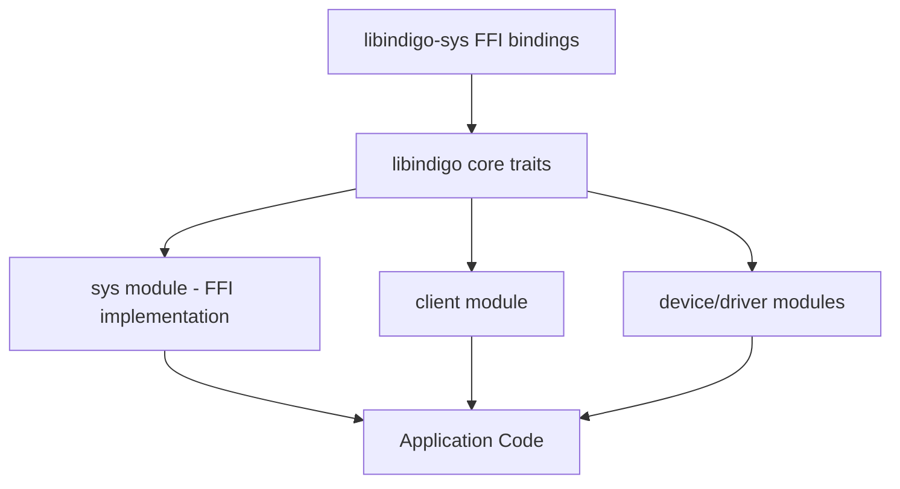
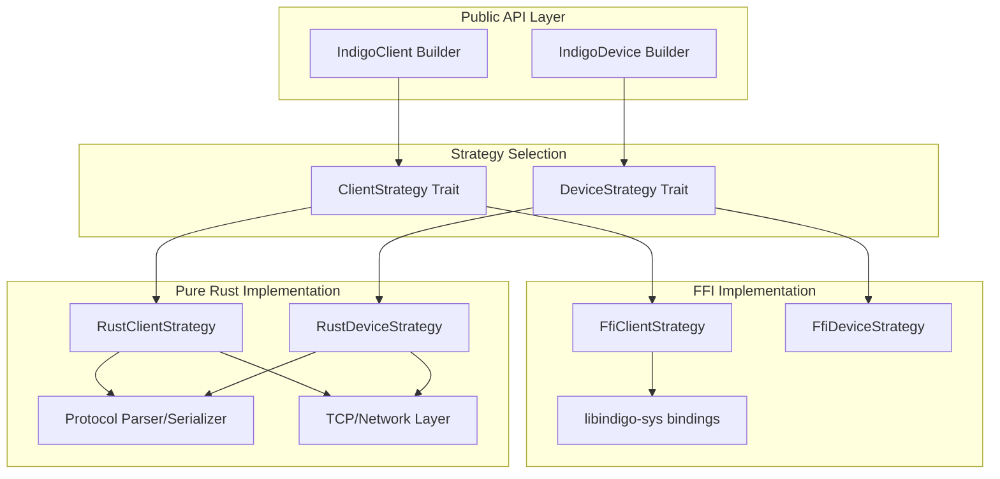

# LibINDIGO Rust API - Code Review & Architecture Plan

## Executive Summary

This document provides a comprehensive code review of the libindigo-rs crate and proposes an architectural redesign to create a production-ready Rust API for INDIGO clients (and future device drivers) using a dual strategy pattern.

**Key Goals:**

1. Implement dual strategy pattern: FFI bindings OR pure Rust protocol implementation
2. Follow idiomatic Rust patterns and best practices
3. Add async/tokio support for modern Rust ecosystem integration
4. Ensure architecture supports future device driver development
5. Accept breaking changes to achieve production quality

---

## Current State Analysis

### Architecture Overview

The current codebase has three main layers:



### Identified Issues

#### 1. **Synchronous-Only API**

- **Issue**: No async/await support, blocking operations throughout
- **Impact**: Cannot integrate with modern Rust async ecosystem (tokio, async-std)
- **Evidence**: No `async` keywords, no `Future` types in codebase
- **Files**: All controller/delegate traits in [`src/indigo.rs`](src/indigo.rs:470-479)

#### 2. **Tight Coupling to FFI Implementation**

- **Issue**: Core traits assume FFI implementation, no abstraction for pure Rust
- **Impact**: Cannot implement protocol-level pure Rust client
- **Evidence**: [`SysClientController`](src/sys.rs:483-489) directly uses raw pointers
- **Files**: [`src/sys.rs`](src/sys.rs:1-400), [`src/indigo.rs`](src/indigo.rs:1-300)

#### 3. **Non-Idiomatic Rust Patterns**

**3a. Excessive Use of Raw Pointers**

```rust
// src/sys.rs:483-489
pub struct SysClientController<D> {
    sys: *mut indigo_client,  // Raw pointer - not idiomatic
    delegate: PhantomData<D>,
}
```

- Should use safer abstractions or clearly document safety invariants

**3b. Manual Memory Management**

```rust
// src/sys.rs:570-596 - Manual Box::into_raw/from_raw
let state = Box::new(RwLock::new(c));
client_context: Box::into_raw(state) as *mut c_void,
```

- Prone to memory leaks if not carefully managed
- No clear ownership model

**3c. Inconsistent Error Handling**

```rust
// Multiple error types without clear hierarchy
pub struct IndigoError { msg: String }
pub struct SysError { msg: &'static str }
pub enum BusError { ... }
```

- Should use `thiserror` or similar for better error ergonomics

**3d. Trait Design Issues**

- Complex associated type requirements make traits hard to implement
- Generic parameters proliferate: `ClientModel<P,B,C>` requires 3 type params
- No clear separation between sync and async APIs

#### 4. **String Handling Inefficiencies**

- **Issue**: Excessive string copying between C and Rust
- **Impact**: Performance overhead, memory allocations
- **Evidence**: [`ISSUES.md`](ISSUES.md:29-36) acknowledges this
- **Files**: String conversions throughout [`src/sys.rs`](src/sys.rs:1-400)

#### 5. **Incomplete Protocol Implementation**

- **Issue**: [`src/protocol.rs`](src/protocol.rs:1-18) is a stub with DTD parsing
- **Impact**: No pure Rust protocol implementation path
- **Evidence**: File contains only example code

#### 6. **Missing Async Primitives**

- **Issue**: No channels, streams, or async event handling
- **Impact**: Cannot build reactive applications
- **Evidence**: Callback-based design in [`src/client.rs`](src/client.rs:9)

#### 7. **Thread Safety Concerns**

- **Issue**: Manual `unsafe impl Sync/Send` without clear justification
- **Evidence**: [`src/indigo.rs`](src/indigo.rs:122-123)

```rust
unsafe impl Sync for IndigoError {}
unsafe impl Send for IndigoError {}
```

#### 8. **Lack of Builder Patterns**

- **Issue**: Complex constructors with many parameters
- **Impact**: Hard to use API, unclear required vs optional parameters
- **Evidence**: Property creation in [`src/property.rs`](src/property.rs:167-183)

#### 9. **No Strategy Pattern Implementation**

- **Issue**: Cannot choose between FFI and pure Rust at runtime/compile-time
- **Impact**: Users locked into FFI implementation
- **Evidence**: Only FFI implementation exists

#### 10. **Device Driver Support Not Architected**

- **Issue**: Device traits exist but incomplete, no clear path forward
- **Impact**: Cannot build device drivers yet
- **Evidence**: [`src/device.rs`](src/device.rs:1-201), [`src/driver.rs`](src/driver.rs:1-200) incomplete

---

## Proposed Architecture

### Dual Strategy Pattern Design



### Core Design Principles

1. **Strategy Pattern**: Runtime or compile-time selection between FFI and pure Rust
2. **Async-First**: All I/O operations return `Future`s, compatible with tokio
3. **Type Safety**: Leverage Rust's type system, minimize `unsafe`
4. **Builder Pattern**: Ergonomic API construction
5. **Zero-Cost Abstractions**: Strategy selection at compile time via features
6. **Clear Ownership**: No manual memory management in public API

---

## Detailed Design

### 1. Feature Flags

```toml
[features]
default = ["async", "ffi-strategy"]
async = ["tokio"]
ffi-strategy = ["libindigo-sys"]
pure-rust-strategy = ["quick-xml", "tokio"]
blocking = []  # Sync wrappers around async
```

### 2. Core Trait Hierarchy

```rust
// Core async traits
pub trait ClientStrategy: Send + Sync {
    async fn connect(&mut self, url: &str) -> Result<()>;
    async fn disconnect(&mut self) -> Result<()>;
    fn property_stream(&self) -> PropertyStream;
    async fn send_property(&mut self, prop: Property) -> Result<()>;
}

pub trait DeviceStrategy: Send + Sync {
    async fn attach(&mut self) -> Result<()>;
    async fn detach(&mut self) -> Result<()>;
    async fn define_property(&mut self, prop: Property) -> Result<()>;
    async fn update_property(&mut self, prop: Property) -> Result<()>;
}
```

### 3. Builder Pattern API

```rust
// Ergonomic client construction
let client = IndigoClient::builder()
    .name("MyClient")
    .strategy(FfiStrategy::new())  // or RustStrategy::new()
    .connect("localhost:7624")
    .await?;

// Stream-based event handling
let mut properties = client.property_stream();
while let Some(event) = properties.next().await {
    match event {
        PropertyEvent::Defined(prop) => { /* ... */ }
        PropertyEvent::Updated(prop) => { /* ... */ }
        PropertyEvent::Deleted(prop) => { /* ... */ }
    }
}
```

### 4. Error Handling

```rust
use thiserror::Error;

#[derive(Error, Debug)]
pub enum IndigoError {
    #[error("Connection failed: {0}")]
    ConnectionError(String),

    #[error("Protocol error: {0}")]
    ProtocolError(String),

    #[error("FFI error: {0}")]
    FfiError(#[from] FfiError),

    #[error("I/O error: {0}")]
    IoError(#[from] std::io::Error),

    #[error("Property not found: {0}")]
    PropertyNotFound(String),
}

pub type Result<T> = std::result::Result<T, IndigoError>;
```

### 5. Async Event Streams

```rust
use tokio::sync::mpsc;
use futures::Stream;

pub struct PropertyStream {
    receiver: mpsc::UnboundedReceiver<PropertyEvent>,
}

impl Stream for PropertyStream {
    type Item = PropertyEvent;

    fn poll_next(mut self: Pin<&mut Self>, cx: &mut Context<'_>)
        -> Poll<Option<Self::Item>>
    {
        self.receiver.poll_recv(cx)
    }
}
```

### 6. Module Structure

```
src/
├── lib.rs                    # Public API exports
├── error.rs                  # Error types using thiserror
├── types/                    # Core types
│   ├── mod.rs
│   ├── property.rs          # Property types
│   ├── device.rs            # Device types
│   └── value.rs             # Value types
├── client/                   # Client API
│   ├── mod.rs
│   ├── builder.rs           # Client builder
│   ├── strategy.rs          # ClientStrategy trait
│   └── stream.rs            # Event streams
├── device/                   # Device API (future)
│   ├── mod.rs
│   ├── builder.rs
│   └── strategy.rs
├── strategies/               # Strategy implementations
│   ├── mod.rs
│   ├── ffi/                 # FFI strategy
│   │   ├── mod.rs
│   │   ├── client.rs
│   │   └── device.rs
│   └── pure_rust/           # Pure Rust strategy
│       ├── mod.rs
│       ├── client.rs
│       ├── device.rs
│       ├── protocol.rs      # XML protocol parser
│       └── transport.rs     # TCP transport
└── blocking/                 # Sync wrappers (optional)
    ├── mod.rs
    └── client.rs
```

---

## Implementation Roadmap

### Phase 1: Foundation & Core Types (Breaking Changes)

**Goal**: Establish idiomatic Rust foundation

1. **Reorganize module structure** as outlined above
2. **Implement error types** using `thiserror`
3. **Redesign core types** (Property, Device, etc.) with:
   - Builder patterns
   - Clear ownership
   - Derive macros (Debug, Clone, etc.)
4. **Define strategy traits** (ClientStrategy, DeviceStrategy)
5. **Add comprehensive documentation** with examples

**Deliverables**:

- New module structure
- `error.rs` with all error types
- `types/` module with core types
- Strategy trait definitions
- Updated `Cargo.toml` with new dependencies

### Phase 2: Async FFI Strategy

**Goal**: Wrap existing FFI in async API

1. **Create async FFI client strategy**
   - Wrap synchronous FFI calls in `tokio::task::spawn_blocking`
   - Implement `ClientStrategy` trait
   - Convert callbacks to async streams using channels
2. **Implement property event streams**
   - Use `tokio::sync::mpsc` for event distribution
   - Implement `Stream` trait
3. **Create client builder**
   - Ergonomic API for client construction
   - Strategy selection
4. **Add integration tests** with real INDIGO server

**Deliverables**:

- `strategies/ffi/client.rs` implementing `ClientStrategy`
- `client/stream.rs` with event streams
- `client/builder.rs` with builder pattern
- Integration tests

### Phase 3: Pure Rust Strategy (Client Only)

**Goal**: Implement protocol-level pure Rust client

1. **Implement INDIGO XML protocol parser**
   - Use `quick-xml` for parsing
   - Serialize/deserialize INDIGO messages
2. **Implement TCP transport layer**
   - Use `tokio::net::TcpStream`
   - Handle connection lifecycle
3. **Create pure Rust client strategy**
   - Implement `ClientStrategy` trait
   - Full protocol implementation
4. **Add protocol compliance tests**
   - Test against reference INDIGO server
   - Ensure interoperability

**Deliverables**:

- `strategies/pure_rust/protocol.rs` with XML parser
- `strategies/pure_rust/transport.rs` with TCP layer
- `strategies/pure_rust/client.rs` implementing `ClientStrategy`
- Protocol compliance test suite

### Phase 4: Device Driver Support

**Goal**: Enable device driver development

1. **Design device driver architecture**
   - Define `DeviceStrategy` trait fully
   - Property management
   - State machine for device lifecycle
2. **Implement FFI device strategy**
   - Wrap INDIGO device FFI
   - Async property updates
3. **Implement pure Rust device strategy**
   - Server-side protocol handling
   - Property broadcasting
4. **Create device builder API**
5. **Add device driver examples**

**Deliverables**:

- `device/` module with full API
- `strategies/ffi/device.rs`
- `strategies/pure_rust/device.rs`
- Example device drivers

### Phase 5: Optimization & Polish

**Goal**: Production-ready quality

1. **Performance optimization**
   - Minimize allocations
   - Zero-copy where possible
   - Benchmark against C implementation
2. **Add blocking API wrappers** (optional feature)
   - Sync wrappers around async for compatibility
3. **Comprehensive documentation**
   - API docs
   - User guide
   - Migration guide from old API
4. **CI/CD improvements**
   - Automated testing
   - Benchmarks
   - Documentation generation

**Deliverables**:

- `blocking/` module with sync wrappers
- Performance benchmarks
- Complete documentation
- CI/CD pipeline

---

## Idiomatic Rust Improvements

### 1. Replace Raw Pointers with Safe Abstractions

**Before**:

```rust
pub struct SysClientController<D> {
    sys: *mut indigo_client,
    delegate: PhantomData<D>,
}
```

**After**:

```rust
pub struct FfiClient {
    inner: Arc<Mutex<FfiClientInner>>,
}

struct FfiClientInner {
    sys: NonNull<indigo_client>,
    _pin: PhantomPinned,
}

impl Drop for FfiClientInner {
    fn drop(&mut self) {
        unsafe { /* proper cleanup */ }
    }
}
```

### 2. Use `thiserror` for Errors

**Before**:

```rust
pub struct IndigoError {
    msg: String,
}
```

**After**:

```rust
#[derive(Error, Debug)]
pub enum IndigoError {
    #[error("Connection failed: {0}")]
    ConnectionError(String),
    // ... more variants
}
```

### 3. Builder Pattern for Complex Types

**Before**:

```rust
PropertyValue::number(value, target, format, step, max, min)
```

**After**:

```rust
NumberProperty::builder()
    .value(42.0)
    .range(0.0..100.0)
    .step(1.0)
    .format("%5.2f")
    .build()?
```

### 4. Use Channels Instead of Callbacks

**Before**:

```rust
type DeviceHook<P> = fn(&ClientDeviceModel<P>, &ClientDeviceEvent) -> IndigoResult<()>;
```

**After**:

```rust
let (tx, mut rx) = mpsc::unbounded_channel();
tokio::spawn(async move {
    while let Some(event) = rx.recv().await {
        // Handle event
    }
});
```

### 5. Leverage Type System for State

**Before**:

```rust
// State tracked at runtime
if client.is_connected() { /* ... */ }
```

**After**:

```rust
// State tracked in types
struct Disconnected;
struct Connected;

struct Client<S> {
    state: PhantomData<S>,
    // ...
}

impl Client<Disconnected> {
    async fn connect(self) -> Result<Client<Connected>> { /* ... */ }
}

impl Client<Connected> {
    async fn disconnect(self) -> Result<Client<Disconnected>> { /* ... */ }
}
```

### 6. Use `derive` Macros

**Before**:

```rust
// Manual implementations
```

**After**:

```rust
#[derive(Debug, Clone, PartialEq, Eq, Hash)]
#[derive(serde::Serialize, serde::Deserialize)]
pub struct Property {
    // ...
}
```

### 7. Const Generics for Fixed-Size Buffers

**Before**:

```rust
name: [i8; 128]
```

**After**:

```rust
struct FixedString<const N: usize> {
    data: [u8; N],
    len: usize,
}
```

---

## Breaking Changes Summary

### API Changes

1. **All I/O operations become async**
   - `fn connect()` → `async fn connect()`
   - Requires tokio runtime

2. **Trait hierarchy simplified**
   - Remove complex associated types
   - Separate sync/async traits

3. **Error types consolidated**
   - Single `IndigoError` enum
   - Implements `std::error::Error`

4. **Builder pattern required**
   - No direct constructors
   - Use `Client::builder()`

5. **Event handling via streams**
   - No more callbacks
   - Use `Stream` trait

6. **Module reorganization**
   - `libindigo::client` → `libindigo::client`
   - `libindigo::sys` → `libindigo::strategies::ffi`

### Migration Path

```rust
// Old API
let client = SysClientController::new(delegate);
client.attach(&mut bus)?;

// New API
let client = IndigoClient::builder()
    .name("MyClient")
    .strategy(FfiStrategy::new())
    .build()
    .await?;

let mut events = client.property_stream();
while let Some(event) = events.next().await {
    // Handle event
}
```

---

## Dependencies to Add

```toml
[dependencies]
tokio = { version = "1.35", features = ["full"], optional = true }
futures = "0.3"
thiserror = "1.0"
async-trait = "0.1"
pin-project = "1.1"
quick-xml = { version = "0.31", optional = true }
serde = { version = "1.0", features = ["derive"] }
tracing = "0.1"  # Replace log with tracing
```

---

## Testing Strategy

### Unit Tests

- Test each strategy independently
- Mock network layer for pure Rust strategy
- Property parsing/serialization

### Integration Tests

- Test against real INDIGO server
- Both FFI and pure Rust strategies
- Ensure protocol compatibility

### Benchmarks

- Compare FFI vs pure Rust performance
- Memory usage
- Latency measurements

### Compliance Tests

- INDIGO protocol compliance
- Interoperability with C clients/devices

---

## Documentation Requirements

1. **API Documentation**
   - All public items documented
   - Examples for common use cases
   - Safety documentation for unsafe code

2. **User Guide**
   - Getting started tutorial
   - Strategy selection guide
   - Migration guide from old API

3. **Architecture Documentation**
   - Design decisions
   - Strategy pattern explanation
   - Async model explanation

4. **Examples**
   - Simple client
   - Property monitoring
   - Device driver (future)

---

## Success Criteria

1. ✅ **Idiomatic Rust**: Passes `clippy` with no warnings
2. ✅ **Async Support**: Full tokio integration
3. ✅ **Dual Strategy**: Both FFI and pure Rust work
4. ✅ **Type Safety**: Minimal `unsafe`, all documented
5. ✅ **Performance**: Within 10% of C implementation
6. ✅ **Documentation**: 100% public API documented
7. ✅ **Testing**: >80% code coverage
8. ✅ **Device Support**: Architecture supports future device drivers

---

## Risk Assessment

### High Risk

- **FFI async wrapping complexity**: Callbacks to streams conversion
  - *Mitigation*: Prototype early, use proven patterns

### Medium Risk

- **Pure Rust protocol implementation**: Ensuring full compatibility
  - *Mitigation*: Extensive testing against reference implementation

- **Performance regression**: Async overhead
  - *Mitigation*: Benchmark continuously, optimize hot paths

### Low Risk

- **Breaking changes**: No production users yet
  - *Mitigation*: Clear migration guide

---

## Timeline Estimate

**Note**: No time estimates provided per requirements. Phases are ordered by priority and dependency.

---

## Next Steps

1. **Review and approve this plan** with stakeholders
2. **Create GitHub issues** for each phase
3. **Set up project board** for tracking
4. **Begin Phase 1** implementation
5. **Establish CI/CD pipeline** early

---

## Appendix: Code Examples

### Example 1: Simple Client

```rust
use libindigo::prelude::*;

#[tokio::main]
async fn main() -> Result<()> {
    // Create client with FFI strategy
    let client = IndigoClient::builder()
        .name("SimpleClient")
        .strategy(FfiStrategy::new())
        .build()
        .await?;

    // Connect to server
    client.connect("localhost:7624").await?;

    // Stream property events
    let mut properties = client.property_stream();

    while let Some(event) = properties.next().await {
        match event {
            PropertyEvent::Defined(prop) => {
                println!("Property defined: {}", prop.name());
            }
            PropertyEvent::Updated(prop) => {
                println!("Property updated: {}", prop.name());
            }
            _ => {}
        }
    }

    Ok(())
}
```

### Example 2: Strategy Selection at Compile Time

```rust
#[cfg(feature = "ffi-strategy")]
type DefaultStrategy = FfiStrategy;

#[cfg(all(feature = "pure-rust-strategy", not(feature = "ffi-strategy")))]
type DefaultStrategy = RustStrategy;

let client = IndigoClient::builder()
    .name("MyClient")
    .strategy(DefaultStrategy::new())
    .build()
    .await?;
```

### Example 3: Property Builder

```rust
let property = NumberProperty::builder()
    .device("CCD Simulator")
    .name("CCD_EXPOSURE")
    .group("Main")
    .label("Exposure")
    .item(
        NumberItem::builder()
            .name("EXPOSURE")
            .label("Duration (s)")
            .value(1.0)
            .range(0.001..3600.0)
            .step(0.001)
            .format("%5.3f")
            .build()?
    )
    .permission(Permission::ReadWrite)
    .state(State::Idle)
    .build()?;
```

---

## Conclusion

This architectural redesign will transform libindigo-rs into a production-ready, idiomatic Rust library that:

1. Provides both FFI and pure Rust implementation strategies
2. Integrates seamlessly with the async Rust ecosystem
3. Follows Rust best practices and idioms
4. Supports future device driver development
5. Maintains compatibility with the INDIGO protocol

The phased approach allows for incremental development while maintaining a clear path to the final architecture.
