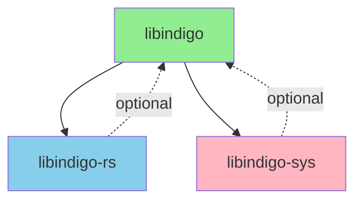

# Crate Restructuring Architecture Plan v2

## Executive Summary

This document proposes a restructuring of the libindigo project to achieve:

1. **`libindigo`** remains the main crate for Client API (and future Device API)
2. **`libindigo-sys`** contains FFI strategy implementation
3. **`libindigo-rs`** contains pure Rust strategy implementation (zero FFI deps)
4. **Feature-based selection** between `rs` and `ffi` strategies
5. **SPI pattern** allows external strategy implementations
6. **Zero FFI dependencies** when using `rs` feature or external SPI

## Revised Architecture

### Workspace Structure

```
libindigo-workspace/
├── libindigo/             # Main crate: Client API + constants
├── libindigo-sys/         # FFI strategy (existing, renamed from sys/)
├── libindigo-rs/          # Pure Rust strategy (NEW)
└── relm/                  # GUI application (unchanged)
```

### Crate Responsibilities

#### 1. `libindigo` - Main Client API Crate

**Purpose**: Client API, Device API (future), INDIGO constants, and SPI trait

**Contents**:

- Client API: `Client`, `ClientBuilder`
- `ClientStrategy` trait (the SPI)
- Core types: `Property`, `PropertyType`, `PropertyValue`, etc.
- INDIGO constants (pre-generated from `props.rs`)
- Protocol types and traits
- Error types

**Dependencies**:

```toml
[dependencies]
# Core dependencies (always present)
serde = { version = "1.0", default-features = false }
tokio = { version = "1.35", features = ["rt-multi-thread", "sync", "macros", "time", "net", "io-util"], optional = true }
async-trait = "0.1"
thiserror = "1.0"
chrono = "0.4"
# ... other core deps

# Strategy implementations (optional)
libindigo-rs = { version = "0.2", path = "../libindigo-rs", optional = true }
libindigo-sys = { version = "0.2", path = "../libindigo-sys", optional = true }

[features]
default = ["client", "rs"]

# API features
client = ["tokio"]
device = []  # Future: Device API

# Strategy features (mutually exclusive in practice, but can coexist)
rs = ["libindigo-rs"]
ffi = ["libindigo-sys"]

# Other features
async = ["tokio"]
std = []
```

**Key Point**: When published to crates.io, downstream users can:

```toml
# Pure Rust (default)
libindigo = "0.2"

# FFI strategy
libindigo = { version = "0.2", default-features = false, features = ["client", "ffi"] }

# External SPI (no built-in strategy)
libindigo = { version = "0.2", default-features = false, features = ["client"] }
```

**Build Script** ([`libindigo/build.rs`]):

```rust
fn main() -> std::io::Result<()> {
    // No build-time generation needed!
    // Constants are pre-generated in src/constants.rs

    // Only check that at least one strategy is available at runtime
    // (This is a compile-time check via feature flags)

    println!("cargo:rerun-if-changed=src/constants.rs");
    Ok(())
}
```

**Constants** ([`libindigo/src/constants.rs`]):

```rust
// INDIGO Protocol Constants
// Generated from INDIGO 2.0.300
// To regenerate: see scripts/generate_constants.sh

pub const INFO_PROPERTY: &str = "INFO";
pub const INFO_DEVICE_INTERFACE_ITEM: &str = "DEVICE_INTERFACE";
pub const CONNECTION_PROPERTY: &str = "CONNECTION";
// ... 1000+ constants from props.rs
```

**SPI Trait** ([`libindigo/src/client/strategy.rs`]):

```rust
#[async_trait]
pub trait ClientStrategy: Send + Sync {
    async fn connect(&mut self, url: &str) -> Result<()>;
    async fn disconnect(&mut self) -> Result<()>;
    async fn enumerate_properties(&mut self, device: Option<&str>) -> Result<()>;
    async fn send_property(&mut self, property: Property) -> Result<()>;
    async fn property_receiver(&self) -> Option<mpsc::UnboundedReceiver<Property>>;
}
```

**Strategy Selection** ([`libindigo/src/client/builder.rs`]):

```rust
impl ClientBuilder {
    pub fn new() -> Self {
        Self {
            strategy: None,
            // ... other fields
        }
    }

    /// Use pure Rust strategy (requires 'rs' feature)
    #[cfg(feature = "rs")]
    pub fn with_rs_strategy(mut self) -> Self {
        self.strategy = Some(Box::new(libindigo_rs::RsClientStrategy::new()));
        self
    }

    /// Use FFI strategy (requires 'ffi' feature)
    #[cfg(feature = "ffi")]
    pub fn with_ffi_strategy(mut self) -> Self {
        self.strategy = Some(Box::new(libindigo_sys::FfiClientStrategy::new()));
        self
    }

    /// Use custom strategy (always available)
    pub fn with_strategy(mut self, strategy: Box<dyn ClientStrategy>) -> Self {
        self.strategy = Some(strategy);
        self
    }

    pub fn build(self) -> Result<Client> {
        let strategy = self.strategy.ok_or_else(|| {
            IndigoError::Configuration(
                "No ClientStrategy provided. Either:\n\
                 1. Enable 'rs' feature: libindigo = { version = \"0.2\", features = [\"rs\"] }\n\
                 2. Enable 'ffi' feature: libindigo = { version = \"0.2\", features = [\"ffi\"] }\n\
                 3. Provide custom strategy: builder.with_strategy(my_strategy)\n\
                 4. Add external SPI crate as dependency".to_string()
            )
        })?;

        Ok(Client::new(strategy))
    }
}

// Convenience: auto-select strategy if only one feature is enabled
impl Default for ClientBuilder {
    fn default() -> Self {
        let mut builder = Self::new();

        #[cfg(all(feature = "rs", not(feature = "ffi")))]
        {
            builder = builder.with_rs_strategy();
        }

        #[cfg(all(feature = "ffi", not(feature = "rs")))]
        {
            builder = builder.with_ffi_strategy();
        }

        builder
    }
}
```

**File Structure**:

```
libindigo/
├── src/
│   ├── lib.rs
│   ├── constants.rs          # Pre-generated INDIGO constants
│   ├── error.rs
│   ├── client/
│   │   ├── mod.rs
│   │   ├── builder.rs        # ClientBuilder with strategy selection
│   │   ├── client.rs         # Client implementation
│   │   └── strategy.rs       # ClientStrategy trait (SPI)
│   ├── types/
│   │   ├── mod.rs
│   │   ├── property.rs
│   │   ├── value.rs
│   │   └── device.rs
│   └── device/               # Future: Device API
│       └── mod.rs
├── build.rs                  # Minimal (no generation)
└── Cargo.toml
```

#### 2. `libindigo-rs` - Pure Rust Strategy

**Purpose**: Pure Rust implementation of `ClientStrategy` trait

**Contents**:

- `RsClientStrategy` implementation
- TCP transport layer
- XML/JSON protocol parsers
- Protocol negotiation
- Zero C dependencies

**Dependencies**:

```toml
[dependencies]
libindigo = { version = "0.2", path = "../libindigo", default-features = false, features = ["client"] }
tokio = { version = "1.35", features = ["rt-multi-thread", "sync", "macros", "time", "net", "io-util"] }
quick-xml = "0.31"
serde_json = "1.0"
base64 = "0.21"
async-trait = "0.1"
# ... other pure Rust deps

[features]
default = ["xml", "json"]
xml = ["quick-xml"]
json = ["serde_json"]
```

**Key Point**: This crate has **ZERO** FFI dependencies. It can be published and used independently.

**File Structure**:

```
libindigo-rs/
├── src/
│   ├── lib.rs
│   ├── strategy.rs           # RsClientStrategy implementation
│   ├── transport.rs          # TCP transport
│   ├── protocol.rs           # XML protocol
│   ├── protocol_json.rs      # JSON protocol
│   └── protocol_negotiation.rs
└── Cargo.toml
```

#### 3. `libindigo-sys` - FFI Strategy

**Purpose**: FFI-based implementation using upstream INDIGO C library

**Contents**:

- `FfiClientStrategy` implementation
- `AsyncFfiStrategy` implementation
- Raw FFI bindings
- C library build integration

**Dependencies**:

```toml
[dependencies]
libindigo = { version = "0.2", path = "../libindigo", default-features = false, features = ["client"] }
tokio = { version = "1.35", features = ["rt-multi-thread", "sync", "macros"], optional = true }
async-trait = "0.1"
# ... FFI-related deps

[build-dependencies]
bindgen = "0.71"
cc = "1.0"
# ... build deps

[features]
default = []
async = ["tokio"]
```

**Build Script** ([`libindigo-sys/build.rs`]):

- Handles INDIGO C library compilation
- Git submodule or system library detection
- Generates FFI bindings

**File Structure**:

```
libindigo-sys/
├── src/
│   ├── lib.rs
│   ├── strategy.rs           # FfiClientStrategy implementation
│   ├── async_strategy.rs     # AsyncFfiStrategy implementation
│   └── bindings.rs           # Generated FFI bindings
├── build.rs                  # C library build
└── Cargo.toml
```

## Dependency Graph



**Key Properties**:

- `libindigo`: Core API, no strategy dependencies by default
- `libindigo-rs`: Implements `libindigo::ClientStrategy`, zero FFI
- `libindigo-sys`: Implements `libindigo::ClientStrategy`, requires C library
- Optional dependencies prevent circular issues

## Usage Examples

### Example 1: Pure Rust Client (Default)

```rust
// Cargo.toml
[dependencies]
libindigo = "0.2"  # defaults to ["client", "rs"]
tokio = { version = "1", features = ["full"] }

// main.rs
use libindigo::{Client, ClientBuilder};

#[tokio::main]
async fn main() -> Result<(), Box<dyn std::error::Error>> {
    // Auto-selects RsClientStrategy (only 'rs' feature enabled)
    let client = ClientBuilder::default().build()?;

    client.connect("localhost:7624").await?;
    Ok(())
}
```

### Example 2: FFI Client

```rust
// Cargo.toml
[dependencies]
libindigo = { version = "0.2", default-features = false, features = ["client", "ffi"] }
tokio = { version = "1", features = ["full"] }

// main.rs
use libindigo::{Client, ClientBuilder};

#[tokio::main]
async fn main() -> Result<(), Box<dyn std::error::Error>> {
    // Auto-selects FfiClientStrategy (only 'ffi' feature enabled)
    let client = ClientBuilder::default().build()?;

    client.connect("localhost:7624").await?;
    Ok(())
}
```

### Example 3: External SPI Implementation

```rust
// Cargo.toml
[dependencies]
libindigo = { version = "0.2", default-features = false, features = ["client"] }
my-custom-strategy = "1.0"
tokio = { version = "1", features = ["full"] }

// main.rs
use libindigo::{Client, ClientBuilder};
use my_custom_strategy::MyStrategy;

#[tokio::main]
async fn main() -> Result<(), Box<dyn std::error::Error>> {
    let strategy = MyStrategy::new();
    let client = ClientBuilder::new()
        .with_strategy(Box::new(strategy))
        .build()?;

    client.connect("localhost:7624").await?;
    Ok(())
}
```

### Example 4: Explicit Strategy Selection

```rust
// Cargo.toml
[dependencies]
libindigo = { version = "0.2", features = ["rs", "ffi"] }  # Both available
tokio = { version = "1", features = ["full"] }

// main.rs
use libindigo::{Client, ClientBuilder};

#[tokio::main]
async fn main() -> Result<(), Box<dyn std::error::Error>> {
    // Explicitly choose RS strategy
    let client = ClientBuilder::new()
        .with_rs_strategy()
        .build()?;

    // Or explicitly choose FFI strategy
    let client = ClientBuilder::new()
        .with_ffi_strategy()
        .build()?;

    client.connect("localhost:7624").await?;
    Ok(())
}
```

### Example 5: No Strategy (Compile Error)

```rust
// Cargo.toml
[dependencies]
libindigo = { version = "0.2", default-features = false, features = ["client"] }
# No strategy crate!

// main.rs
use libindigo::{Client, ClientBuilder};

#[tokio::main]
async fn main() -> Result<(), Box<dyn std::error::Error>> {
    // This will return an error with helpful message
    let client = ClientBuilder::default().build()?;
    // Error: "No ClientStrategy provided. Either:
    //  1. Enable 'rs' feature: libindigo = { version = "0.2", features = ["rs"] }
    //  2. Enable 'ffi' feature: libindigo = { version = "0.2", features = ["ffi"] }
    //  3. Provide custom strategy: builder.with_strategy(my_strategy)
    //  4. Add external SPI crate as dependency"

    Ok(())
}
```

## Constants Generation Strategy

### Pre-generated Constants (Checked into Git)

**File**: [`libindigo/src/constants.rs`]

```rust
// INDIGO Protocol Constants
// Generated from INDIGO 2.0.300
// Source: indigo_names.h
// To regenerate: ./scripts/generate_constants.sh

pub const INFO_PROPERTY: &str = "INFO";
pub const INFO_DEVICE_INTERFACE_ITEM: &str = "DEVICE_INTERFACE";
// ... 1000+ constants
```

**Benefits**:

1. ✅ No build-time dependency on INDIGO C headers
2. ✅ Fast compilation (no code generation)
3. ✅ Works for pure Rust builds
4. ✅ Works for FFI builds
5. ✅ Easy to update (run script, commit changes)

**Update Script**: [`scripts/generate_constants.sh`]

```bash
#!/bin/bash
# Generate constants from INDIGO headers

INDIGO_SOURCE="${1:-sys/externals/indigo}"
HEADER="$INDIGO_SOURCE/indigo_libs/indigo/indigo_names.h"

if [ ! -f "$HEADER" ]; then
    echo "Error: INDIGO header not found at $HEADER"
    exit 1
fi

# Parse header and generate Rust constants
# (Use existing logic from build.rs)
cargo run --manifest-path tools/const-gen/Cargo.toml -- "$HEADER" > libindigo/src/constants.rs

echo "Constants generated in libindigo/src/constants.rs"
echo "Please review and commit the changes"
```

## Migration Strategy

### Phase 1: Restructure Existing Code (Week 1)

**Step 1.1**: Create `libindigo-rs` crate

```bash
mkdir libindigo-rs
cp -r src/strategies/rs/* libindigo-rs/src/
# Create libindigo-rs/Cargo.toml
# Update imports to use libindigo::ClientStrategy
```

**Step 1.2**: Move constants to source

```bash
cp props.rs libindigo/src/constants.rs
# Update libindigo/src/lib.rs to include constants.rs
```

**Step 1.3**: Rename `sys/` to `libindigo-sys/`

```bash
mv sys libindigo-sys
# Update workspace Cargo.toml
```

**Step 1.4**: Update `libindigo/Cargo.toml`

```toml
[dependencies]
libindigo-rs = { version = "0.2", path = "../libindigo-rs", optional = true }
libindigo-sys = { version = "0.2", path = "../libindigo-sys", optional = true }

[features]
default = ["client", "rs"]
client = ["tokio"]
rs = ["libindigo-rs"]
ffi = ["libindigo-sys"]
```

**Step 1.5**: Update `libindigo/build.rs`

```rust
fn main() -> std::io::Result<()> {
    // No generation needed - constants are in src/constants.rs
    println!("cargo:rerun-if-changed=src/constants.rs");
    Ok(())
}
```

### Phase 2: Update Client Builder (Week 1)

**Step 2.1**: Update [`libindigo/src/client/builder.rs`]

- Add `with_rs_strategy()` method (gated by `#[cfg(feature = "rs")]`)
- Add `with_ffi_strategy()` method (gated by `#[cfg(feature = "ffi")]`)
- Update `build()` to return error if no strategy provided
- Update `Default` impl to auto-select strategy

**Step 2.2**: Update strategy implementations

- `libindigo-rs`: Implement `libindigo::ClientStrategy`
- `libindigo-sys`: Implement `libindigo::ClientStrategy`

### Phase 3: Update CI/CD (Week 2)

**Step 3.1**: Update workflows

```yaml
# Test pure Rust (no INDIGO submodule needed)
- name: Test Pure Rust
  run: cargo test --no-default-features --features client,rs

# Test FFI (with INDIGO submodule)
- name: Test FFI
  run: cargo test --no-default-features --features client,ffi
```

**Step 3.2**: Test matrix

- Pure Rust build (no submodule)
- FFI build (with submodule)
- No strategy build (should fail with clear error)

### Phase 4: Documentation and Examples (Week 2)

**Step 4.1**: Update README.md

- Document feature flags
- Show usage examples
- Explain SPI pattern

**Step 4.2**: Create examples

- `examples/pure_rust_client.rs`
- `examples/ffi_client.rs`
- `examples/custom_strategy.rs`

**Step 4.3**: Update API documentation

- Document `ClientStrategy` trait
- Document feature flags
- Document error messages

## CI/CD Configuration

### Workflow Jobs

```yaml
jobs:
  # Test pure Rust (fast, no C compilation)
  test-rs:
    runs-on: ubuntu-latest
    steps:
      - uses: actions/checkout@v4
      # No submodule checkout needed!

      - name: Install Rust
        uses: actions-rust-lang/setup-rust-toolchain@v1

      - name: Install avahi (for zeroconf if needed)
        run: sudo apt-get install -y libavahi-client-dev

      - name: Test libindigo with rs feature
        run: cargo test -p libindigo --no-default-features --features client,rs

      - name: Test libindigo-rs
        run: cargo test -p libindigo-rs

  # Test FFI (requires C compilation)
  test-ffi:
    runs-on: ubuntu-latest
    steps:
      - uses: actions/checkout@v4
        with:
          submodules: recursive  # Checkout INDIGO

      - name: Install Rust
        uses: actions-rust-lang/setup-rust-toolchain@v1

      - name: Install system dependencies
        run: |
          sudo apt-get update
          sudo apt-get install -y \
            build-essential \
            libudev-dev \
            libusb-1.0-0-dev \
            libavahi-client-dev \
            libglib2.0-dev \
            libgobject-2.0-dev

      - name: Test libindigo with ffi feature
        run: cargo test -p libindigo --no-default-features --features client,ffi

      - name: Test libindigo-sys
        run: cargo test -p libindigo-sys

  # Test no strategy (should fail gracefully)
  test-no-strategy:
    runs-on: ubuntu-latest
    steps:
      - uses: actions/checkout@v4

      - name: Install Rust
        uses: actions-rust-lang/setup-rust-toolchain@v1

      - name: Build without strategy (should compile)
        run: cargo build -p libindigo --no-default-features --features client

      - name: Test error message
        run: |
          # This should fail with helpful error message
          cargo run --example no_strategy 2>&1 | grep "No ClientStrategy provided"
```

## Benefits of This Architecture

### For Pure Rust Users

✅ Zero C dependencies (use `features = ["rs"]`)
✅ Fast compilation
✅ Cross-platform
✅ No system library requirements

### For FFI Users

✅ Full INDIGO features (use `features = ["ffi"]`)
✅ Hardware driver support
✅ Battle-tested C implementation

### For External SPI Developers

✅ Clear `ClientStrategy` trait to implement
✅ No forced dependency on built-in strategies
✅ Can publish independent strategy crates

### For Workspace Development

✅ Can build with both strategies for testing
✅ INDIGO submodule only needed for FFI builds
✅ Clear separation of concerns

### For CI/CD

✅ Fast pure Rust tests (no C compilation)
✅ Comprehensive FFI tests (with C library)
✅ Clear error messages for missing strategies

## Addressing Your Requirements

### ✅ No backward compatibility needed

- Clean break, new architecture
- Clear migration path

### ✅ `libindigo` is main crate

- Contains Client API
- Contains constants
- Contains `ClientStrategy` SPI trait

### ✅ `libindigo-sys` contains FFI strategy

- Renamed from `sys/`
- Implements `ClientStrategy`
- Optional dependency

### ✅ `libindigo-rs` contains pure Rust strategy

- New crate
- Implements `ClientStrategy`
- Zero FFI dependencies
- Optional dependency

### ✅ Feature-based selection

- `rs` feature → includes `libindigo-rs`
- `ffi` feature → includes `libindigo-sys`
- No features → external SPI expected

### ✅ Clear error for missing SPI

- `ClientBuilder::build()` returns error
- Error message explains options
- Compile succeeds, runtime fails gracefully

### ✅ No FFI dependency for pure Rust

- `libindigo` with `rs` feature has zero FFI deps
- `libindigo-rs` has zero FFI deps
- Can publish and use without C library

### ✅ Client/Device features

- `client` feature (default) → Client API
- `device` feature (future) → Device API
- Can build with neither for library usage

### ✅ Workspace can have INDIGO dependency

- Workspace builds both strategies
- Individual crates don't require it
- Published crates work independently

## Timeline

- **Week 1**: Restructure code, create new crates
- **Week 2**: Update CI/CD, documentation, examples
- **Total**: 2 weeks for complete migration

## Next Steps

1. **Review and approve** this architecture
2. **Create `libindigo-rs`** crate (Phase 1.1)
3. **Move constants** to source (Phase 1.2)
4. **Update features** and dependencies (Phase 1.4)
5. **Test locally** before pushing
6. **Update CI/CD** workflows
7. **Publish** new versions

---

**Document Version**: 2.0
**Date**: 2026-03-04
**Author**: Architecture Planning
**Status**: Proposed (Revised per feedback)
