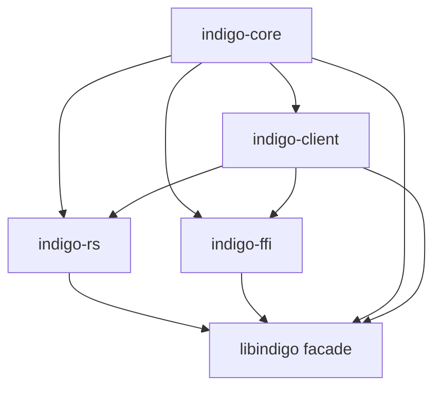

# Crate Restructuring Architecture Plan

## Executive Summary

This document proposes a restructuring of the libindigo project to achieve:

1. **Clean separation** between Client API and SPI (Service Provider Interface) implementations
2. **Zero FFI dependencies** for pure Rust builds
3. **Shared INDIGO constants** available to all implementations
4. **Publishable crates** with correct dependency graphs

## Current Architecture Issues

### Problem 1: Build Script Dependencies

The root [`build.rs`](../build.rs:29) currently:

- Always tries to access INDIGO submodule (even for pure Rust builds)
- Generates constants from C headers at build time
- Creates tight coupling between Client API and FFI implementation

### Problem 2: Monolithic Crate Structure

Current workspace:

```
libindigo/          # Main crate - contains everything
├── sys/            # FFI bindings to C library
└── relm/           # GUI application (separate concern)
```

Issues:

- Client API code mixed with SPI implementations
- Cannot publish pure Rust client without FFI dependencies
- INDIGO constants only available when building with FFI features

### Problem 3: Feature Flag Complexity

Current features in [`Cargo.toml`](../Cargo.toml:81):

```toml
default = ["async", "ffi-strategy", "sys", "std", "auto"]
ffi-strategy = ["libindigo-sys"]
rs-strategy = ["quick-xml", "tokio", "base64", "serde_json", "serde/derive"]
```

Problems:

- Default includes FFI (not suitable for pure Rust users)
- Cannot build Client API without choosing an implementation
- Constants generation tied to FFI features

## Proposed Architecture

### New Crate Structure

```
libindigo-workspace/
├── indigo-core/           # NEW: Core types and constants
├── indigo-client/         # NEW: Client API (SPI consumer)
├── indigo-rs/             # NEW: Pure Rust SPI implementation
├── indigo-ffi/            # RENAMED: FFI SPI implementation (was libindigo-sys)
├── libindigo/             # FACADE: Re-exports for backward compatibility
└── relm/                  # GUI application (unchanged)
```

### Crate Responsibilities

#### 1. `indigo-core` - Foundation Crate

**Purpose**: Shared types, traits, and constants used by all crates

**Contents**:

- INDIGO protocol constants (INFO_PROPERTY, CONNECTION_PROPERTY, etc.)
- Core types: `Property`, `PropertyType`, `PropertyValue`, `PropertyState`
- Protocol traits: `PropertyItem`, `VectorAttributes`
- Device interface enums
- Error types

**Dependencies**:

- Minimal: `serde`, `thiserror`, `chrono`, `bitflags`
- **NO** tokio, quick-xml, or FFI dependencies

**Build Strategy**:

- Include pre-generated constants from [`props.rs`](../props.rs:1) (checked into git)
- Optional: build script to regenerate from INDIGO headers (only when INDIGO_SOURCE env var set)
- This allows downstream users to build without INDIGO C library

**Key Files**:

```
indigo-core/
├── src/
│   ├── lib.rs
│   ├── constants.rs      # INDIGO property/item names
│   ├── types/
│   │   ├── property.rs
│   │   ├── value.rs
│   │   └── device.rs
│   ├── error.rs
│   └── traits.rs         # Device type traits (future)
└── Cargo.toml
```

#### 2. `indigo-client` - Client API Crate

**Purpose**: High-level Client API that works with any SPI implementation

**Contents**:

- `Client` struct
- `ClientBuilder` for configuration
- `ClientStrategy` trait (the SPI)
- Protocol negotiation logic
- Connection management
- Property subscription/streaming

**Dependencies**:

- `indigo-core` (required)
- `tokio` (for async runtime)
- `async-trait`
- **NO** implementation-specific dependencies

**Features**:

```toml
[features]
default = ["async"]
async = ["tokio"]
blocking = []  # Future: synchronous API
```

**Key Point**: This crate is **implementation-agnostic**. Users choose their SPI implementation by adding the appropriate dependency.

#### 3. `indigo-rs` - Pure Rust SPI Implementation

**Purpose**: Pure Rust implementation of `ClientStrategy` trait

**Contents**:

- `RsClientStrategy` implementation
- TCP transport layer
- XML/JSON protocol parsers
- Protocol negotiation
- Zero C dependencies

**Dependencies**:

- `indigo-core` (required)
- `indigo-client` (required - implements its SPI)
- `tokio`, `quick-xml`, `serde_json`, `base64`
- **NO** FFI dependencies

**Features**:

```toml
[features]
default = ["xml", "json"]
xml = ["quick-xml"]
json = ["serde_json"]
```

#### 4. `indigo-ffi` - FFI SPI Implementation

**Purpose**: FFI-based implementation using upstream INDIGO C library

**Contents**:

- `FfiClientStrategy` implementation
- `AsyncFfiStrategy` implementation
- Raw FFI bindings (moved from `libindigo-sys`)
- C library build integration

**Dependencies**:

- `indigo-core` (required)
- `indigo-client` (required - implements its SPI)
- `bindgen`, build dependencies for C library
- System libraries: libusb, libavahi, etc.

**Build Strategy**:

- `build.rs` handles INDIGO C library compilation
- Git submodule or system library detection
- Only built when explicitly requested

#### 5. `libindigo` - Facade Crate (Backward Compatibility)

**Purpose**: Maintain backward compatibility with existing code

**Contents**:

- Re-exports from `indigo-core`, `indigo-client`
- Feature flags to select SPI implementation
- Convenience imports

**Dependencies**:

```toml
[dependencies]
indigo-core = { version = "0.2", path = "../indigo-core" }
indigo-client = { version = "0.2", path = "../indigo-client" }
indigo-rs = { version = "0.2", path = "../indigo-rs", optional = true }
indigo-ffi = { version = "0.2", path = "../indigo-ffi", optional = true }

[features]
default = ["rs-strategy"]
rs-strategy = ["indigo-rs"]
ffi-strategy = ["indigo-ffi"]
async-ffi-strategy = ["indigo-ffi/async"]
```

**Usage Example**:

```rust
// Pure Rust (default)
[dependencies]
libindigo = "0.2"

// FFI implementation
[dependencies]
libindigo = { version = "0.2", features = ["ffi-strategy"] }
```

## Dependency Graph



**Key Properties**:

- `indigo-core`: No circular dependencies, minimal external deps
- `indigo-client`: Depends only on `indigo-core`
- `indigo-rs` & `indigo-ffi`: Implement `indigo-client` SPI
- `libindigo`: Optional facade for convenience

## Constants Generation Strategy

### Approach: Pre-generated + Optional Regeneration

**Checked-in Constants** ([`indigo-core/src/constants.rs`]):

```rust
// Generated from INDIGO 2.0.300
// To regenerate: INDIGO_SOURCE=/path/to/indigo cargo build

pub const INFO_PROPERTY: &str = "INFO";
pub const INFO_DEVICE_INTERFACE_ITEM: &str = "DEVICE_INTERFACE";
pub const CONNECTION_PROPERTY: &str = "CONNECTION";
// ... 1000+ more constants
```

**Build Script** ([`indigo-core/build.rs`]):

```rust
fn main() {
    // Only regenerate if explicitly requested
    if let Ok(indigo_source) = env::var("INDIGO_SOURCE") {
        generate_constants_from_headers(&indigo_source);
    } else {
        // Use pre-generated constants (already in src/constants.rs)
        println!("cargo:rerun-if-changed=src/constants.rs");
    }
}
```

**Benefits**:

1. ✅ Downstream users can build without INDIGO C library
2. ✅ Constants available to all implementations
3. ✅ Can update constants when INDIGO releases new version
4. ✅ No runtime dependency on C library for pure Rust builds

## Migration Strategy

### Phase 1: Create Core Crate (Week 1)

1. Create `indigo-core` crate
2. Move [`props.rs`](../props.rs:1) → `indigo-core/src/constants.rs`
3. Move core types from [`src/types/`](../src/types/mod.rs:1) → `indigo-core/src/types/`
4. Move error types → `indigo-core/src/error.rs`
5. Create simple build script (use pre-generated constants)
6. Publish `indigo-core` v0.2.0

### Phase 2: Extract Client API (Week 2)

1. Create `indigo-client` crate
2. Move [`src/client/`](../src/client/mod.rs:1) → `indigo-client/src/`
3. Move `ClientStrategy` trait
4. Update imports to use `indigo-core`
5. Ensure no implementation-specific code
6. Publish `indigo-client` v0.2.0

### Phase 3: Create RS Implementation (Week 2-3)

1. Create `indigo-rs` crate
2. Move [`src/strategies/rs/`](../src/strategies/rs/mod.rs:1) → `indigo-rs/src/`
3. Implement `ClientStrategy` from `indigo-client`
4. Remove all FFI dependencies
5. Test pure Rust builds
6. Publish `indigo-rs` v0.2.0

### Phase 4: Create FFI Implementation (Week 3)

1. Create `indigo-ffi` crate
2. Move [`sys/`](../sys/build.rs:1) → `indigo-ffi/`
3. Move [`src/strategies/ffi.rs`](../src/strategies/ffi.rs:1) → `indigo-ffi/src/`
4. Move [`src/strategies/async_ffi.rs`](../src/strategies/async_ffi.rs:1) → `indigo-ffi/src/`
5. Update build script
6. Test FFI builds
7. Publish `indigo-ffi` v0.2.0

### Phase 5: Create Facade (Week 4)

1. Update root `libindigo` to re-export from new crates
2. Add feature flags for implementation selection
3. Update documentation
4. Test backward compatibility
5. Publish `libindigo` v0.2.0

### Phase 6: Update CI/CD (Week 4)

1. Update workflows to test each crate independently
2. Test pure Rust builds (no INDIGO submodule)
3. Test FFI builds (with INDIGO submodule)
4. Test facade with different features
5. Verify published crates work correctly

## Usage Examples

### Pure Rust Client (Zero C Dependencies)

```rust
// Cargo.toml
[dependencies]
indigo-client = "0.2"
indigo-rs = "0.2"
tokio = { version = "1", features = ["full"] }

// main.rs
use indigo_client::{Client, ClientBuilder};
use indigo_rs::RsClientStrategy;

#[tokio::main]
async fn main() -> Result<(), Box<dyn std::error::Error>> {
    let strategy = RsClientStrategy::new();
    let client = ClientBuilder::new()
        .strategy(Box::new(strategy))
        .build();

    client.connect("localhost:7624").await?;
    Ok(())
}
```

### FFI Client (Using C Library)

```rust
// Cargo.toml
[dependencies]
indigo-client = "0.2"
indigo-ffi = "0.2"
tokio = { version = "1", features = ["full"] }

// main.rs
use indigo_client::{Client, ClientBuilder};
use indigo_ffi::AsyncFfiStrategy;

#[tokio::main]
async fn main() -> Result<(), Box<dyn std::error::Error>> {
    let strategy = AsyncFfiStrategy::new();
    let client = ClientBuilder::new()
        .strategy(Box::new(strategy))
        .build();

    client.connect("localhost:7624").await?;
    Ok(())
}
```

### Using Facade (Backward Compatible)

```rust
// Cargo.toml - Pure Rust
[dependencies]
libindigo = "0.2"  # defaults to rs-strategy

// Cargo.toml - FFI
[dependencies]
libindigo = { version = "0.2", features = ["ffi-strategy"] }

// main.rs (same for both)
use libindigo::{Client, ClientBuilder};

#[tokio::main]
async fn main() -> Result<(), Box<dyn std::error::Error>> {
    let client = ClientBuilder::new().build();
    client.connect("localhost:7624").await?;
    Ok(())
}
```

## Device Type Traits (Future Enhancement)

Once core structure is in place, add device type traits to `indigo-core`:

```rust
// indigo-core/src/traits/ccd.rs
pub trait CcdDevice {
    fn exposure_property(&self) -> Option<&Property>;
    fn set_exposure(&mut self, seconds: f64) -> Result<()>;
    fn start_exposure(&mut self) -> Result<()>;
    // ... standard CCD operations
}

// indigo-core/src/traits/mount.rs
pub trait MountDevice {
    fn equatorial_coordinates(&self) -> Option<&Property>;
    fn slew_to(&mut self, ra: f64, dec: f64) -> Result<()>;
    // ... standard mount operations
}
```

These traits can be used in:

- Client development (type-safe device interaction)
- Device development (implement standard interfaces)
- Agent development (coordinate multiple devices)

## Benefits of This Architecture

### For Pure Rust Users

✅ Zero C dependencies
✅ Fast compilation (no bindgen, no C compilation)
✅ Cross-platform (no system library requirements)
✅ Easy to publish and distribute

### For FFI Users

✅ Full access to upstream INDIGO features
✅ Hardware driver support
✅ Battle-tested C implementation
✅ Can mix with pure Rust code

### For Library Developers

✅ Clear separation of concerns
✅ Testable components
✅ Independent versioning
✅ Easier to maintain

### For CI/CD

✅ Can test pure Rust without INDIGO submodule
✅ Can test FFI with INDIGO submodule
✅ Faster builds for pure Rust
✅ Clear dependency requirements

## Risks and Mitigations

### Risk 1: Breaking Changes

**Mitigation**:

- Keep `libindigo` facade for backward compatibility
- Provide migration guide
- Deprecation warnings before removing old APIs

### Risk 2: Constant Synchronization

**Mitigation**:

- Automated tests comparing generated vs checked-in constants
- CI job to regenerate and check for differences
- Version constants with INDIGO version

### Risk 3: Increased Complexity

**Mitigation**:

- Clear documentation for each crate
- Examples for common use cases
- Facade crate for simple usage

## Next Steps

1. **Review and Approve** this architecture plan
2. **Create `indigo-core`** crate (Phase 1)
3. **Update CI/CD** to test new structure
4. **Iterate** through remaining phases
5. **Publish** new crate versions

## Questions for Discussion

1. Should we version `indigo-core` constants with INDIGO version (e.g., `indigo-core-2.0.300`)?
2. Do we want synchronous API in addition to async (`blocking` feature)?
3. Should device type traits be in `indigo-core` or separate `indigo-traits` crate?
4. Timeline: Is 4 weeks realistic, or should we extend?

---

**Document Version**: 1.0
**Date**: 2026-03-04
**Author**: Architecture Planning
**Status**: Proposed
