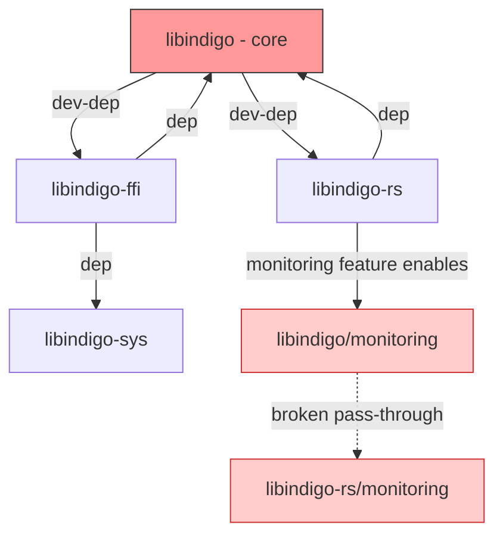
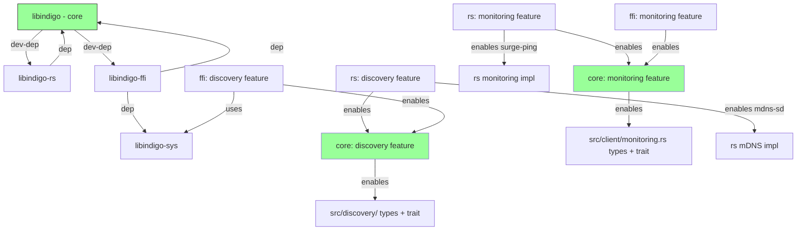

# Feature Independence Refactoring Plan

## Problem

The core `libindigo` crate's `discovery` and `monitoring` features are defined as pass-throughs to `libindigo-rs`:

```toml
# Cargo.toml (core)
discovery = ["libindigo-rs/discovery"]
monitoring = ["libindigo-rs/monitoring"]
```

But `libindigo-rs` is only a `[dev-dependencies]`, so these features only activate during tests — they are **non-functional for downstream consumers**. Meanwhile, the RS crate defines its own `monitoring = ["libindigo/monitoring", ...]` which activates the core feature from the other direction.

This creates a broken feature model: the core crate cannot stand alone, and FFI consumers cannot use discovery or monitoring without pulling in the RS crate.

## Current Dependency Graph



## Target Dependency Graph



## What Moves to Core

### Discovery types: new `src/discovery/` module

The following types from [`rs/src/discovery/mod.rs`](rs/src/discovery/mod.rs) move to a new [`src/discovery/mod.rs`](src/discovery/mod.rs) in core:

| Type | Source | Notes |
|------|--------|-------|
| `DiscoveredServer` | [`rs/src/discovery/mod.rs:73`](rs/src/discovery/mod.rs:73) | Struct — generic, no mDNS deps |
| `DiscoveryMode` | [`rs/src/discovery/mod.rs:117`](rs/src/discovery/mod.rs:117) | Enum — `OneShot` / `Continuous` |
| `DiscoveryConfig` | [`rs/src/discovery/mod.rs:139`](rs/src/discovery/mod.rs:139) | Struct — builder pattern config |
| `DiscoveryEvent` | [`rs/src/discovery/mod.rs:255`](rs/src/discovery/mod.rs:255) | Enum — `ServerAdded`, `ServerRemoved`, etc. |

### Discovery error types: new `src/discovery/error.rs`

A subset of [`rs/src/discovery/error.rs`](rs/src/discovery/error.rs) moves to core. The `MdnsError` variant is RS-specific and stays in RS; core gets a generic version:

```rust
// src/discovery/error.rs
#[derive(Debug, Clone, Error)]
pub enum DiscoveryError {
    #[error("Failed to initialize discovery: {0}")]
    InitializationFailed(String),

    #[error("Discovery timeout after {0:?}")]
    Timeout(Duration),

    #[error("Service registration failed: {0}")]
    RegistrationFailed(String),

    #[error("Discovery not started")]
    NotStarted,

    #[error("No INDIGO servers found")]
    NoServersFound,

    #[error("Discovery failed: {0}")]
    DiscoveryFailed(String),

    #[error("Platform error: {0}")]
    PlatformError(String),

    #[error("IO error: {0}")]
    Io(String),
}
```

The RS crate keeps `MdnsError` as a conversion from its internal errors into `DiscoveryError::DiscoveryFailed`.

### Announcement types: new `src/discovery/announce.rs`

Move from [`rs/src/discovery/announce.rs`](rs/src/discovery/announce.rs:29):

| Type | Notes |
|------|-------|
| `ServiceAnnouncement` | Generic config struct — no mDNS deps |

`AnnouncementHandle` stays in RS — it wraps `mdns_sd::ServiceDaemon` directly.

### Monitoring types — already in core ✅

[`src/client/monitoring.rs`](src/client/monitoring.rs) already has all shared types: [`AvailabilityStatus`](src/client/monitoring.rs:12), [`MonitoringEvent`](src/client/monitoring.rs:42), [`ClientEvent`](src/client/monitoring.rs:62), [`MonitoringConfig`](src/client/monitoring.rs:84). No changes needed.

## Core Feature Definitions

### Before (broken)

```toml
[features]
discovery = ["libindigo-rs/discovery"]    # pass-through to dev-dep
monitoring = ["libindigo-rs/monitoring"]   # pass-through to dev-dep
```

### After (self-contained)

```toml
[features]
discovery = []    # enables src/discovery/ module with shared types + trait
monitoring = []   # enables src/client/monitoring.rs types + trait methods
test-server = []
```

The features gate `#[cfg(feature = "...")]` blocks in core only. No external crate dependencies.

## RS Crate Changes

### `rs/Cargo.toml`

```toml
[features]
default = ["client"]
client = []
device = []
discovery = ["libindigo/discovery", "mdns-sd"]   # ADD: enables core types
monitoring = ["libindigo/monitoring", "surge-ping", "socket2"]  # UNCHANGED
```

Key change: `discovery` now also activates `libindigo/discovery` to get the shared types, same pattern as `monitoring` already uses.

### `rs/src/discovery/mod.rs`

- **Remove**: `DiscoveredServer`, `DiscoveryMode`, `DiscoveryConfig`, `DiscoveryEvent` struct/enum definitions
- **Add**: `pub use libindigo::discovery::{DiscoveredServer, DiscoveryMode, DiscoveryConfig, DiscoveryEvent, DiscoveryError, ServiceAnnouncement};`
- **Keep**: `mod announce;`, `mod api;`, `mod mdns_impl;` — these are RS-specific implementations
- **Keep**: `pub use announce::AnnouncementHandle;` and `pub use api::{ServerDiscovery, ServerDiscoveryApi};`

### `rs/src/discovery/error.rs`

- **Remove**: The entire file. RS-specific errors convert to core's `DiscoveryError` variants.
- **OR**: Keep as thin wrapper that converts `mdns_sd` errors into `DiscoveryError::DiscoveryFailed(...)`.

### `rs/src/discovery/announce.rs`

- **Remove**: `ServiceAnnouncement` definition (moved to core)
- **Add**: `use libindigo::discovery::ServiceAnnouncement;`
- **Keep**: `AnnouncementHandle`, `announce_service()` — these use `mdns_sd` directly

### `rs/src/discovery/api.rs`

- **Update imports**: Use `libindigo::discovery::*` for shared types
- **Keep**: `ServerDiscoveryApi`, `ServerDiscovery` — these are RS-specific orchestration

### `rs/src/lib.rs`

- **Update re-exports**: Add discovery types from core:

  ```rust
  pub use libindigo::client::{
      AvailabilityStatus, Client, ClientBuilder, ClientEvent, MonitoringConfig, MonitoringEvent,
  };
  // Add:
  #[cfg(feature = "discovery")]
  pub use libindigo::discovery::{
      DiscoveredServer, DiscoveryConfig, DiscoveryEvent, DiscoveryMode, ServiceAnnouncement,
  };
  ```

## FFI Crate Changes

### `ffi/Cargo.toml`

```toml
[features]
default = ["client"]
client = []
device = []
async = ["tokio", "futures"]
discovery = ["libindigo/discovery"]        # NEW: enables core types + FFI impl
monitoring = ["libindigo/monitoring"]       # UNCHANGED
sys-available = []
```

### New: `ffi/src/discovery.rs`

Create a new discovery module that wraps `libindigo-sys` functions for INDIGO's built-in Bonjour/Avahi-based discovery. This module will:

1. Use the raw FFI bindings from `libindigo-sys` for `indigo_service_discovery.c` functions
2. Convert results into core `DiscoveredServer` types
3. Provide an async wrapper consistent with the FFI crate's patterns

Sketch:

```rust
//! FFI-based server discovery using INDIGO C library's built-in discovery.

use libindigo::discovery::{DiscoveredServer, DiscoveryConfig, DiscoveryEvent};

/// FFI discovery implementation.
/// Uses INDIGO C library's indigo_service_discovery functions.
pub struct FfiDiscovery {
    // ... wraps C discovery state
}

impl FfiDiscovery {
    pub async fn discover(config: DiscoveryConfig)
        -> Result<Vec<DiscoveredServer>, libindigo::discovery::DiscoveryError>
    {
        // Call libindigo_sys discovery functions
        // Convert C results to DiscoveredServer
        todo!()
    }
}
```

The exact implementation depends on what `libindigo-sys` exposes from the C INDIGO discovery API. The `sys` crate already compiles `indigo_service_discovery.c` — the bindings just need to be used.

### `ffi/src/lib.rs`

Add the discovery module gated on the feature:

```rust
#[cfg(feature = "discovery")]
pub mod discovery;
```

## ClientStrategy Trait Changes

### Should discovery methods be added to `ClientStrategy`?

**Recommendation: No.** Discovery is a pre-connection concern — you discover servers *before* connecting a client. The [`ClientStrategy`](src/client/strategy.rs:49) trait models a connected client session.

Instead, discovery should remain a standalone API:

- RS: `ServerDiscoveryApi::discover(config)` — static methods
- FFI: `FfiDiscovery::discover(config)` — static methods

Both return `Vec<DiscoveredServer>` using shared core types.

### What stays on `ClientStrategy`

Monitoring methods remain on the trait as-is since monitoring operates on an active connection:

- [`set_monitoring_config()`](src/client/strategy.rs:140) — configure monitoring for the connection
- [`subscribe_status()`](src/client/strategy.rs:160) — subscribe to status events

These are already correctly gated with `#[cfg(feature = "monitoring")]`.

### Optional: Add a `DiscoveryStrategy` trait to core

If we want a unified discovery interface across RS and FFI, add a separate trait:

```rust
// src/discovery/mod.rs
#[cfg(feature = "discovery")]
#[async_trait]
pub trait DiscoveryStrategy: Send + Sync {
    async fn discover(&self, config: DiscoveryConfig) -> Result<Vec<DiscoveredServer>, DiscoveryError>;
    // continuous discovery could be added later
}
```

This is **optional** and can be deferred. The shared types alone are sufficient for the first iteration.

## Dependency Changes Summary

### Core `Cargo.toml` changes

```diff
 [features]
-discovery = ["libindigo-rs/discovery"]
-monitoring = ["libindigo-rs/monitoring"]
+discovery = []
+monitoring = []
 test-server = []
```

No new dependencies needed — the discovery module only uses `std` types.

### RS `rs/Cargo.toml` changes

```diff
 [features]
-discovery = ["mdns-sd"]
+discovery = ["libindigo/discovery", "mdns-sd"]
 monitoring = ["libindigo/monitoring", "surge-ping", "socket2"]
```

### FFI `ffi/Cargo.toml` changes

```diff
 [features]
+discovery = ["libindigo/discovery"]
 monitoring = ["libindigo/monitoring"]
```

### Sys `sys/Cargo.toml` — no changes

The sys crate already compiles `indigo_service_discovery.c` unconditionally.

## Migration Steps

These steps are ordered to maintain compilation at each step.

### Step 1: Create `src/discovery/` module in core

1. Create `src/discovery/mod.rs` with types copied from RS (not moved yet)
2. Create `src/discovery/error.rs` with generic error types
3. Gate module with `#[cfg(feature = "discovery")]`
4. Add `pub mod discovery;` to [`src/lib.rs`](src/lib.rs) gated on feature
5. Add re-exports to [`src/lib.rs`](src/lib.rs:58)
6. Include unit tests from RS `mod.rs` that test the shared types
7. **Verify**: `cargo check --features discovery` compiles

### Step 2: Fix core feature definitions

1. Change `Cargo.toml` features from pass-throughs to self-contained:

   ```toml
   discovery = []
   monitoring = []
   ```

2. **Verify**: `cargo check`, `cargo check --features discovery`, `cargo check --features monitoring` all compile

### Step 3: Update RS crate to import from core

1. Add `"libindigo/discovery"` to RS `discovery` feature
2. Replace type definitions in `rs/src/discovery/mod.rs` with re-exports from core
3. Update `rs/src/discovery/announce.rs` to import `ServiceAnnouncement` from core
4. Update `rs/src/discovery/error.rs` — either remove or convert to thin wrapper
5. Update `rs/src/discovery/api.rs` imports
6. Update `rs/src/lib.rs` re-exports
7. **Verify**: `cargo check -p libindigo-rs --features discovery,monitoring` compiles

### Step 4: Update FFI crate monitoring feature

1. Verify `ffi/Cargo.toml` `monitoring` feature already works correctly (it enables `libindigo/monitoring`)
2. Confirm [`ffi/src/monitoring.rs`](ffi/src/monitoring.rs:35) imports from `libindigo::client::monitoring` — this already works ✅
3. **Verify**: `cargo check -p libindigo-ffi --features monitoring` compiles

### Step 5: Add FFI discovery scaffolding

1. Add `discovery = ["libindigo/discovery"]` to `ffi/Cargo.toml` features
2. Create `ffi/src/discovery.rs` with FFI discovery implementation stub
3. Gate module in `ffi/src/lib.rs` with `#[cfg(feature = "discovery")]`
4. **Verify**: `cargo check -p libindigo-ffi --features discovery` compiles

### Step 6: Clean up and verify full workspace

1. Run `cargo check --workspace --all-features`
2. Run `cargo test --workspace`
3. Verify examples still compile: `cargo check --examples`
4. Update documentation in `docs/` if needed

### Step 7 (optional, deferred): Add `DiscoveryStrategy` trait

1. Define trait in `src/discovery/mod.rs`
2. Implement in RS crate
3. Implement in FFI crate
4. This step can be done in a follow-up PR

## Files Changed Summary

| File | Action |
|------|--------|
| `src/discovery/mod.rs` | **NEW** — shared types + optional trait |
| `src/discovery/error.rs` | **NEW** — generic discovery errors |
| `src/lib.rs` | **MODIFY** — add `pub mod discovery`, re-exports |
| `Cargo.toml` | **MODIFY** — fix feature definitions |
| `rs/Cargo.toml` | **MODIFY** — add `libindigo/discovery` to discovery feature |
| `rs/src/discovery/mod.rs` | **MODIFY** — replace type defs with re-exports |
| `rs/src/discovery/error.rs` | **MODIFY/REMOVE** — thin wrapper or delete |
| `rs/src/discovery/announce.rs` | **MODIFY** — import `ServiceAnnouncement` from core |
| `rs/src/discovery/api.rs` | **MODIFY** — update imports |
| `rs/src/lib.rs` | **MODIFY** — update re-exports |
| `ffi/Cargo.toml` | **MODIFY** — add discovery feature |
| `ffi/src/discovery.rs` | **NEW** — FFI discovery implementation |
| `ffi/src/lib.rs` | **MODIFY** — add discovery module |

## Out of Scope

- Implementing the full FFI discovery (just scaffolding in this PR)
- Adding `DiscoveryStrategy` trait (deferred to follow-up)
- Changing the monitoring implementation in RS or FFI crates
- Modifying `libindigo-sys` build or bindings
