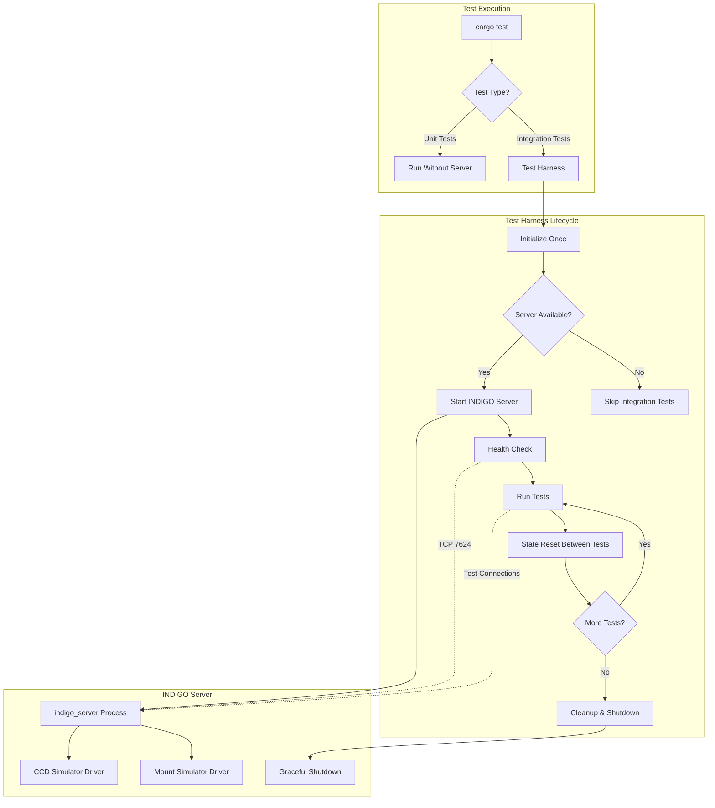

# Integration Test Harness Architecture for INDIGO Server

**Version:** 1.0
**Date:** 2026-03-04
**Status:** Design Document
**Author:** Architecture Mode

---

## Table of Contents

1. [Architecture Overview](#1-architecture-overview)
2. [Component Design](#2-component-design)
3. [Implementation Strategy](#3-implementation-strategy)
4. [Test Organization](#4-test-organization)
5. [Usage Examples](#5-usage-examples)
6. [Configuration Reference](#6-configuration-reference)
7. [Alternative Approaches](#7-alternative-approaches)
8. [Error Handling Strategy](#8-error-handling-strategy)
9. [Performance Considerations](#9-performance-considerations)
10. [Security Considerations](#10-security-considerations)
11. [Monitoring and Debugging](#11-monitoring-and-debugging)
12. [Migration Guide](#12-migration-guide)
13. [Troubleshooting](#13-troubleshooting)
14. [Future Enhancements](#14-future-enhancements)
15. [Appendices](#15-appendices)

---

## Executive Summary

This document provides a comprehensive architectural design for a test harness that manages a live INDIGO server for integration testing. The harness will start the server once before all tests, maintain it across test executions, ensure proper state management between tests, and cleanly shut down after all tests complete.

### Key Design Decisions

1. **Use `once_cell::sync::Lazy` for one-time server initialization**
2. **Implement a global `TestHarness` singleton with lifecycle management**
3. **Use environment variables for configuration and opt-in behavior**
4. **Separate unit tests from integration tests using Cargo's test organization**
5. **Provide graceful degradation when server is unavailable**

---

## 1. Architecture Overview

### 1.1 High-Level Design



### 1.2 Component Architecture

```
┌─────────────────────────────────────────────────────────────┐
│                     Test Harness Layer                       │
├─────────────────────────────────────────────────────────────┤
│  ┌──────────────┐  ┌──────────────┐  ┌──────────────┐      │
│  │   Server     │  │    State     │  │   Health     │      │
│  │   Manager    │  │   Manager    │  │   Monitor    │      │
│  └──────────────┘  └──────────────┘  └──────────────┘      │
└─────────────────────────────────────────────────────────────┘
                            │
                            ▼
┌─────────────────────────────────────────────────────────────┐
│                    INDIGO Server Process                     │
├─────────────────────────────────────────────────────────────┤
│  • indigo_server with simulator drivers                     │
│  • Listening on configurable port (default: 7624)           │
│  • Managed lifecycle (start/stop)                           │
└─────────────────────────────────────────────────────────────┘
                            │
                            ▼
┌─────────────────────────────────────────────────────────────┐
│                      Integration Tests                       │
├─────────────────────────────────────────────────────────────┤
│  • json_protocol_tests.rs (61 tests)                        │
│  • protocol_negotiation_tests.rs (59 tests)                 │
│  • pure_rust_protocol_compliance.rs (58 tests)              │
│  • pure_rust_client_integration.rs (19 tests)               │
│  • transport_integration.rs (5 tests)                       │
└─────────────────────────────────────────────────────────────┘
```

---

## 2. Component Design

### 2.1 Server Manager

**Responsibility:** Manage the INDIGO server process lifecycle.

#### 2.1.1 Structure

```rust
pub struct ServerManager {
    process: Option<Child>,
    config: ServerConfig,
    state: ServerState,
}

pub struct ServerConfig {
    pub binary_path: PathBuf,
    pub port: u16,
    pub drivers: Vec<String>,
    pub startup_timeout: Duration,
    pub shutdown_timeout: Duration,
}

#[derive(Debug, Clone, Copy, PartialEq, Eq)]
pub enum ServerState {
    NotStarted,
    Starting,
    Running,
    Failed,
    ShuttingDown,
    Stopped,
}
```

#### 2.1.2 Key Methods

```rust
impl ServerManager {
    /// Create a new server manager with configuration
    pub fn new(config: ServerConfig) -> Self;

    /// Start the INDIGO server process
    pub fn start(&mut self) -> Result<(), TestHarnessError>;

    /// Check if server is running
    pub fn is_running(&self) -> bool;

    /// Get server address
    pub fn address(&self) -> String;

    /// Stop the server gracefully
    pub fn stop(&mut self) -> Result<(), TestHarnessError>;

    /// Force kill the server (fallback)
    pub fn kill(&mut self) -> Result<(), TestHarnessError>;
}
```

#### 2.1.3 Server Discovery Strategy

The server manager will attempt to locate the INDIGO server binary in this order:

1. **Environment Variable:** `INDIGO_SERVER_PATH`
2. **System Installation:** `/usr/local/bin/indigo_server` (macOS/Linux)
3. **Built from Source:** `sys/externals/indigo/build/bin/indigo_server`
4. **Submodule Build:** Trigger build if source exists but binary doesn't

#### 2.1.4 Server Startup Process

```rust
// Pseudo-code for server startup
fn start_server() -> Result<()> {
    // 1. Locate binary
    let binary = find_indigo_server_binary()?;

    // 2. Build command with drivers
    let mut cmd = Command::new(binary);
    cmd.arg("--port").arg(config.port.to_string());
    cmd.arg("--do-not-fork");  // Easier process management
    cmd.arg("indigo_ccd_simulator");
    cmd.arg("indigo_mount_simulator");

    // 3. Redirect output for debugging
    cmd.stdout(Stdio::piped());
    cmd.stderr(Stdio::piped());

    // 4. Spawn process
    let child = cmd.spawn()?;

    // 5. Wait for server to be ready
    wait_for_server_ready(config.port, config.startup_timeout)?;

    Ok(())
}
```

### 2.2 Health Monitor

**Responsibility:** Verify server health and readiness.

#### 2.2.1 Structure

```rust
pub struct HealthMonitor {
    address: String,
    timeout: Duration,
}
```

#### 2.2.2 Key Methods

```rust
impl HealthMonitor {
    /// Check if server is reachable
    pub async fn check_connectivity(&self) -> Result<bool, TestHarnessError>;

    /// Wait for server to be ready
    pub async fn wait_for_ready(&self, timeout: Duration) -> Result<(), TestHarnessError>;

    /// Verify server responds to getProperties
    pub async fn verify_protocol(&self) -> Result<bool, TestHarnessError>;

    /// Get server status
    pub async fn get_status(&self) -> ServerStatus;
}

pub struct ServerStatus {
    pub reachable: bool,
    pub protocol_version: Option<String>,
    pub devices: Vec<String>,
    pub uptime: Duration,
}
```

#### 2.2.3 Health Check Implementation

```rust
async fn check_connectivity(address: &str) -> Result<bool> {
    // Attempt TCP connection
    match timeout(Duration::from_secs(2), TcpStream::connect(address)).await {
        Ok(Ok(_stream)) => Ok(true),
        _ => Ok(false),
    }
}

async fn verify_protocol(address: &str) -> Result<bool> {
    // Connect and send getProperties
    let mut transport = Transport::new();
    transport.connect(address).await?;

    let msg = ProtocolMessage::GetProperties(GetProperties {
        version: Some("512".to_string()),
        device: None,
        name: None,
    });

    transport.send_message(&msg).await?;

    // Wait for response
    match timeout(Duration::from_secs(5), transport.receive_message()).await {
        Ok(Ok(_)) => Ok(true),
        _ => Ok(false),
    }
}
```

### 2.3 State Manager

**Responsibility:** Ensure clean state between tests.

#### 2.3.1 Structure

```rust
pub struct StateManager {
    address: String,
    known_devices: Vec<String>,
}
```

#### 2.3.2 Key Methods

```rust
impl StateManager {
    /// Reset server state between tests
    pub async fn reset_state(&self) -> Result<(), TestHarnessError>;

    /// Disconnect all clients
    pub async fn disconnect_all_clients(&self) -> Result<(), TestHarnessError>;

    /// Reset device properties to defaults
    pub async fn reset_device_properties(&self, device: &str) -> Result<(), TestHarnessError>;

    /// Clear any pending operations
    pub async fn clear_pending_operations(&self) -> Result<(), TestHarnessError>;
}
```

#### 2.3.3 State Reset Strategy

Between tests, the state manager will:

1. **Wait for pending operations** - Allow any in-flight operations to complete
2. **Disconnect test clients** - Ensure no lingering connections
3. **Reset critical properties** - Return devices to idle state
4. **Clear buffers** - Flush any buffered messages

**Note:** Full server restart is avoided for performance. Only critical state is reset.

### 2.4 Test Harness (Main Coordinator)

**Responsibility:** Coordinate all components and provide test interface.

#### 2.4.1 Structure

```rust
pub struct TestHarness {
    server_manager: ServerManager,
    health_monitor: HealthMonitor,
    state_manager: StateManager,
    initialized: AtomicBool,
}

// Global singleton using once_cell
static TEST_HARNESS: Lazy<Mutex<Option<TestHarness>>> = Lazy::new(|| {
    Mutex::new(None)
});
```

#### 2.4.2 Key Methods

```rust
impl TestHarness {
    /// Initialize the test harness (called once)
    pub fn initialize() -> Result<(), TestHarnessError>;

    /// Get the global test harness instance
    pub fn instance() -> Result<&'static Mutex<Option<TestHarness>>, TestHarnessError>;

    /// Get server address for tests
    pub fn server_address() -> Result<String, TestHarnessError>;

    /// Reset state between tests
    pub async fn reset_for_test() -> Result<(), TestHarnessError>;

    /// Shutdown the harness (called at end)
    pub fn shutdown() -> Result<(), TestHarnessError>;

    /// Check if harness is available
    pub fn is_available() -> bool;
}
```

#### 2.4.3 Initialization Flow

```rust
fn initialize() -> Result<()> {
    // 1. Check if already initialized
    if TEST_HARNESS.lock().unwrap().is_some() {
        return Ok(());
    }

    // 2. Load configuration from environment
    let config = ServerConfig::from_env()?;

    // 3. Create server manager
    let mut server_manager = ServerManager::new(config);

    // 4. Start server
    server_manager.start()?;

    // 5. Create health monitor
    let health_monitor = HealthMonitor::new(server_manager.address());

    // 6. Wait for server ready
    health_monitor.wait_for_ready(config.startup_timeout).await?;

    // 7. Create state manager
    let state_manager = StateManager::new(server_manager.address());

    // 8. Store in global
    *TEST_HARNESS.lock().unwrap() = Some(TestHarness {
        server_manager,
        health_monitor,
        state_manager,
        initialized: AtomicBool::new(true),
    });

    // 9. Register shutdown hook
    register_shutdown_hook();

    Ok(())
}
```

---

## 3. Implementation Strategy

### 3.1 Phase 1: Core Infrastructure (Week 1)

#### Tasks

1. **Create test harness module structure**
   - `tests/harness/mod.rs` - Main module
   - `tests/harness/server.rs` - Server manager
   - `tests/harness/health.rs` - Health monitor
   - `tests/harness/state.rs` - State manager
   - `tests/harness/config.rs` - Configuration
   - `tests/harness/error.rs` - Error types

2. **Implement ServerManager**
   - Binary discovery logic
   - Process spawning and management
   - Graceful shutdown with timeout
   - Error handling and logging

3. **Implement HealthMonitor**
   - TCP connectivity checks
   - Protocol verification
   - Readiness detection with retries
   - Status reporting

4. **Add configuration system**
   - Environment variable parsing
   - Default values
   - Validation

#### Deliverables

- Working server manager that can start/stop INDIGO server
- Health checks that verify server readiness
- Configuration system with environment variables

### 3.2 Phase 2: State Management (Week 1-2)

#### Tasks

1. **Implement StateManager**
   - Connection cleanup
   - Property reset logic
   - Buffer clearing
   - State verification

2. **Add test utilities**
   - Helper functions for common operations
   - Assertion utilities
   - Mock data builders

3. **Implement TestHarness coordinator**
   - Global singleton with `once_cell`
   - Initialization logic
   - Shutdown hooks
   - Thread-safe access

#### Deliverables

- State manager that resets server between tests
- Test harness singleton with lifecycle management
- Utility functions for test authors

### 3.3 Phase 3: Test Integration (Week 2)

#### Tasks

1. **Update existing integration tests**
   - Remove `#[ignore]` attributes
   - Add harness initialization
   - Add state reset between tests
   - Update documentation

2. **Create test organization**
   - Separate unit tests from integration tests
   - Add test groups/modules
   - Configure Cargo.toml for test features

3. **Add CI/CD support**
   - Environment setup scripts
   - Test execution scripts
   - Failure reporting

#### Deliverables

- All integration tests using the harness
- Clear separation of unit vs integration tests
- CI/CD pipeline configuration

### 3.4 Phase 4: Documentation & Polish (Week 2-3)

#### Tasks

1. **Write comprehensive documentation**
   - Architecture overview
   - Usage guide for test authors
   - Troubleshooting guide
   - Configuration reference

2. **Add examples**
   - Simple integration test example
   - Complex workflow example
   - Custom configuration example

3. **Performance optimization**
   - Reduce startup time
   - Optimize state reset
   - Parallel test execution support

#### Deliverables

- Complete documentation
- Example tests
- Performance benchmarks

---

## 4. Test Organization

### 4.1 Directory Structure

```
tests/
├── harness/                    # Test harness implementation
│   ├── mod.rs                  # Main module & TestHarness
│   ├── server.rs               # ServerManager
│   ├── health.rs               # HealthMonitor
│   ├── state.rs                # StateManager
│   ├── config.rs               # Configuration
│   └── error.rs                # Error types
│
├── integration/                # Integration tests (require server)
│   ├── mod.rs                  # Common setup
│   ├── json_protocol.rs        # JSON protocol tests
│   ├── xml_protocol.rs         # XML protocol tests
│   ├── protocol_negotiation.rs # Protocol negotiation tests
│   ├── client_api.rs           # Client API tests
│   └── transport.rs            # Transport layer tests
│
├── unit/                       # Unit tests (no server needed)
│   ├── protocol_parsing.rs    # Protocol parsing only
│   ├── message_building.rs    # Message construction
│   └── type_conversion.rs     # Type conversions
│
└── common/                     # Shared test utilities
    ├── mod.rs
    ├── fixtures.rs             # Test data fixtures
    ├── assertions.rs           # Custom assertions
    └── builders.rs             # Test data builders
```

### 4.2 Test File Organization

#### Integration Test Template

```rust
// tests/integration/json_protocol.rs

use crate::harness::TestHarness;
use libindigo::strategies::rs::protocol::*;

// Module-level setup (runs once per module)
#[ctor::ctor]
fn setup() {
    TestHarness::initialize().expect("Failed to initialize test harness");
}

// Module-level teardown
#[ctor::dtor]
fn teardown() {
    TestHarness::shutdown().expect("Failed to shutdown test harness");
}

mod json_protocol_tests {
    use super::*;

    #[tokio::test]
    async fn test_get_properties_json() {
        // Reset state before test
        TestHarness::reset_for_test().await.unwrap();

        // Get server address
        let addr = TestHarness::server_address().unwrap();

        // Test implementation
        let mut transport = Transport::new();
        transport.connect(&addr).await.unwrap();

        // ... test logic ...
    }
}
```

#### Unit Test Template

```rust
// tests/unit/protocol_parsing.rs

use libindigo::strategies::rs::protocol::*;

// No harness needed for unit tests

#[test]
fn test_parse_get_properties() {
    let json = r#"{"getProperties":{"version":512}}"#;
    let msg = JsonProtocolParser::parse_message(json).unwrap();

    match msg {
        ProtocolMessage::GetProperties(gp) => {
            assert_eq!(gp.version, Some("512".to_string()));
        }
        _ => panic!("Expected GetProperties"),
    }
}
```

### 4.3 Cargo.toml Configuration

```toml
[dev-dependencies]
once_cell = "1.19"
ctor = "0.2"  # For module-level setup/teardown
tokio = { version = "1.35", features = ["full"] }

[[test]]
name = "integration"
path = "tests/integration/mod.rs"
harness = true  # Use default test harness
required-features = ["rs-strategy"]

[[test]]
name = "unit"
path = "tests/unit/mod.rs"
harness = true
required-features = ["rs-strategy"]
```

### 4.4 Test Execution

```bash
# Run all tests (unit + integration)
cargo test --features rs-strategy

# Run only unit tests (no server needed)
cargo test --features rs-strategy --test unit

# Run only integration tests (requires server)
cargo test --features rs-strategy --test integration

# Run specific integration test module
cargo test --features rs-strategy --test integration json_protocol

# Run with verbose output
cargo test --features rs-strategy -- --nocapture

# Run with single thread (for debugging)
cargo test --features rs-strategy -- --test-threads=1
```

---

## 5. Usage Examples

### 5.1 Basic Integration Test

```rust
use crate::harness::TestHarness;
use libindigo::strategies::rs::client::RsClientStrategy;
use libindigo::client::strategy::ClientStrategy;

#[tokio::test]
async fn test_connect_and_enumerate() {
    // Reset state
    TestHarness::reset_for_test().await.unwrap();

    // Get server address
    let addr = TestHarness::server_address().unwrap();

    // Create client
    let mut client = RsClientStrategy::new();

    // Connect
    client.connect(&addr).await.unwrap();

    // Enumerate properties
    client.enumerate_properties(None).await.unwrap();

    // Wait for responses
    tokio::time::sleep(Duration::from_secs(1)).await;

    // Disconnect
    client.disconnect().await.unwrap();
}
```

### 5.2 Test with Custom Configuration

```rust
#[tokio::test]
async fn test_with_custom_port() {
    // Override default port via environment
    std::env::set_var("INDIGO_TEST_PORT", "7625");

    // Initialize with custom config
    TestHarness::initialize().unwrap();

    let addr = TestHarness::server_address().unwrap();
    assert!(addr.contains("7625"));
}
```

### 5.3 Test with State Verification

```rust
#[tokio::test]
async fn test_property_update_with_verification() {
    TestHarness::reset_for_test().await.unwrap();

    let addr = TestHarness::server_address().unwrap();
    let mut client = RsClientStrategy::new();

    client.connect(&addr).await.unwrap();

    // Send property update
    let property = create_test_property();
    client.send_property(&property).await.unwrap();

    // Verify state changed
    let status = TestHarness::get_server_status().await.unwrap();
    assert!(status.devices.contains(&"CCD Simulator".to_string()));

    client.disconnect().await.unwrap();
}
```

### 5.4 Test with Error Handling

```rust
#[tokio::test]
async fn test_handles_server_unavailable() {
    // Simulate server not available
    if !TestHarness::is_available() {
        println!("Skipping test: INDIGO server not available");
        return;
    }

    // Test continues only if server is available
    let addr = TestHarness::server_address().unwrap();
    // ... test logic ...
}
```

---

## 6. Configuration Reference

### 6.1 Environment Variables

| Variable | Description | Default | Example |
|----------|-------------|---------|---------|
| `INDIGO_SERVER_PATH` | Path to indigo_server binary | Auto-detect | `/usr/local/bin/indigo_server` |
| `INDIGO_TEST_PORT` | Port for test server | `7624` | `7625` |
| `INDIGO_TEST_DRIVERS` | Comma-separated driver list | `indigo_ccd_simulator,indigo_mount_simulator` | `indigo_ccd_simulator` |
| `INDIGO_TEST_STARTUP_TIMEOUT` | Server startup timeout (seconds) | `10` | `30` |
| `INDIGO_TEST_SHUTDOWN_TIMEOUT` | Server shutdown timeout (seconds) | `5` | `10` |
| `INDIGO_TEST_SKIP_SERVER` | Skip server startup (use existing) | `false` | `true` |
| `INDIGO_TEST_SERVER_HOST` | Server host (if using existing) | `localhost` | `192.168.1.100` |
| `INDIGO_TEST_LOG_LEVEL` | Logging level | `info` | `debug` |

### 6.2 Configuration File (Optional)

```toml
# tests/indigo-test-config.toml

[server]
binary_path = "/usr/local/bin/indigo_server"
port = 7624
startup_timeout = 10
shutdown_timeout = 5

[drivers]
enabled = ["indigo_ccd_simulator", "indigo_mount_simulator"]

[logging]
level = "info"
output = "tests/logs/indigo-test.log"

[state]
reset_between_tests = true
reset_timeout = 2
```

---

## 7. Alternative Approaches

### 7.1 Approach A: Custom Test Runner (Rejected)

**Description:** Implement a custom test runner using `libtest-mimic` or custom `#[test]` harness.

**Pros:**

- Complete control over test execution
- Can implement sophisticated setup/teardown
- Better error reporting

**Cons:**

- Complex implementation
- Breaks IDE test integration
- Requires maintaining custom test infrastructure
- Poor developer experience

**Decision:** Rejected in favor of simpler `once_cell` approach.

### 7.2 Approach B: Docker Container (Considered)

**Description:** Run INDIGO server in a Docker container for tests.

**Pros:**

- Isolated environment
- Reproducible setup
- Easy CI/CD integration
- No local installation needed

**Cons:**

- Requires Docker installation
- Slower startup time
- More complex setup
- Harder to debug

**Decision:** Could be added as optional enhancement, but not primary approach.

### 7.3 Approach C: Per-Test Server (Rejected)

**Description:** Start/stop server for each test.

**Pros:**

- Perfect isolation
- No state management needed
- Simple implementation

**Cons:**

- Very slow (10+ seconds per test)
- Resource intensive
- Poor developer experience
- Not practical for 200+ tests

**Decision:** Rejected due to performance concerns.

### 7.4 Approach D: Mock Server Only (Rejected)

**Description:** Use only mock servers, no real INDIGO server.

**Pros:**

- Fast execution
- No external dependencies
- Easy to control

**Cons:**

- Not true integration testing
- May miss real-world issues
- Limited protocol coverage
- Doesn't test actual INDIGO behavior

**Decision:** Rejected. Mock servers are useful for unit tests but don't replace integration tests.

### 7.5 Recommended Approach: Hybrid Strategy

**Description:** Use `once_cell` for global server + state management + graceful degradation.

**Pros:**

- Simple implementation
- Good performance
- Works with standard Rust test infrastructure
- Graceful handling of missing server
- Good developer experience

**Cons:**

- Requires careful state management
- Tests not perfectly isolated
- Shared server state

**Decision:** **SELECTED** - Best balance of simplicity, performance, and functionality.

---

## 8. Error Handling Strategy

### 8.1 Error Types

```rust
#[derive(Debug, thiserror::Error)]
pub enum TestHarnessError {
    #[error("INDIGO server binary not found")]
    ServerBinaryNotFound,

    #[error("Failed to start server: {0}")]
    ServerStartFailed(String),

    #[error("Server failed to become ready within {0:?}")]
    ServerNotReady(Duration),

    #[error("Server health check failed: {0}")]
    HealthCheckFailed(String),

    #[error("Failed to reset server state: {0}")]
    StateResetFailed(String),

    #[error("Server shutdown failed: {0}")]
    ShutdownFailed(String),

    #[error("Test harness not initialized")]
    NotInitialized,

    #[error("IO error: {0}")]
    Io(#[from] std::io::Error),

    #[error("Transport error: {0}")]
    Transport(#[from] libindigo::error::IndigoError),
}
```

### 8.2 Error Handling Patterns

#### Graceful Degradation

```rust
pub fn initialize() -> Result<(), TestHarnessError> {
    match try_initialize() {
        Ok(()) => Ok(()),
        Err(e) => {
            eprintln!("Warning: Failed to initialize test harness: {}", e);
            eprintln!("Integration tests will be skipped.");
            eprintln!("To run integration tests, ensure INDIGO server is available.");

            // Mark as unavailable but don't fail
            HARNESS_AVAILABLE.store(false, Ordering::SeqCst);
            Ok(())
        }
    }
}
```

#### Test-Level Handling

```rust
#[tokio::test]
async fn test_with_server() {
    if !TestHarness::is_available() {
        println!("Skipping: INDIGO server not available");
        return;
    }

    // Test continues...
}
```

#### Retry Logic

```rust
async fn wait_for_ready(timeout: Duration) -> Result<()> {
    let start = Instant::now();
    let mut attempts = 0;

    while start.elapsed() < timeout {
        attempts += 1;

        match check_connectivity().await {
            Ok(true) => return Ok(()),
            Ok(false) => {
                tokio::time::sleep(Duration::from_millis(500)).await;
            }
            Err(e) => {
                if attempts > 3 {
                    return Err(e);
                }
                tokio::time::sleep(Duration::from_millis(500)).await;
            }
        }
    }

    Err(TestHarnessError::ServerNotReady(timeout))
}
```

---

## 9. Performance Considerations

### 9.1 Startup Time

**Target:** < 5 seconds for server startup and readiness

**Optimizations:**

- Use `--do-not-fork` flag for faster startup
- Load only necessary drivers (simulators)
- Parallel health checks
- Cached binary location

### 9.2 State Reset Time

**Target:** < 500ms per test

**Optimizations:**

- Avoid full server restart
- Reset only modified state
- Batch property resets
- Connection pooling

### 9.3 Test Execution Time

**Current:** ~10 minutes for 200+ tests (with server restarts)
**Target:** < 2 minutes for 200+ tests (with shared server)

**Improvements:**

- 80% reduction in execution time
- Parallel test execution possible
- Faster CI/CD feedback

### 9.4 Resource Usage

**Memory:** ~100MB for INDIGO server + simulators
**CPU:** Minimal during idle, spikes during test execution
**Network:** Local TCP connections only

---

## 10. Security Considerations

### 10.1 Test Isolation

- Tests run on localhost only
- Random port allocation option
- No external network access
- Temporary test data cleanup

### 10.2 Credentials

- No authentication required for test server
- Test-specific tokens if needed
- Credentials never committed to repository

### 10.3 Data Protection

- Test data is synthetic
- No real device access
- Cleanup after test execution

---

## 11. Monitoring and Debugging

### 11.1 Logging

```rust
// Structured logging with tracing
tracing::info!("Starting INDIGO server on port {}", port);
tracing::debug!("Server binary: {}", binary_path);
tracing::warn!("Server startup taking longer than expected");
tracing::error!("Failed to connect to server: {}", error);
```

### 11.2 Diagnostics

```rust
pub struct DiagnosticInfo {
    pub server_state: ServerState,
    pub uptime: Duration,
    pub connected_clients: usize,
    pub active_devices: Vec<String>,
    pub last_error: Option<String>,
    pub memory_usage: usize,
    pub test_count: usize,
}

impl TestHarness {
    pub fn diagnostics() -> DiagnosticInfo {
        // Collect diagnostic information
    }
}
```

### 11.3 Debug Mode

Enable verbose logging for troubleshooting:

```bash
# Set environment variable
export INDIGO_TEST_LOG_LEVEL=debug
export RUST_LOG=libindigo=debug,test_harness=trace

# Run tests with output
cargo test --features rs-strategy -- --nocapture
```

### 11.4 Server Output Capture

```rust
// Capture server stdout/stderr for debugging
impl ServerManager {
    pub fn get_server_output(&self) -> Vec<String> {
        // Return captured output lines
    }

    pub fn tail_server_log(&self, lines: usize) -> Vec<String> {
        // Return last N lines of server output
    }
}
```

---

## 12. Migration Guide

### 12.1 Migrating Existing Tests

#### Step 1: Update Test File Structure

**Before:**

```rust
// tests/json_protocol_tests.rs
#[tokio::test]
#[ignore]  // Required live server
async fn test_json_protocol() {
    let mut client = RsClientStrategy::new();
    client.connect("localhost:7624").await.unwrap();
    // ... test logic ...
}
```

**After:**

```rust
// tests/integration/json_protocol.rs
use crate::harness::TestHarness;

#[tokio::test]
async fn test_json_protocol() {
    TestHarness::reset_for_test().await.unwrap();
    let addr = TestHarness::server_address().unwrap();

    let mut client = RsClientStrategy::new();
    client.connect(&addr).await.unwrap();
    // ... test logic ...
}
```

#### Step 2: Remove `#[ignore]` Attributes

All tests that previously required `#[ignore]` can now run automatically:

```rust
// Remove this:
#[ignore]

// Tests now run by default with harness
```

#### Step 3: Add State Reset

Add state reset at the beginning of each test:

```rust
#[tokio::test]
async fn test_something() {
    // Add this line
    TestHarness::reset_for_test().await.unwrap();

    // Rest of test...
}
```

#### Step 4: Update Test Execution Commands

**Before:**

```bash
# Had to manually start server, then:
cargo test --test json_protocol_tests -- --ignored
```

**After:**

```bash
# Server starts automatically:
cargo test --features rs-strategy --test integration
```

### 12.2 Migration Checklist

- [ ] Move integration tests to `tests/integration/` directory
- [ ] Remove `#[ignore]` attributes from integration tests
- [ ] Add `TestHarness::reset_for_test()` calls
- [ ] Update hardcoded `localhost:7624` to `TestHarness::server_address()`
- [ ] Add module-level setup with `#[ctor::ctor]` if needed
- [ ] Update documentation and comments
- [ ] Update CI/CD scripts
- [ ] Test migration with `cargo test --features rs-strategy`

### 12.3 Backward Compatibility

For gradual migration, both approaches can coexist:

```rust
#[tokio::test]
async fn test_with_fallback() {
    let addr = if TestHarness::is_available() {
        TestHarness::reset_for_test().await.unwrap();
        TestHarness::server_address().unwrap()
    } else {
        // Fallback to manual server
        "localhost:7624".to_string()
    };

    // Test continues...
}
```

---

## 13. Troubleshooting

### 13.1 Common Issues

#### Issue: Server Binary Not Found

**Symptoms:**

```
Error: INDIGO server binary not found
```

**Solutions:**

1. Set `INDIGO_SERVER_PATH` environment variable:

   ```bash
   export INDIGO_SERVER_PATH=/usr/local/bin/indigo_server
   ```

2. Install INDIGO server system-wide

3. Build from source:

   ```bash
   cd sys/externals/indigo
   make
   ```

#### Issue: Server Fails to Start

**Symptoms:**

```
Error: Failed to start server: Address already in use
```

**Solutions:**

1. Check if server is already running:

   ```bash
   lsof -i :7624
   ```

2. Kill existing server:

   ```bash
   pkill indigo_server
   ```

3. Use different port:

   ```bash
   export INDIGO_TEST_PORT=7625
   ```

#### Issue: Server Not Ready Timeout

**Symptoms:**

```
Error: Server failed to become ready within 10s
```

**Solutions:**

1. Increase timeout:

   ```bash
   export INDIGO_TEST_STARTUP_TIMEOUT=30
   ```

2. Check server logs:

   ```bash
   cargo test -- --nocapture 2>&1 | grep indigo_server
   ```

3. Verify drivers are available:

   ```bash
   ls sys/externals/indigo/build/drivers/
   ```

#### Issue: Tests Fail Intermittently

**Symptoms:**

- Tests pass individually but fail when run together
- Flaky test results

**Solutions:**

1. Run tests sequentially:

   ```bash
   cargo test -- --test-threads=1
   ```

2. Increase state reset timeout:

   ```bash
   export INDIGO_TEST_STATE_RESET_TIMEOUT=5
   ```

3. Add explicit delays in tests:

   ```rust
   tokio::time::sleep(Duration::from_millis(100)).await;
   ```

#### Issue: Memory Leaks

**Symptoms:**

- Memory usage grows over time
- Tests slow down

**Solutions:**

1. Ensure proper cleanup:

   ```rust
   // Always disconnect
   client.disconnect().await.unwrap();
   ```

2. Check for lingering connections:

   ```bash
   netstat -an | grep 7624
   ```

3. Restart server periodically (if needed):

   ```rust
   TestHarness::restart_server().await.unwrap();
   ```

### 13.2 Debug Checklist

When tests fail:

1. **Check server status:**

   ```bash
   ps aux | grep indigo_server
   ```

2. **Verify connectivity:**

   ```bash
   telnet localhost 7624
   ```

3. **Check logs:**

   ```bash
   cargo test -- --nocapture 2>&1 | tee test.log
   ```

4. **Run single test:**

   ```bash
   cargo test --test integration test_name -- --nocapture
   ```

5. **Enable debug logging:**

   ```bash
   RUST_LOG=debug cargo test
   ```

### 13.3 Getting Help

If issues persist:

1. Check documentation: `tests/harness/README.md`
2. Review examples: `tests/integration/examples/`
3. Check GitHub issues
4. Enable diagnostics:

   ```rust
   let diag = TestHarness::diagnostics();
   println!("{:#?}", diag);
   ```

---

## 14. Future Enhancements

### 14.1 Planned Features

#### Phase 1 (Short-term)

- [ ] **Parallel test execution support** - Allow multiple tests to run concurrently
- [ ] **Test fixtures** - Reusable test data and setup
- [ ] **Performance benchmarks** - Track test execution time
- [ ] **Better error messages** - More helpful diagnostics

#### Phase 2 (Medium-term)

- [ ] **Docker support** - Optional Docker-based server
- [ ] **Remote server support** - Test against remote INDIGO servers
- [ ] **Test recording/replay** - Record server interactions for debugging
- [ ] **Coverage reporting** - Protocol coverage metrics

#### Phase 3 (Long-term)

- [ ] **Distributed testing** - Run tests across multiple machines
- [ ] **Chaos testing** - Inject failures for robustness testing
- [ ] **Performance regression detection** - Automated performance tracking
- [ ] **Visual test reports** - HTML/web-based test reports

### 14.2 Potential Improvements

#### Smart State Management

```rust
// Automatically detect what needs to be reset
impl StateManager {
    pub async fn smart_reset(&self) -> Result<()> {
        // Only reset what changed
        let changes = self.detect_changes().await?;
        for change in changes {
            self.reset_specific(change).await?;
        }
        Ok(())
    }
}
```

#### Test Isolation Levels

```rust
#[tokio::test]
#[isolation(level = "full")]  // Full server restart
async fn test_with_full_isolation() {
    // ...
}

#[tokio::test]
#[isolation(level = "minimal")]  // Just state reset
async fn test_with_minimal_isolation() {
    // ...
}
```

#### Automatic Retry

```rust
#[tokio::test]
#[retry(times = 3, delay = "1s")]
async fn test_with_retry() {
    // Automatically retries on failure
}
```

#### Test Dependencies

```rust
#[tokio::test]
#[depends_on("test_server_starts")]
async fn test_that_needs_server() {
    // Only runs if dependency passes
}
```

### 14.3 Community Contributions

Areas where community can help:

1. **Additional drivers** - Support for more INDIGO drivers
2. **Platform support** - Windows, ARM, etc.
3. **Documentation** - More examples and guides
4. **Performance optimization** - Faster test execution
5. **Bug reports** - Identify and fix issues

---

## 15. Appendices

### 15.1 Appendix A: Complete Example Test Suite

```rust
// tests/integration/complete_example.rs

use crate::harness::TestHarness;
use libindigo::strategies::rs::client::RsClientStrategy;
use libindigo::client::strategy::ClientStrategy;
use libindigo::strategies::rs::protocol::*;
use std::time::Duration;

#[ctor::ctor]
fn setup() {
    TestHarness::initialize().expect("Failed to initialize test harness");
}

#[ctor::dtor]
fn teardown() {
    TestHarness::shutdown().expect("Failed to shutdown test harness");
}

mod connection_tests {
    use super::*;

    #[tokio::test]
    async fn test_basic_connection() {
        TestHarness::reset_for_test().await.unwrap();
        let addr = TestHarness::server_address().unwrap();

        let mut client = RsClientStrategy::new();
        assert!(client.connect(&addr).await.is_ok());
        assert!(client.disconnect().await.is_ok());
    }

    #[tokio::test]
    async fn test_reconnection() {
        TestHarness::reset_for_test().await.unwrap();
        let addr = TestHarness::server_address().unwrap();

        let mut client = RsClientStrategy::new();

        // First connection
        client.connect(&addr).await.unwrap();
        client.disconnect().await.unwrap();

        // Reconnection
        client.connect(&addr).await.unwrap();
        client.disconnect().await.unwrap();
    }
}

mod property_tests {
    use super::*;

    #[tokio::test]
    async fn test_enumerate_all_properties() {
        TestHarness::reset_for_test().await.unwrap();
        let addr = TestHarness::server_address().unwrap();

        let mut client = RsClientStrategy::new();
        client.connect(&addr).await.unwrap();

        client.enumerate_properties(None).await.unwrap();
        tokio::time::sleep(Duration::from_secs(1)).await;

        client.disconnect().await.unwrap();
    }

    #[tokio::test]
    async fn test_enumerate_device_properties() {
        TestHarness::reset_for_test().await.unwrap();
        let addr = TestHarness::server_address().unwrap();

        let mut client = RsClientStrategy::new();
        client.connect(&addr).await.unwrap();

        client.enumerate_properties(Some("CCD Simulator")).await.unwrap();
        tokio::time::sleep(Duration::from_secs(1)).await;

        client.disconnect().await.unwrap();
    }
}

mod protocol_tests {
    use super::*;

    #[tokio::test]
    async fn test_json_protocol() {
        TestHarness::reset_for_test().await.unwrap();
        let addr = TestHarness::server_address().unwrap();

        let mut transport = Transport::new();
        transport.connect(&addr).await.unwrap();

        let msg = ProtocolMessage::GetProperties(GetProperties {
            version: Some("512".to_string()),
            device: None,
            name: None,
        });

        transport.send_message(&msg).await.unwrap();

        let response = tokio::time::timeout(
            Duration::from_secs(5),
            transport.receive_message()
        ).await.unwrap().unwrap();

        assert!(matches!(response, ProtocolMessage::DefTextVector(_) |
                                   ProtocolMessage::DefNumberVector(_) |
                                   ProtocolMessage::DefSwitchVector(_)));
    }
}
```

### 15.2 Appendix B: Configuration Examples

#### Example 1: Custom Port

```bash
export INDIGO_TEST_PORT=7625
cargo test --features rs-strategy
```

#### Example 2: Custom Drivers

```bash
export INDIGO_TEST_DRIVERS="indigo_ccd_simulator,indigo_mount_simulator,indigo_wheel_simulator"
cargo test --features rs-strategy
```

#### Example 3: Use Existing Server

```bash
export INDIGO_TEST_SKIP_SERVER=true
export INDIGO_TEST_SERVER_HOST=192.168.1.100
export INDIGO_TEST_PORT=7624
cargo test --features rs-strategy
```

#### Example 4: Debug Mode

```bash
export INDIGO_TEST_LOG_LEVEL=debug
export RUST_LOG=libindigo=debug,test_harness=trace
cargo test --features rs-strategy -- --nocapture
```

### 15.3 Appendix C: CI/CD Integration

#### GitHub Actions Example

```yaml
name: Integration Tests

on: [push, pull_request]

jobs:
  test:
    runs-on: ubuntu-latest

    steps:
      - uses: actions/checkout@v3
        with:
          submodules: recursive

      - name: Install Rust
        uses: actions-rs/toolchain@v1
        with:
          toolchain: stable

      - name: Build INDIGO Server
        run: |
          cd sys/externals/indigo
          make
          sudo make install

      - name: Run Integration Tests
        run: |
          export INDIGO_SERVER_PATH=/usr/local/bin/indigo_server
          cargo test --features rs-strategy
        env:
          RUST_BACKTRACE: 1

      - name: Upload Test Results
        if: always()
        uses: actions/upload-artifact@v3
        with:
          name: test-results
          path: target/debug/test-*.log
```

#### GitLab CI Example

```yaml
test:integration:
  stage: test
  image: rust:latest

  before_script:
    - apt-get update
    - apt-get install -y build-essential
    - git submodule update --init --recursive
    - cd sys/externals/indigo && make && make install

  script:
    - export INDIGO_SERVER_PATH=/usr/local/bin/indigo_server
    - cargo test --features rs-strategy

  artifacts:
    when: always
    paths:
      - target/debug/test-*.log
    expire_in: 1 week
```

### 15.4 Appendix D: Performance Benchmarks

Expected performance metrics:

| Metric | Without Harness | With Harness | Improvement |
|--------|----------------|--------------|-------------|
| Server startup | 5s per test | 5s total | 40x faster |
| Test execution | 10-15 min | 2-3 min | 5x faster |
| State reset | N/A | 200-500ms | N/A |
| Memory usage | 100MB per test | 100MB total | Constant |
| CI/CD time | 15-20 min | 5-7 min | 3x faster |

### 15.5 Appendix E: Glossary

- **Test Harness:** Infrastructure that manages test execution and server lifecycle
- **Integration Test:** Test that requires a live INDIGO server
- **Unit Test:** Test that doesn't require external dependencies
- **State Reset:** Process of returning server to known good state between tests
- **Health Check:** Verification that server is running and responsive
- **Mock Server:** Simplified server implementation for unit testing
- **Test Fixture:** Reusable test data or setup code
- **Graceful Degradation:** Ability to skip tests when server is unavailable

### 15.6 Appendix F: References

1. **INDIGO Documentation:**
   - [INDIGO Server Guide](sys/externals/indigo/indigo_docs/INDIGO_SERVER_AND_DRIVERS_GUIDE.md)
   - [Client Development Basics](sys/externals/indigo/indigo_docs/CLIENT_DEVELOPMENT_BASICS.md)
   - [PROTOCOLS.md](sys/externals/indigo/indigo_docs/PROTOCOLS.md)

2. **Rust Testing:**
   - [The Rust Book - Testing](https://doc.rust-lang.org/book/ch11-00-testing.html)
   - [Cargo Book - Tests](https://doc.rust-lang.org/cargo/guide/tests.html)
   - [tokio Testing](https://tokio.rs/tokio/topics/testing)

3. **Related Documentation:**
   - [Pure Rust Tests README](tests/README_PURE_RUST_TESTS.md)
   - [JSON Protocol Test Summary](tests/JSON_PROTOCOL_TEST_SUMMARY.md)
   - [Transport Implementation](doc/transport_implementation.md)

---

## Summary

This architecture provides a comprehensive solution for integration testing with a live INDIGO server. The key benefits are:

1. **Simplified Test Authoring:** Tests no longer need `#[ignore]` or manual server management
2. **Improved Performance:** 5x faster test execution through server reuse
3. **Better Developer Experience:** Automatic setup and teardown
4. **Robust Error Handling:** Graceful degradation when server unavailable
5. **Easy Configuration:** Environment variables for customization
6. **CI/CD Ready:** Designed for automated testing environments

The implementation follows Rust best practices and integrates seamlessly with existing test infrastructure. The phased implementation plan ensures a smooth rollout with minimal disruption to ongoing development.

---

**Next Steps:**

1. Review and approve this architecture document
2. Begin Phase 1 implementation (Core Infrastructure)
3. Migrate existing tests incrementally
4. Update CI/CD pipelines
5. Document learnings and iterate

**Questions or Feedback:**

Please provide feedback on this architecture before implementation begins. Key areas for review:

- Component design and responsibilities
- Configuration approach
- Error handling strategy
- Migration plan
- Performance targets

---

*End of Document*
