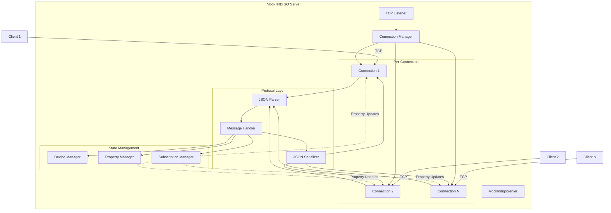
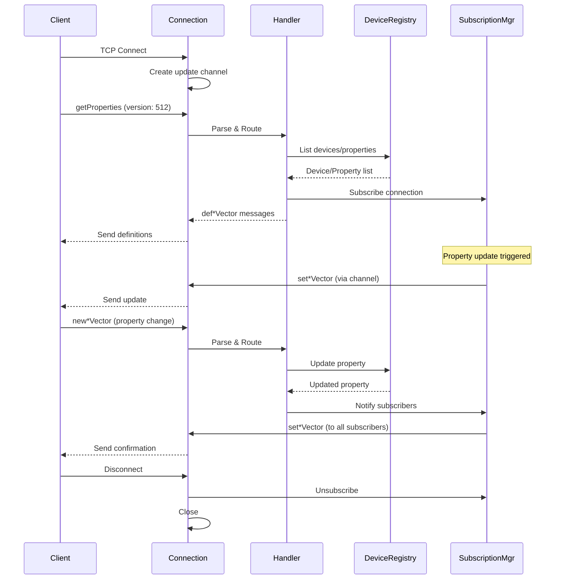

# Pure Rust Mock INDIGO Server Architecture

## Overview

This document defines the architecture for a pure Rust mock INDIGO server implementation. The mock server is designed for testing the [`libindigo-rs`](../rs/src/lib.rs) client without requiring FFI dependencies or a live INDIGO server installation.

**Key Requirements:**

- Pure Rust implementation (NO FFI dependencies)
- Async/await using tokio runtime
- JSON protocol support (version 512)
- Support for basic message types: `getProperties`, `def*Vector`, `set*Vector`
- Maintain internal state of devices and properties
- Handle multiple concurrent client connections
- Property streaming capability (continuous updates)
- Minimal but functional for testing

## Design Goals

1. **Zero FFI Dependencies**: No dependency on [`sys`](../sys/Cargo.toml) crate or C bindings
2. **Reuse Existing Types**: Leverage protocol types from [`rs/src/protocol.rs`](../rs/src/protocol.rs) and [`rs/src/protocol_json.rs`](../rs/src/protocol_json.rs)
3. **Test-Focused**: Optimized for testing scenarios, not production use
4. **Extensible**: Easy to add new mock devices and behaviors
5. **Concurrent**: Support multiple simultaneous client connections
6. **Observable**: Provide introspection for test assertions

## Architecture Diagram



## Module Structure

```
tests/
└── mock_server/
    ├── mod.rs                  # Public API and re-exports
    ├── server.rs               # MockIndigoServer main implementation
    ├── connection.rs           # Per-client connection handler
    ├── device.rs               # Mock device management
    ├── property.rs             # Property state management
    ├── subscription.rs         # Property subscription tracking
    ├── handler.rs              # Message routing and handling
    ├── builder.rs              # Fluent builder for server configuration
    └── presets/
        ├── mod.rs              # Preset device configurations
        ├── ccd_simulator.rs    # CCD camera simulator preset
        └── mount_simulator.rs  # Mount simulator preset
```

## Core Data Structures

### 1. MockIndigoServer

The main server struct that coordinates all components.

```rust
/// Pure Rust mock INDIGO server for testing.
///
/// This server implements the INDIGO JSON protocol (version 512) without
/// any FFI dependencies. It's designed for testing the libindigo-rs client.
pub struct MockIndigoServer {
    /// Server configuration
    config: ServerConfig,

    /// TCP listener address
    addr: SocketAddr,

    /// Shared server state
    state: Arc<ServerState>,

    /// Shutdown signal sender
    shutdown_tx: broadcast::Sender<()>,

    /// Server task handle
    task_handle: Option<JoinHandle<Result<()>>>,
}

/// Server configuration
#[derive(Debug, Clone)]
pub struct ServerConfig {
    /// Bind address (default: "127.0.0.1:0" for random port)
    pub bind_addr: String,

    /// Protocol version (always 512 for JSON)
    pub protocol_version: u32,

    /// Maximum concurrent connections
    pub max_connections: usize,

    /// Property update interval for streaming (None = no auto-updates)
    pub update_interval: Option<Duration>,

    /// Enable verbose logging
    pub verbose: bool,
}

impl Default for ServerConfig {
    fn default() -> Self {
        Self {
            bind_addr: "127.0.0.1:0".to_string(),
            protocol_version: 512,
            max_connections: 10,
            update_interval: None,
            verbose: false,
        }
    }
}
```

### 2. ServerState

Shared state accessible by all connections.

```rust
/// Shared server state (thread-safe)
pub struct ServerState {
    /// Device registry
    devices: RwLock<DeviceRegistry>,

    /// Active client subscriptions
    subscriptions: RwLock<SubscriptionManager>,

    /// Connection counter for debugging
    connection_count: AtomicUsize,

    /// Server statistics
    stats: RwLock<ServerStats>,
}

/// Server statistics for testing/debugging
#[derive(Debug, Default, Clone)]
pub struct ServerStats {
    pub total_connections: usize,
    pub active_connections: usize,
    pub messages_received: usize,
    pub messages_sent: usize,
    pub properties_defined: usize,
    pub properties_updated: usize,
}
```

### 3. DeviceRegistry

Manages mock devices and their properties.

```rust
/// Registry of mock devices
pub struct DeviceRegistry {
    /// Devices by name
    devices: HashMap<String, MockDevice>,
}

/// A mock INDIGO device
#[derive(Debug, Clone)]
pub struct MockDevice {
    /// Device name (unique identifier)
    pub name: String,

    /// Device interface bitmap
    pub interface: u32,

    /// Properties owned by this device
    pub properties: HashMap<String, MockProperty>,

    /// Device metadata
    pub metadata: DeviceMetadata,
}

/// Device metadata
#[derive(Debug, Clone, Default)]
pub struct DeviceMetadata {
    pub version: Option<String>,
    pub driver_name: Option<String>,
    pub driver_version: Option<String>,
    pub driver_interface: Option<u32>,
}

impl DeviceRegistry {
    pub fn new() -> Self { /* ... */ }

    pub fn add_device(&mut self, device: MockDevice) { /* ... */ }

    pub fn get_device(&self, name: &str) -> Option<&MockDevice> { /* ... */ }

    pub fn get_device_mut(&mut self, name: &str) -> Option<&mut MockDevice> { /* ... */ }

    pub fn list_devices(&self) -> Vec<&MockDevice> { /* ... */ }

    pub fn add_property(&mut self, device: &str, property: MockProperty) -> Result<()> { /* ... */ }

    pub fn get_property(&self, device: &str, name: &str) -> Option<&MockProperty> { /* ... */ }

    pub fn update_property(&mut self, device: &str, name: &str, update: PropertyUpdate) -> Result<()> { /* ... */ }

    pub fn list_properties(&self, device: Option<&str>) -> Vec<(&str, &MockProperty)> { /* ... */ }
}
```

### 4. MockProperty

Represents a property with its current state.

```rust
/// A mock INDIGO property
#[derive(Debug, Clone)]
pub struct MockProperty {
    /// Property metadata
    pub device: String,
    pub name: String,
    pub group: String,
    pub label: String,
    pub state: PropertyState,
    pub perm: PropertyPerm,
    pub property_type: PropertyType,

    /// Property items
    pub items: Vec<PropertyItem>,

    /// Optional fields
    pub timeout: Option<f64>,
    pub timestamp: Option<String>,
    pub message: Option<String>,

    /// Type-specific metadata
    pub type_metadata: PropertyTypeMetadata,
}

/// Type-specific property metadata
#[derive(Debug, Clone)]
pub enum PropertyTypeMetadata {
    Text,
    Number,
    Switch { rule: SwitchRule },
    Light,
    Blob,
}

/// A property item (element)
#[derive(Debug, Clone)]
pub struct PropertyItem {
    pub name: String,
    pub label: String,
    pub value: PropertyValue,
}

/// Property value types
#[derive(Debug, Clone, PartialEq)]
pub enum PropertyValue {
    Text(String),
    Number(NumberValue),
    Switch(bool),
    Light(PropertyState),
    Blob(BlobValue),
}

/// Number value with constraints
#[derive(Debug, Clone, PartialEq)]
pub struct NumberValue {
    pub value: f64,
    pub format: String,
    pub min: f64,
    pub max: f64,
    pub step: f64,
}

/// BLOB value (URL reference only for JSON protocol)
#[derive(Debug, Clone, PartialEq)]
pub struct BlobValue {
    pub url: String,
    pub format: String,
    pub size: usize,
}

/// Property update request
#[derive(Debug, Clone)]
pub struct PropertyUpdate {
    pub state: Option<PropertyState>,
    pub items: Vec<(String, PropertyValue)>,
    pub message: Option<String>,
}
```

### 5. SubscriptionManager

Tracks which clients are subscribed to which properties.

```rust
/// Manages property subscriptions for clients
pub struct SubscriptionManager {
    /// Subscriptions by connection ID
    subscriptions: HashMap<usize, ClientSubscription>,
}

/// A client's subscription preferences
#[derive(Debug, Clone)]
pub struct ClientSubscription {
    /// Connection ID
    pub connection_id: usize,

    /// Device filter (None = all devices)
    pub device_filter: Option<String>,

    /// Property filter (None = all properties)
    pub property_filter: Option<String>,

    /// Channel to send updates
    pub sender: mpsc::UnboundedSender<ProtocolMessage>,
}

impl SubscriptionManager {
    pub fn new() -> Self { /* ... */ }

    pub fn subscribe(&mut self, subscription: ClientSubscription) { /* ... */ }

    pub fn unsubscribe(&mut self, connection_id: usize) { /* ... */ }

    pub fn notify_property_update(&self, device: &str, property: &str, message: ProtocolMessage) { /* ... */ }

    pub fn get_subscribers(&self, device: &str, property: &str) -> Vec<&ClientSubscription> { /* ... */ }
}
```

### 6. Connection

Handles a single client connection.

```rust
/// Represents a single client connection
pub struct Connection {
    /// Unique connection ID
    id: usize,

    /// TCP stream
    stream: TcpStream,

    /// Shared server state
    state: Arc<ServerState>,

    /// Shutdown signal receiver
    shutdown_rx: broadcast::Receiver<()>,

    /// Property update receiver
    update_rx: mpsc::UnboundedReceiver<ProtocolMessage>,

    /// Property update sender (for subscription)
    update_tx: mpsc::UnboundedSender<ProtocolMessage>,

    /// Connection-specific state
    negotiated: bool,
    protocol_version: Option<u32>,
}

impl Connection {
    pub async fn handle(mut self) -> Result<()> {
        // Main connection loop:
        // 1. Read messages from client
        // 2. Parse and handle messages
        // 3. Send responses
        // 4. Stream property updates
        // 5. Handle shutdown
    }

    async fn read_message(&mut self) -> Result<Option<Vec<u8>>> { /* ... */ }

    async fn write_message(&mut self, data: &[u8]) -> Result<()> { /* ... */ }

    async fn handle_message(&mut self, message: ProtocolMessage) -> Result<Vec<ProtocolMessage>> { /* ... */ }
}
```

### 7. MessageHandler

Routes and processes protocol messages.

```rust
/// Handles INDIGO protocol messages
pub struct MessageHandler {
    /// Connection ID
    connection_id: usize,

    /// Shared server state
    state: Arc<ServerState>,
}

impl MessageHandler {
    pub fn new(connection_id: usize, state: Arc<ServerState>) -> Self { /* ... */ }

    /// Handle a protocol message and return response messages
    pub async fn handle(&mut self, message: ProtocolMessage) -> Result<Vec<ProtocolMessage>> {
        match message {
            ProtocolMessage::GetProperties(msg) => self.handle_get_properties(msg).await,
            ProtocolMessage::NewTextVector(msg) => self.handle_new_text_vector(msg).await,
            ProtocolMessage::NewNumberVector(msg) => self.handle_new_number_vector(msg).await,
            ProtocolMessage::NewSwitchVector(msg) => self.handle_new_switch_vector(msg).await,
            ProtocolMessage::EnableBLOB(msg) => self.handle_enable_blob(msg).await,
            _ => {
                // Unsupported message type
                Ok(vec![])
            }
        }
    }

    async fn handle_get_properties(&mut self, msg: GetProperties) -> Result<Vec<ProtocolMessage>> { /* ... */ }

    async fn handle_new_text_vector(&mut self, msg: NewTextVector) -> Result<Vec<ProtocolMessage>> { /* ... */ }

    async fn handle_new_number_vector(&mut self, msg: NewNumberVector) -> Result<Vec<ProtocolMessage>> { /* ... */ }

    async fn handle_new_switch_vector(&mut self, msg: NewSwitchVector) -> Result<Vec<ProtocolMessage>> { /* ... */ }

    async fn handle_enable_blob(&mut self, msg: EnableBLOB) -> Result<Vec<ProtocolMessage>> { /* ... */ }
}
```

## Protocol Implementation

### Message Flow



### Protocol Negotiation

The server supports JSON protocol version 512:

1. **Client sends `getProperties` with `version: 512`**
   - Server validates version
   - Server marks connection as negotiated
   - Server responds with property definitions

2. **Version mismatch handling**
   - If client sends unsupported version, server sends error message
   - Connection remains open but no properties are sent

### Message Parsing

Reuse existing parsers from [`rs/src/protocol_json.rs`](../rs/src/protocol_json.rs):

```rust
use libindigo_rs::protocol_json::JsonProtocolParser;

async fn parse_message(data: &[u8]) -> Result<ProtocolMessage> {
    let json_str = std::str::from_utf8(data)?;
    JsonProtocolParser::parse_message(json_str)
}
```

### Message Serialization

Reuse existing serializers from [`rs/src/protocol_json.rs`](../rs/src/protocol_json.rs):

```rust
use libindigo_rs::protocol_json::JsonProtocolSerializer;

async fn serialize_message(message: &ProtocolMessage) -> Result<Vec<u8>> {
    let json = JsonProtocolSerializer::serialize(message)?;
    Ok(json.into_bytes())
}
```

### Message Framing

INDIGO protocol uses newline-delimited JSON:

```rust
/// Read a single JSON message (terminated by newline)
async fn read_message(reader: &mut BufReader<ReadHalf<TcpStream>>) -> Result<Option<String>> {
    let mut line = String::new();
    match reader.read_line(&mut line).await? {
        0 => Ok(None), // EOF
        _ => Ok(Some(line)),
    }
}

/// Write a JSON message (append newline)
async fn write_message(writer: &mut WriteHalf<TcpStream>, json: &str) -> Result<()> {
    writer.write_all(json.as_bytes()).await?;
    writer.write_all(b"\n").await?;
    writer.flush().await?;
    Ok(())
}
```

## Property Management

### Property Definition

When a client requests properties via `getProperties`, the server sends `def*Vector` messages:

```rust
async fn send_property_definitions(
    device_filter: Option<&str>,
    property_filter: Option<&str>,
    registry: &DeviceRegistry,
) -> Result<Vec<ProtocolMessage>> {
    let mut messages = Vec::new();

    for (device_name, property) in registry.list_properties(device_filter) {
        // Apply property filter
        if let Some(filter) = property_filter {
            if property.name != filter {
                continue;
            }
        }

        // Convert MockProperty to def*Vector message
        let message = property_to_def_message(property)?;
        messages.push(message);
    }

    Ok(messages)
}

fn property_to_def_message(property: &MockProperty) -> Result<ProtocolMessage> {
    match property.property_type {
        PropertyType::Text => {
            // Build DefTextVector
            Ok(ProtocolMessage::DefTextVector(DefTextVector {
                attrs: VectorAttributes {
                    device: property.device.clone(),
                    name: property.name.clone(),
                    label: property.label.clone(),
                    group: property.group.clone(),
                    state: property.state,
                    timeout: property.timeout,
                    timestamp: property.timestamp.clone(),
                    message: property.message.clone(),
                },
                perm: property.perm,
                elements: property.items.iter().map(|item| {
                    DefText {
                        name: item.name.clone(),
                        label: item.label.clone(),
                        value: match &item.value {
                            PropertyValue::Text(s) => s.clone(),
                            _ => String::new(),
                        },
                    }
                }).collect(),
            }))
        }
        PropertyType::Number => { /* Similar for DefNumberVector */ }
        PropertyType::Switch => { /* Similar for DefSwitchVector */ }
        PropertyType::Light => { /* Similar for DefLightVector */ }
        PropertyType::Blob => { /* Similar for DefBLOBVector */ }
    }
}
```

### Property Updates

When a property changes, the server sends `set*Vector` messages to subscribed clients:

```rust
async fn notify_property_update(
    device: &str,
    property: &MockProperty,
    subscriptions: &SubscriptionManager,
) -> Result<()> {
    // Convert property to set*Vector message
    let message = property_to_set_message(property)?;

    // Notify all subscribers
    subscriptions.notify_property_update(device, &property.name, message);

    Ok(())
}

fn property_to_set_message(property: &MockProperty) -> Result<ProtocolMessage> {
    match property.property_type {
        PropertyType::Text => {
            Ok(ProtocolMessage::SetTextVector(SetTextVector {
                attrs: SetVectorAttributes {
                    device: property.device.clone(),
                    name: property.name.clone(),
                    state: Some(property.state),
                    timeout: property.timeout,
                    timestamp: property.timestamp.clone(),
                    message: property.message.clone(),
                },
                elements: property.items.iter().map(|item| {
                    OneText {
                        name: item.name.clone(),
                        value: match &item.value {
                            PropertyValue::Text(s) => s.clone(),
                            _ => String::new(),
                        },
                    }
                }).collect(),
            }))
        }
        PropertyType::Number => { /* Similar for SetNumberVector */ }
        PropertyType::Switch => { /* Similar for SetSwitchVector */ }
        PropertyType::Light => { /* Similar for SetLightVector */ }
        PropertyType::Blob => { /* Similar for SetBLOBVector */ }
    }
}
```

### Property Streaming

The server can automatically update properties at regular intervals:

```rust
/// Spawn a task to periodically update properties
async fn spawn_property_updater(
    state: Arc<ServerState>,
    interval: Duration,
    shutdown_rx: broadcast::Receiver<()>,
) {
    tokio::spawn(async move {
        let mut interval_timer = tokio::time::interval(interval);
        let mut shutdown = shutdown_rx;

        loop {
            tokio::select! {
                _ = interval_timer.tick() => {
                    // Update properties (e.g., simulate sensor readings)
                    if let Err(e) = update_simulated_properties(&state).await {
                        eprintln!("Property update error: {}", e);
                    }
                }
                _ = shutdown.recv() => {
                    break;
                }
            }
        }
    });
}

async fn update_simulated_properties(state: &ServerState) -> Result<()> {
    let mut devices = state.devices.write().await;
    let subscriptions = state.subscriptions.read().await;

    // Example: Update CCD temperature
    if let Some(device) = devices.get_device_mut("CCD Simulator") {
        if let Some(property) = device.properties.get_mut("CCD_TEMPERATURE") {
            // Simulate temperature change
            for item in &mut property.items {
                if item.name == "CCD_TEMPERATURE_VALUE" {
                    if let PropertyValue::Number(ref mut num) = item.value {
                        num.value += (rand::random::<f64>() - 0.5) * 0.1;
                        num.value = num.value.clamp(num.min, num.max);
                    }
                }
            }
            property.state = PropertyState::Ok;

            // Notify subscribers
            let message = property_to_set_message(property)?;
            subscriptions.notify_property_update(&property.device, &property.name, message);
        }
    }

    Ok(())
}
```

## Concurrency Model

### Thread-Safe State Access

All shared state uses `Arc<RwLock<T>>` for concurrent access:

```rust
pub struct ServerState {
    devices: RwLock<DeviceRegistry>,      // Multiple readers, single writer
    subscriptions: RwLock<SubscriptionManager>,  // Multiple readers, single writer
    connection_count: AtomicUsize,         // Lock-free counter
    stats: RwLock<ServerStats>,            // Multiple readers, single writer
}
```

### Connection Handling

Each client connection runs in its own tokio task:

```rust
async fn accept_connections(
    listener: TcpListener,
    state: Arc<ServerState>,
    shutdown_rx: broadcast::Receiver<()>,
) -> Result<()> {
    let mut connection_id = 0;

    loop {
        tokio::select! {
            result = listener.accept() => {
                let (stream, addr) = result?;
                connection_id += 1;

                let conn = Connection::new(
                    connection_id,
                    stream,
                    state.clone(),
                    shutdown_rx.resubscribe(),
                );

                // Spawn task for this connection
                tokio::spawn(async move {
                    if let Err(e) = conn.handle().await {
                        eprintln!("Connection {} error: {}", connection_id, e);
                    }
                });
            }
            _ = shutdown_rx.recv() => {
                break;
            }
        }
    }

    Ok(())
}
```

### Message Broadcasting

Property updates are broadcast to all subscribed connections using channels:

```rust
impl SubscriptionManager {
    pub fn notify_property_update(&self, device: &str, property: &str, message: ProtocolMessage) {
        for subscription in self.get_subscribers(device, property) {
            // Non-blocking send (drops if channel full)
            let _ = subscription.sender.send(message.clone());
        }
    }
}
```

### Graceful Shutdown

The server uses a broadcast channel for coordinated shutdown:

```rust
impl MockIndigoServer {
    pub async fn shutdown(mut self) -> Result<()> {
        // Send shutdown signal to all tasks
        let _ = self.shutdown_tx.send(());

        // Wait for server task to complete
        if let Some(handle) = self.task_handle.take() {
            handle.await??;
        }

        Ok(())
    }
}
```

## Public API Design

### Builder Pattern

```rust
/// Fluent builder for MockIndigoServer
pub struct MockServerBuilder {
    config: ServerConfig,
    devices: Vec<MockDevice>,
}

impl MockServerBuilder {
    pub fn new() -> Self {
        Self {
            config: ServerConfig::default(),
            devices: Vec::new(),
        }
    }

    /// Set bind address
    pub fn bind(mut self, addr: impl Into<String>) -> Self {
        self.config.bind_addr = addr.into();
        self
    }

    /// Set maximum connections
    pub fn max_connections(mut self, max: usize) -> Self {
        self.config.max_connections = max;
        self
    }

    /// Enable property streaming with interval
    pub fn with_streaming(mut self, interval: Duration) -> Self {
        self.config.update_interval = Some(interval);
        self
    }

    /// Add a mock device
    pub fn with_device(mut self, device: MockDevice) -> Self {
        self.devices.push(device);
        self
    }

    /// Add a preset device (CCD simulator)
    pub fn with_ccd_simulator(self) -> Self {
        self.with_device(presets::ccd_simulator())
    }

    /// Add a preset device (Mount simulator)
    pub fn with_mount_simulator(self) -> Self {
        self.with_device(presets::mount_simulator())
    }

    /// Enable verbose logging
    pub fn verbose(mut self) -> Self {
        self.config.verbose = true;
        self
    }

    /// Build and start the server
    pub async fn build(self) -> Result<MockIndigoServer> {
        MockIndigoServer::new(self.config, self.devices).await
    }
}
```

### Main Server API

```rust
impl MockIndigoServer {
    /// Create a new mock server with configuration and devices
    pub async fn new(config: ServerConfig, devices: Vec<MockDevice>) -> Result<Self> {
        // Bind TCP listener
        let listener = TcpListener::bind(&config.bind_addr).await?;
        let addr = listener.local_addr()?;

        // Create shared state
        let state = Arc::new(ServerState::new());

        // Add devices to registry
        {
            let mut registry = state.devices.write().await;
            for device in devices {
                registry.add_device(device);
            }
        }

        // Create shutdown channel
        let (shutdown_tx, shutdown_rx) = broadcast::channel(1);

        // Spawn server task
        let task_handle = tokio::spawn(Self::run_server(
            listener,
            state.clone(),
            config.clone(),
            shutdown_rx,
        ));

        Ok(Self {
            config,
            addr,
            state,
            shutdown_tx,
            task_handle: Some(task_handle),
        })
    }

    /// Get the server's listening address
    pub fn addr(&self) -> SocketAddr {
        self.addr
    }

    /// Get server statistics
    pub async fn stats(&self) -> ServerStats {
        self.state.stats.read().await.clone()
    }

    /// Add a device at runtime
    pub async fn add_device(&self, device: MockDevice) -> Result<()> {
        let mut registry = self.state.devices.write().await;
        registry.add_device(device);
        Ok(())
    }

    /// Update a property value
    pub async fn update_property(
        &self,
        device: &str,
        property: &str,
        update: PropertyUpdate,
    ) -> Result<()> {
        let mut registry = self.state.devices.write().await;
        registry.update_property(device, property, update)?;

        // Notify subscribers
        if let Some(prop) = registry.get_property(device, property) {
            let subscriptions = self.state.subscriptions.read().await;
            let message = property_to_set_message(prop)?;
            subscriptions.notify_property_update(device, property, message);
        }

        Ok(())
    }

    /// Get a property value (for test assertions)
    pub async fn get_property(&self, device: &str, property: &str) -> Option<MockProperty> {
        let registry = self.state.devices.read().await;
        registry.get_property(device, property).cloned()
    }

    /// List all devices
    pub async fn list_devices(&self) -> Vec<String> {
        let registry = self.state.devices.read().await;
        registry.list_devices().iter().map(|d| d.name.clone()).collect()
    }

    /// Shutdown the server gracefully
    pub async fn shutdown(mut self) -> Result<()> {
        let _ = self.shutdown_tx.send(());
        if let Some(handle) = self.task_handle.take() {
            handle.await??;
        }
        Ok(())
    }

    /// Internal server loop
    async fn run_server(
        listener: TcpListener,
        state: Arc<ServerState>,
        config: ServerConfig,
        mut shutdown_rx: broadcast::Receiver<()>,
    ) -> Result<()> {
        // Spawn property updater if configured
        if let Some(interval) = config.update_interval {
            spawn_property_updater(state.clone(), interval, shutdown_rx.resubscribe());
        }

        // Accept connections
        accept_connections(listener, state, shutdown_rx).await
    }
}
```

### Usage Examples

#### Basic Usage

```rust
use tests::mock_server::MockServerBuilder;

#[tokio::test]
async fn test_with_mock_server() {
    // Create and start mock server
    let server = MockServerBuilder::new()
        .with_ccd_simulator()
        .with_mount_simulator()
        .build()
        .await
        .unwrap();

    let addr = server.addr();

    // Use server for testing
    let mut client = RsClientStrategy::new();
    client.connect(&format!("localhost:{}", addr.port())).await.unwrap();

    // ... test code ...

    // Shutdown server
    server.shutdown().await.unwrap();
}
```

#### Advanced Usage with Property Streaming

```rust
#[tokio::test]
async fn test_property_streaming() {
    let server = MockServerBuilder::new()
        .with_ccd_simulator()
        .with_streaming(Duration::from_millis(100))  // Update every 100ms
        .verbose()
        .build()
        .await
        .unwrap();

    let addr = server.addr();

    // Connect client and subscribe to properties
    let mut client = RsClientStrategy::new();
    client.connect(&format!("localhost:{}", addr.port())).await.unwrap();

    let mut receiver = client.subscribe_properties().await;

    // Receive streaming updates
    for _ in 0..10 {
        if let Some(property) = receiver.recv().await {
            println!("Received: {}.{}", property.device, property.name);
        }
    }

    server.shutdown().await.unwrap();
}
```

#### Manual Property Updates

```rust
#[tokio::test]
async fn test_manual_property_update() {
    let server = MockServerBuilder::new()
        .with_ccd_simulator()
        .build()
        .await
        .unwrap();

    // Update a property manually
    server.update_property(
        "CCD Simulator",
        "CCD_TEMPERATURE",
        PropertyUpdate {
            state: Some(PropertyState::Ok),
            items: vec![
                ("CCD_TEMPERATURE_VALUE".to_string(), PropertyValue::Number(NumberValue {
                    value: -10.5,
                    format: "%.2f".to_string(),
                    min: -50.0,
                    max: 50.0,
                    step: 0.1,
                }))
            ],
            message: Some("Temperature updated".to_string()),
        }
    ).await.unwrap();

    // Verify update
    let property = server.get_property("CCD Simulator", "CCD_TEMPERATURE").await.unwrap();
    assert_eq!(property.state, PropertyState::Ok);

    server.shutdown().await.unwrap();
}
```

## File Organization

### Location in Project

The mock server should be located in the test infrastructure:

```
tests/
├── mock_server/           # Mock server implementation
│   ├── mod.rs
│   ├── server.rs
│   ├── connection.rs
│   ├── device.rs
│   ├── property.rs
│   ├── subscription.rs
│   ├── handler.rs
│   ├── builder.rs
│   └── presets/
│       ├── mod.rs
│       ├── ccd_simulator.rs
│       └── mount_simulator.rs
├── common/                # Shared test utilities
│   └── mod.rs
└── harness/               # Test harness (existing)
    └── ...
```

### Module Exports

```rust
// tests/mock_server/mod.rs

//! Pure Rust mock INDIGO server for testing.
//!
//! This module provides a mock INDIGO server implementation that supports
//! the JSON protocol (version 512) without any FFI dependencies.
//!
//! # Example
//!
//! ```ignore
//! use tests::mock_server::MockServerBuilder;
//!
//! let server = MockServerBuilder::new()
//!     .with_ccd_simulator()
//!     .build()
//!     .await?;
//!
//! let addr = server.addr();
//! // Use addr for testing...
//!
//! server.shutdown().await?;
//! ```

mod server;
mod connection;
mod device;
mod property;
mod subscription;
mod handler;
mod builder;
pub mod presets;

// Public API exports
pub use server::{MockIndigoServer, ServerConfig, ServerState, ServerStats};
pub use device::{MockDevice, DeviceRegistry, DeviceMetadata};
pub use property::{
    MockProperty, PropertyItem, PropertyValue, PropertyUpdate,
    NumberValue, BlobValue, PropertyTypeMetadata,
};
pub use builder::MockServerBuilder;
pub use subscription::{SubscriptionManager, ClientSubscription};
```

## Dependencies

### Required Cargo Dependencies

Add to `Cargo.toml` (dev-dependencies section):

```toml
[dev-dependencies]
# Existing dependencies
test-log = "0.2.16"
env_logger = "0.11"
tokio = { version = "1.35", features = ["rt-multi-thread", "macros", "time", "net", "io-util", "sync"] }
libindigo-rs = { path = "rs" }

# Additional dependencies for mock server
serde_json = "1.0"
rand = "0.8"  # For simulated property updates
```

Note: Most dependencies are already present. The mock server primarily reuses existing protocol types from [`libindigo-rs`](../rs/Cargo.toml).

### Feature Flags

No new feature flags required. The mock server is only available in tests and uses the existing `rs` feature for protocol types.

## Preset Devices

### CCD Simulator Preset

```rust
// tests/mock_server/presets/ccd_simulator.rs

use super::super::*;

/// Creates a mock CCD camera simulator device
pub fn ccd_simulator() -> MockDevice {
    let mut device = MockDevice {
        name: "CCD Simulator".to_string(),
        interface: 0x01,  // CCD interface
        properties: HashMap::new(),
        metadata: DeviceMetadata {
            version: Some("1.0".to_string()),
            driver_name: Some("indigo_ccd_simulator".to_string()),
            driver_version: Some("2.0.300".to_string()),
            driver_interface: Some(0x01),
        },
    };

    // CONNECTION property
    device.properties.insert("CONNECTION".to_string(), MockProperty {
        device: "CCD Simulator".to_string(),
        name: "CONNECTION".to_string(),
        group: "Main".to_string(),
        label: "Connection".to_string(),
        state: PropertyState::Idle,
        perm: PropertyPerm::ReadWrite,
        property_type: PropertyType::Switch,
        items: vec![
            PropertyItem {
                name: "CONNECTED".to_string(),
                label: "Connected".to_string(),
                value: PropertyValue::Switch(false),
            },
            PropertyItem {
                name: "DISCONNECTED".to_string(),
                label: "Disconnected".to_string(),
                value: PropertyValue::Switch(true),
            },
        ],
        timeout: None,
        timestamp: None,
        message: None,
        type_metadata: PropertyTypeMetadata::Switch {
            rule: SwitchRule::OneOfMany,
        },
    });

    // CCD_EXPOSURE property
    device.properties.insert("CCD_EXPOSURE".to_string(), MockProperty {
        device: "CCD Simulator".to_string(),
        name: "CCD_EXPOSURE".to_string(),
        group: "Main".to_string(),
        label: "Exposure".to_string(),
        state: PropertyState::Idle,
        perm: PropertyPerm::ReadWrite,
        property_type: PropertyType::Number,
        items: vec![
            PropertyItem {
                name: "EXPOSURE".to_string(),
                label: "Exposure time".to_string(),
                value: PropertyValue::Number(NumberValue {
                    value: 1.0,
                    format: "%.2f".to_string(),
                    min: 0.001,
                    max: 3600.0,
                    step: 0.001,
                }),
            },
        ],
        timeout: None,
        timestamp: None,
        message: None,
        type_metadata: PropertyTypeMetadata::Number,
    });

    // CCD_TEMPERATURE property
    device.properties.insert("CCD_TEMPERATURE".to_string(), MockProperty {
        device: "CCD Simulator".to_string(),
        name: "CCD_TEMPERATURE".to_string(),
        group: "Main".to_string(),
        label: "Temperature".to_string(),
        state: PropertyState::Ok,
        perm: PropertyPerm::ReadWrite,
        property_type: PropertyType::Number,
        items: vec![
            PropertyItem {
                name: "CCD_TEMPERATURE_VALUE".to_string(),
                label: "Temperature".to_string(),
                value: PropertyValue::Number(NumberValue {
                    value: 20.0,
                    format: "%.2f".to_string(),
                    min: -50.0,
                    max: 50.0,
                    step: 0.1,
                }),
            },
        ],
        timeout: None,
        timestamp: None,
        message: None,
        type_metadata: PropertyTypeMetadata::Number,
    });

    // CCD_INFO property (read-only)
    device.properties.insert("CCD_INFO".to_string(), MockProperty {
        device: "CCD Simulator".to_string(),
        name: "CCD_INFO".to_string(),
        group: "Main".to_string(),
        label: "CCD Info".to_string(),
        state: PropertyState::Ok,
        perm: PropertyPerm::ReadOnly,
        property_type: PropertyType::Number,
        items: vec![
            PropertyItem {
                name: "CCD_WIDTH".to_string(),
                label: "Width".to_string(),
                value: PropertyValue::Number(NumberValue {
                    value: 1280.0,
                    format: "%.0f".to_string(),
                    min: 0.0,
                    max: 10000.0,
                    step: 1.0,
                }),
            },
            PropertyItem {
                name: "CCD_HEIGHT".to_string(),
                label: "Height".to_string(),
                value: PropertyValue::Number(NumberValue {
                    value: 1024.0,
                    format: "%.0f".to_string(),
                    min: 0.0,
                    max: 10000.0,
                    step: 1.0,
                }),
            },
            PropertyItem {
                name: "CCD_PIXEL_SIZE".to_string(),
                label: "Pixel size".to_string(),
                value: PropertyValue::Number(NumberValue {
                    value: 5.2,
                    format: "%.2f".to_string(),
                    min: 0.0,
                    max: 100.0,
                    step: 0.1,
                }),
            },
        ],
        timeout: None,
        timestamp: None,
        message: None,
        type_metadata: PropertyTypeMetadata::Number,
    });

    device
}
```

### Mount Simulator Preset

```rust
// tests/mock_server/presets/mount_simulator.rs

use super::super::*;

/// Creates a mock telescope mount simulator device
pub fn mount_simulator() -> MockDevice {
    let mut device = MockDevice {
        name: "Mount Simulator".to_string(),
        interface: 0x02,  // Mount interface
        properties: HashMap::new(),
        metadata: DeviceMetadata {
            version: Some("1.0".to_string()),
            driver_name: Some("indigo_mount_simulator".to_string()),
            driver_version: Some("2.0.300".to_string()),
            driver_interface: Some(0x02),
        },
    };

    // CONNECTION property
    device.properties.insert("CONNECTION".to_string(), MockProperty {
        device: "Mount Simulator".to_string(),
        name: "CONNECTION".to_string(),
        group: "Main".to_string(),
        label: "Connection".to_string(),
        state: PropertyState::Idle,
        perm: PropertyPerm::ReadWrite,
        property_type: PropertyType::Switch,
        items: vec![
            PropertyItem {
                name: "CONNECTED".to_string(),
                label: "Connected".to_string(),
                value: PropertyValue::Switch(false),
            },
            PropertyItem {
                name: "DISCONNECTED".to_string(),
                label: "Disconnected".to_string(),
                value: PropertyValue::Switch(true),
            },
        ],
        timeout: None,
        timestamp: None,
        message: None,
        type_metadata: PropertyTypeMetadata::Switch {
            rule: SwitchRule::OneOfMany,
        },
    });

    // MOUNT_EQUATORIAL_COORDINATES property
    device.properties.insert("MOUNT_EQUATORIAL_COORDINATES".to_string(), MockProperty {
        device: "Mount Simulator".to_string(),
        name: "MOUNT_EQUATORIAL_COORDINATES".to_string(),
        group: "Main".to_string(),
        label: "Equatorial Coordinates".to_string(),
        state: PropertyState::Ok,
        perm: PropertyPerm::ReadWrite,
        property_type: PropertyType::Number,
        items: vec![
            PropertyItem {
                name: "RA".to_string(),
                label: "Right Ascension".to_string(),
                value: PropertyValue::Number(NumberValue {
                    value: 0.0,
                    format: "%.6f".to_string(),
                    min: 0.0,
                    max: 24.0,
                    step: 0.0001,
                }),
            },
            PropertyItem {
                name: "DEC".to_string(),
                label: "Declination".to_string(),
                value: PropertyValue::Number(NumberValue {
                    value: 0.0,
                    format: "%.6f".to_string(),
                    min: -90.0,
                    max: 90.0,
                    step: 0.0001,
                }),
            },
        ],
        timeout: None,
        timestamp: None,
        message: None,
        type_metadata: PropertyTypeMetadata::Number,
    });

    // MOUNT_PARK property
    device.properties.insert("MOUNT_PARK".to_string(), MockProperty {
        device: "Mount Simulator".to_string(),
        name: "MOUNT_PARK".to_string(),
        group: "Main".to_string(),
        label: "Park".to_string(),
        state: PropertyState::Idle,
        perm: PropertyPerm::ReadWrite,
        property_type: PropertyType::Switch,
        items: vec![
            PropertyItem {
                name: "PARKED".to_string(),
                label: "Parked".to_string(),
                value: PropertyValue::Switch(true),
            },
            PropertyItem {
                name: "UNPARKED".to_string(),
                label: "Unparked".to_string(),
                value: PropertyValue::Switch(false),
            },
        ],
        timeout: None,
        timestamp: None,
        message: None,
        type_metadata: PropertyTypeMetadata::Switch {
            rule: SwitchRule::OneOfMany,
        },
    });

    device
}
```

### Preset Module

```rust
// tests/mock_server/presets/mod.rs

//! Preset device configurations for common INDIGO devices.

mod ccd_simulator;
mod mount_simulator;

pub use ccd_simulator::ccd_simulator;
pub use mount_simulator::mount_simulator;
```

## Implementation Phases

### Phase 1: Core Infrastructure

**Goal**: Basic server that can accept connections and parse messages.

**Tasks**:

1. Create module structure
2. Implement `ServerConfig` and `ServerState`
3. Implement TCP listener and connection handling
4. Implement message framing (newline-delimited JSON)
5. Integrate existing JSON parser/serializer
6. Basic error handling

**Deliverables**:

- Server can start and accept connections
- Server can parse incoming JSON messages
- Server can send JSON responses

### Phase 2: Device and Property Management

**Goal**: Store and manage mock devices and properties.

**Tasks**:

1. Implement `DeviceRegistry`
2. Implement `MockDevice` and `MockProperty`
3. Implement property conversion functions (MockProperty ↔ def*Vector/set*Vector)
4. Create preset devices (CCD, Mount)
5. Implement `MockServerBuilder`

**Deliverables**:

- Server can store devices and properties
- Server can convert properties to protocol messages
- Preset devices available for testing

### Phase 3: Protocol Message Handling

**Goal**: Handle client requests and send appropriate responses.

**Tasks**:

1. Implement `MessageHandler`
2. Handle `getProperties` requests
3. Handle `new*Vector` requests (property updates)
4. Handle `enableBLOB` requests
5. Send `def*Vector` messages on connection
6. Send `set*Vector` messages on property updates

**Deliverables**:

- Server responds to `getProperties` with property definitions
- Server accepts property updates from clients
- Server sends property update notifications

### Phase 4: Subscription and Streaming

**Goal**: Support property subscriptions and streaming updates.

**Tasks**:

1. Implement `SubscriptionManager`
2. Implement subscription tracking per connection
3. Implement property update broadcasting
4. Implement automatic property updates (streaming)
5. Handle connection cleanup

**Deliverables**:

- Clients can subscribe to property updates
- Server broadcasts updates to all subscribers
- Server can simulate property changes over time

### Phase 5: Testing and Documentation

**Goal**: Comprehensive tests and documentation.

**Tasks**:

1. Write unit tests for each module
2. Write integration tests using the mock server
3. Add inline documentation
4. Create usage examples
5. Performance testing

**Deliverables**:

- Full test coverage
- Comprehensive documentation
- Usage examples
- Performance benchmarks

## Testing Strategy

### Unit Tests

Each module should have unit tests:

```rust
#[cfg(test)]
mod tests {
    use super::*;

    #[test]
    fn test_device_registry_add_device() {
        let mut registry = DeviceRegistry::new();
        let device = MockDevice {
            name: "Test Device".to_string(),
            interface: 0,
            properties: HashMap::new(),
            metadata: DeviceMetadata::default(),
        };

        registry.add_device(device);
        assert!(registry.get_device("Test Device").is_some());
    }

    #[tokio::test]
    async fn test_property_to_def_message() {
        let property = MockProperty {
            device: "Test".to_string(),
            name: "TEST_PROP".to_string(),
            group: "Main".to_string(),
            label: "Test Property".to_string(),
            state: PropertyState::Ok,
            perm: PropertyPerm::ReadWrite,
            property_type: PropertyType::Text,
            items: vec![
                PropertyItem {
                    name: "ITEM1".to_string(),
                    label: "Item 1".to_string(),
                    value: PropertyValue::Text("value".to_string()),
                }
            ],
            timeout: None,
            timestamp: None,
            message: None,
            type_metadata: PropertyTypeMetadata::Text,
        };

        let message = property_to_def_message(&property).unwrap();
        assert!(matches!(message, ProtocolMessage::DefTextVector(_)));
    }
}
```

### Integration Tests

Test the complete server with a real client:

```rust
#[tokio::test]
async fn test_mock_server_integration() {
    // Start mock server
    let server = MockServerBuilder::new()
        .with_ccd_simulator()
        .build()
        .await
        .unwrap();

    let addr = server.addr();

    // Connect client
    let mut client = RsClientStrategy::new();
    client.connect(&format!("localhost:{}", addr.port())).await.unwrap();

    // Subscribe to properties
    let mut receiver = client.subscribe_properties().await;

    // Should receive property definitions
    let mut received_properties = Vec::new();
    for _ in 0..5 {
        if let Some(property) = tokio::time::timeout(
            Duration::from_secs(1),
            receiver.recv()
        ).await.ok().flatten() {
            received_properties.push(property);
        }
    }

    assert!(!received_properties.is_empty());
    assert!(received_properties.iter().any(|p| p.device == "CCD Simulator"));

    // Cleanup
    client.disconnect().await.unwrap();
    server.shutdown().await.unwrap();
}
```

### Property Update Tests

```rust
#[tokio::test]
async fn test_property_update_notification() {
    let server = MockServerBuilder::new()
        .with_ccd_simulator()
        .build()
        .await
        .unwrap();

    let addr = server.addr();

    // Connect client and subscribe
    let mut client = RsClientStrategy::new();
    client.connect(&format!("localhost:{}", addr.port())).await.unwrap();
    let mut receiver = client.subscribe_properties().await;

    // Drain initial property definitions
    tokio::time::sleep(Duration::from_millis(100)).await;
    while receiver.try_recv().is_ok() {}

    // Update property on server
    server.update_property(
        "CCD Simulator",
        "CCD_TEMPERATURE",
        PropertyUpdate {
            state: Some(PropertyState::Ok),
            items: vec![
                ("CCD_TEMPERATURE_VALUE".to_string(), PropertyValue::Number(NumberValue {
                    value: -15.0,
                    format: "%.2f".to_string(),
                    min: -50.0,
                    max: 50.0,
                    step: 0.1,
                }))
            ],
            message: None,
        }
    ).await.unwrap();

    // Client should receive update
    let update = tokio::time::timeout(
        Duration::from_secs(1),
        receiver.recv()
    ).await.unwrap().unwrap();

    assert_eq!(update.device, "CCD Simulator");
    assert_eq!(update.name, "CCD_TEMPERATURE");
    assert_eq!(update.state, PropertyState::Ok);

    server.shutdown().await.unwrap();
}
```

## Error Handling

### Error Types

```rust
use thiserror::Error;

#[derive(Error, Debug)]
pub enum MockServerError {
    #[error("IO error: {0}")]
    Io(#[from] std::io::Error),

    #[error("Protocol error: {0}")]
    Protocol(#[from] libindigo::error::IndigoError),

    #[error("Device not found: {0}")]
    DeviceNotFound(String),

    #[error("Property not found: {device}.{property}")]
    PropertyNotFound { device: String, property: String },

    #[error("Invalid property update: {0}")]
    InvalidUpdate(String),

    #[error("Connection error: {0}")]
    Connection(String),

    #[error("Server error: {0}")]
    Server(String),
}

pub type Result<T> = std::result::Result<T, MockServerError>;
```

### Error Recovery

- **Connection errors**: Log and close connection gracefully
- **Parse errors**: Send error message to client, keep connection open
- **Property errors**: Send Alert state update to client
- **Server errors**: Log and continue serving other connections

## Performance Considerations

### Optimization Strategies

1. **Lock Granularity**: Use `RwLock` for read-heavy operations (device/property lookups)
2. **Message Batching**: Batch property updates when possible
3. **Channel Sizing**: Use unbounded channels for property updates to avoid blocking
4. **Connection Pooling**: Reuse buffers for message parsing
5. **Lazy Initialization**: Only create property update tasks when needed

### Expected Performance

- **Connections**: Support 10+ concurrent connections
- **Throughput**: Handle 100+ messages/second per connection
- **Latency**: <10ms message processing time
- **Memory**: <50MB for typical test scenarios

### Benchmarking

```rust
#[tokio::test]
async fn bench_message_throughput() {
    let server = MockServerBuilder::new()
        .with_ccd_simulator()
        .build()
        .await
        .unwrap();

    let addr = server.addr();
    let mut client = RsClientStrategy::new();
    client.connect(&format!("localhost:{}", addr.port())).await.unwrap();

    let start = std::time::Instant::now();
    let count = 1000;

    for _ in 0..count {
        // Send property update
        client.send_property(/* ... */).await.unwrap();
    }

    let elapsed = start.elapsed();
    let throughput = count as f64 / elapsed.as_secs_f64();

    println!("Throughput: {:.2} messages/sec", throughput);
    assert!(throughput > 100.0);

    server.shutdown().await.unwrap();
}
```

## Security Considerations

**Note**: This is a test-only mock server. Security is not a primary concern, but basic safeguards are included:

1. **Bind to localhost only**: Default bind address is `127.0.0.1`
2. **Connection limits**: Maximum concurrent connections enforced
3. **Message size limits**: Prevent memory exhaustion from large messages
4. **No authentication**: Not required for testing
5. **No encryption**: Not required for testing

## Future Enhancements

Potential improvements for future iterations:

1. **XML Protocol Support**: Add XML protocol parser/serializer
2. **BLOB Support**: Implement BLOB URL serving
3. **Advanced Simulations**: More realistic device behavior (e.g., exposure simulation)
4. **Recording/Playback**: Record real server interactions for replay
5. **Fuzzing**: Random message generation for robustness testing
6. **Performance Monitoring**: Built-in metrics and profiling
7. **Configuration Files**: Load device configurations from JSON/TOML
8. **Hot Reload**: Update devices/properties without restart
9. **Multi-Server**: Simulate multiple INDIGO servers
10. **Network Simulation**: Simulate latency, packet loss, etc.

## References

- [INDIGO JSON Protocol Documentation](../docs/protocols/json-protocol.md)
- [Protocol Implementation](../rs/src/protocol_json.rs)
- [Property Types](../src/types/property.rs)
- [Device Types](../src/types/device.rs)
- [Test Harness](../tests/harness/README.md)
- [INDIGO Protocol Specification](../sys/externals/indigo/indigo_docs/PROTOCOLS.md)

## Conclusion

This architecture provides a comprehensive design for a pure Rust mock INDIGO server that:

✅ **Meets all requirements**: Pure Rust, async, JSON protocol, property streaming
✅ **Reuses existing code**: Leverages protocol types and parsers from `libindigo-rs`
✅ **Test-focused**: Designed specifically for testing scenarios
✅ **Extensible**: Easy to add new devices and behaviors
✅ **Well-structured**: Clear module organization and separation of concerns
✅ **Observable**: Provides introspection for test assertions
✅ **Documented**: Comprehensive documentation and examples

The implementation can proceed in phases, with each phase building on the previous one. The architecture is flexible enough to accommodate future enhancements while maintaining simplicity for the core testing use case.
