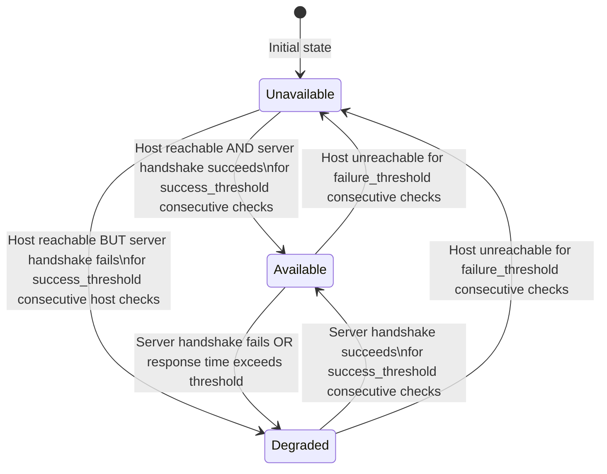

# Server Monitoring Architecture for libindigo

## 1. Overview

This document describes the architecture for adding server monitoring capabilities to the libindigo Client API. The monitoring system provides two-level health checking (host availability + INDIGO server handshake), status smoothing via rolling windows, and event-based status reporting integrated into the existing Client event system.

### Design Principles

- **Pure Rust**: The monitoring implementation lives in `libindigo-rs` with zero C dependencies
- **Optional**: Monitoring is gated behind a feature flag and opt-in via `ClientBuilder`
- **Event-driven**: Status changes are delivered as Client events through existing channel infrastructure
- **Migration-friendly**: Designed so Mission Control CLI can migrate from its own monitoring to libindigo's

### Logging Strategy

> **Important**: The existing codebase uses `tracing` (not `log`) throughout all crates. Rather than introducing a second logging facade, the monitoring module will use `tracing` to stay consistent with the codebase. Mission Control can bridge `tracing` → `log` using the [`tracing-log`](https://docs.rs/tracing-log) crate if needed, or migrate to `tracing` which is a superset of `log`.

The monitoring module follows these log level conventions:

| Level   | Usage                                                              |
|---------|--------------------------------------------------------------------|
| `error` | Application integrity compromised — monitoring task panicked       |
| `warn`  | Graceful recovery — e.g. ICMP unavailable, falling back to TCP    |
| `info`  | Meaningful user information — status transitions                   |
| `debug` | Troubleshooting — individual monitoring events                     |
| `trace` | Detailed logic — every ping request/response, state machine steps |

---

## 2. Module Structure and File Layout

### 2.1 Core SPI Types in `libindigo` (src/)

New types added to the core crate so both `libindigo-rs` and `libindigo-ffi` can use them:

```
src/
├── client/
│   ├── mod.rs              # Add `pub mod monitoring;`
│   ├── builder.rs          # Add `.with_monitoring(MonitoringConfig)` to ClientBuilder
│   ├── strategy.rs         # Existing - no changes needed
│   └── monitoring.rs       # NEW: MonitoringConfig, MonitoringEvent, AvailabilityStatus
└── lib.rs                  # Re-export monitoring types in prelude
```

### 2.2 Implementation in `libindigo-rs` (rs/)

The actual monitoring logic lives here, feature-gated behind `monitoring`:

```
rs/
├── Cargo.toml              # Add monitoring feature + dependencies
├── src/
│   ├── lib.rs              # Add `#[cfg(feature = "monitoring")] pub mod monitoring;`
│   ├── client.rs           # Integrate monitoring lifecycle with connect/disconnect
│   └── monitoring/
│       ├── mod.rs           # Module root, re-exports
│       ├── config.rs        # MonitoringConfig builder (extends core config)
│       ├── heartbeat.rs     # Host-level ICMP/TCP ping implementation
│       ├── server_check.rs  # Server-level TCP handshake check
│       ├── status.rs        # Rolling window + status state machine
│       └── monitor.rs       # MonitoringActor — the orchestrator task
```

### 2.3 FFI Exposure in `libindigo-ffi` (ffi/)

```
ffi/
├── Cargo.toml              # Add monitoring feature passthrough
├── src/
│   ├── lib.rs              # Conditional monitoring module
│   ├── callback.rs         # Add MonitoringEvent variants to FfiEvent
│   └── monitoring_ffi.rs   # NEW: C-compatible monitoring config + callbacks
```

---

## 3. Key Types

### 3.1 Core SPI Types — [`src/client/monitoring.rs`](src/client/monitoring.rs)

These types are defined in the `libindigo` core crate so they can be shared across strategies:

```rust
use std::time::Duration;
use std::net::SocketAddr;

/// Server availability status.
///
/// Represents the three-state availability model used by the monitoring system.
#[derive(Debug, Clone, Copy, PartialEq, Eq, Hash)]
pub enum AvailabilityStatus {
    /// Server is reachable and responding to INDIGO protocol handshake.
    Available,
    /// Host is reachable but INDIGO server is not responding correctly.
    /// This can indicate the server process is starting up, overloaded, or partially failed.
    Degraded,
    /// Host is unreachable or not responding at all.
    Unavailable,
}

/// Events emitted by the monitoring system.
///
/// These are the high-level events exposed through the Client API.
/// Lower-level monitoring details (individual pings) are only logged, not emitted as events.
#[derive(Debug, Clone)]
pub enum MonitoringEvent {
    /// Server status changed to a new availability state.
    StatusChanged {
        /// The server address being monitored.
        server: SocketAddr,
        /// Previous availability status.
        previous: AvailabilityStatus,
        /// New availability status.
        current: AvailabilityStatus,
    },
}

/// Configuration for server monitoring.
///
/// Use the builder methods to customize monitoring behavior.
/// All fields have sensible defaults.
#[derive(Debug, Clone)]
pub struct MonitoringConfig {
    /// Whether monitoring is enabled.
    pub enabled: bool,
    /// Interval between heartbeat pings.
    pub heartbeat_interval: Duration,
    /// Interval between server handshake checks.
    pub server_check_interval: Duration,
    /// Timeout for individual ping/check operations.
    pub check_timeout: Duration,
    /// Number of results to keep in the rolling window.
    pub window_size: usize,
    /// Number of consecutive successes required to transition to Available.
    pub success_threshold: usize,
    /// Number of consecutive failures required to transition to Unavailable.
    pub failure_threshold: usize,
    /// Response time threshold — responses slower than this count as degraded.
    pub response_time_threshold: Duration,
    /// Whether to prefer ICMP ping over TCP connect for host checks.
    /// Automatically disabled for localhost targets.
    pub prefer_icmp: bool,
    /// INDIGO server port for TCP handshake checks (default: 7624).
    pub server_port: u16,
}

impl Default for MonitoringConfig {
    fn default() -> Self {
        Self {
            enabled: true,
            heartbeat_interval: Duration::from_secs(5),
            server_check_interval: Duration::from_secs(10),
            check_timeout: Duration::from_secs(2),
            window_size: 5,
            success_threshold: 5,
            failure_threshold: 5,
            response_time_threshold: Duration::from_secs(1),
            prefer_icmp: true,
            server_port: 7624,
        }
    }
}

impl MonitoringConfig {
    /// Creates a new monitoring configuration with defaults.
    pub fn new() -> Self {
        Self::default()
    }

    /// Sets the heartbeat ping interval.
    pub fn heartbeat_interval(mut self, interval: Duration) -> Self {
        self.heartbeat_interval = interval;
        self
    }

    /// Sets the server check interval.
    pub fn server_check_interval(mut self, interval: Duration) -> Self {
        self.server_check_interval = interval;
        self
    }

    /// Sets the check timeout.
    pub fn check_timeout(mut self, timeout: Duration) -> Self {
        self.check_timeout = timeout;
        self
    }

    /// Sets the rolling window size.
    pub fn window_size(mut self, size: usize) -> Self {
        self.window_size = size;
        self
    }

    /// Sets the response time threshold for degraded status.
    pub fn response_time_threshold(mut self, threshold: Duration) -> Self {
        self.response_time_threshold = threshold;
        self
    }

    /// Disables ICMP and forces TCP-only checks.
    pub fn tcp_only(mut self) -> Self {
        self.prefer_icmp = false;
        self
    }
}
```

### 3.2 Implementation Types — `rs/src/monitoring/`

#### [`heartbeat.rs`](rs/src/monitoring/heartbeat.rs) — Host-Level Checks

```rust
/// Result of a single heartbeat check.
#[derive(Debug, Clone)]
pub struct HeartbeatResult {
    /// When the check was performed.
    pub timestamp: Instant,
    /// Whether the host responded.
    pub success: bool,
    /// Round-trip time (if successful).
    pub rtt: Option<Duration>,
    /// Method used for this check.
    pub method: CheckMethod,
}

/// Method used for host availability checking.
#[derive(Debug, Clone, Copy, PartialEq, Eq)]
pub enum CheckMethod {
    /// ICMP Echo (ping).
    Icmp,
    /// TCP connect to port.
    TcpConnect,
}

/// Host-level heartbeat checker.
///
/// Attempts ICMP ping first, falls back to TCP connect if ICMP is unavailable
/// or if the target is localhost.
pub struct HeartbeatChecker {
    target: IpAddr,
    port: u16,
    timeout: Duration,
    use_icmp: bool,
}
```

#### [`server_check.rs`](rs/src/monitoring/server_check.rs) — Server-Level Checks

```rust
/// Result of a server handshake check.
#[derive(Debug, Clone)]
pub struct ServerCheckResult {
    /// When the check was performed.
    pub timestamp: Instant,
    /// Whether the INDIGO server responded to handshake.
    pub success: bool,
    /// Time to complete handshake (if successful).
    pub handshake_time: Option<Duration>,
}

/// Server-level INDIGO handshake checker.
///
/// Opens a TCP connection and verifies the server responds with
/// a valid INDIGO protocol greeting.
pub struct ServerChecker {
    addr: SocketAddr,
    timeout: Duration,
}
```

#### [`status.rs`](rs/src/monitoring/status.rs) — Status State Machine

```rust
use std::collections::VecDeque;

/// Rolling window of check results for status smoothing.
pub struct StatusWindow {
    heartbeat_results: VecDeque<HeartbeatResult>,
    server_results: VecDeque<ServerCheckResult>,
    window_size: usize,
    success_threshold: usize,
    failure_threshold: usize,
    response_time_threshold: Duration,
    current_status: AvailabilityStatus,
}

impl StatusWindow {
    /// Pushes a new heartbeat result and returns the new status if it changed.
    pub fn push_heartbeat(&mut self, result: HeartbeatResult) -> Option<AvailabilityStatus>;

    /// Pushes a new server check result and returns the new status if it changed.
    pub fn push_server_check(&mut self, result: ServerCheckResult) -> Option<AvailabilityStatus>;

    /// Returns the current computed availability status.
    pub fn current_status(&self) -> AvailabilityStatus;
}
```

#### [`monitor.rs`](rs/src/monitoring/monitor.rs) — Orchestrator

```rust
/// The monitoring actor that runs as a background tokio task.
///
/// Coordinates heartbeat and server checks, manages the status window,
/// and emits MonitoringEvent through a channel when status changes.
pub struct MonitoringActor {
    config: MonitoringConfig,
    heartbeat: HeartbeatChecker,
    server_checker: ServerChecker,
    status_window: StatusWindow,
    event_tx: mpsc::UnboundedSender<MonitoringEvent>,
    shutdown_rx: oneshot::Receiver<()>,
}

/// Handle returned to the client for controlling the monitoring actor.
pub struct MonitoringHandle {
    shutdown_tx: Option<oneshot::Sender<()>>,
    event_rx: mpsc::UnboundedReceiver<MonitoringEvent>,
}
```

---

## 4. Monitoring State Machine

The status state machine uses a two-dimensional input (host reachability × server responsiveness) to derive the three-state output:



### Status Determination Logic

```
if host_check_window has >= failure_threshold consecutive failures:
    status = Unavailable

else if host_check_window has >= success_threshold consecutive successes:
    if server_check_window has >= success_threshold consecutive successes:
        if all recent RTTs < response_time_threshold:
            status = Available
        else:
            status = Degraded  // slow responses
    else:
        status = Degraded  // host up, server not responding properly

else:
    status = previous_status  // insufficient data, maintain current
```

### Localhost Detection

When the target host resolves to a loopback address (`127.0.0.1`, `::1`, or hostname `localhost`), ICMP is automatically disabled regardless of the `prefer_icmp` configuration. This is because:

1. ICMP to localhost always succeeds — it provides no useful signal
2. TCP connect is more meaningful for local server monitoring
3. Avoids unnecessary privilege requirements

---

## 5. Event Flow

### 5.1 Internal Event Flow (within `libindigo-rs`)

```
┌──────────────────────────────────────────────────────────┐
│                    MonitoringActor                        │
│                                                          │
│  ┌─────────────┐     ┌───────────────┐                   │
│  │ Heartbeat   │────>│               │                   │
│  │ Timer       │     │ StatusWindow  │──> status changed? │
│  │ [5s tick]   │     │               │        │          │
│  └─────────────┘     │ - rolling     │        │          │
│                      │   window      │        ▼          │
│  ┌─────────────┐     │ - thresholds  │  MonitoringEvent  │
│  │ Server      │────>│ - state       │        │          │
│  │ Check Timer │     │   machine     │        │          │
│  │ [10s tick]  │     └───────────────┘        │          │
│  └─────────────┘                              │          │
│                                               │          │
└───────────────────────────────────────────────┼──────────┘
                                                │
                                    mpsc::UnboundedSender
                                                │
                                                ▼
┌──────────────────────────────────────────────────────────┐
│                   RsClientStrategy                        │
│                                                          │
│  MonitoringHandle.event_rx ──> broadcast to subscribers   │
│                                                          │
│  Subscribers receive MonitoringEvent::StatusChanged       │
│  with server, previous status, and current status         │
└──────────────────────────────────────────────────────────┘
```

### 5.2 Client API Event Flow

```
                         User Code
                            │
                            ▼
                   ┌─────────────────┐
                   │  ClientBuilder   │
                   │  .with_strategy  │
                   │  .with_monitoring│
                   │  .build          │
                   └────────┬────────┘
                            │
                            ▼
                   ┌─────────────────┐
                   │     Client       │
                   │                  │ connect
                   │  client.connect  │──────────┐
                   │                  │           ▼
                   │                  │  ┌─────────────────┐
                   │                  │  │ MonitoringActor  │
                   │                  │  │ spawned as       │
                   │                  │  │ background task  │
                   │                  │  └────────┬────────┘
                   │                  │           │
                   │  subscribe_      │<──────────┘
                   │  monitoring()    │  MonitoringEvent
                   └────────┬────────┘
                            │
                            ▼
              mpsc::UnboundedReceiver of MonitoringEvent
              (same pattern as subscribe_properties)
```

### 5.3 Logging at Each Level

| Component         | Level   | Example Message                                                |
|-------------------|---------|----------------------------------------------------------------|
| `HeartbeatChecker`| `trace` | `"ICMP ping sent to 192.168.1.50"`                            |
| `HeartbeatChecker`| `trace` | `"ICMP ping response from 192.168.1.50: rtt=12ms"`            |
| `HeartbeatChecker`| `warn`  | `"ICMP unavailable, falling back to TCP connect"`              |
| `HeartbeatChecker`| `debug` | `"Heartbeat check failed for 192.168.1.50: connection refused"`|
| `ServerChecker`   | `trace` | `"TCP handshake attempt to 192.168.1.50:7624"`                |
| `ServerChecker`   | `debug` | `"Server handshake failed: timeout after 2s"`                 |
| `StatusWindow`    | `trace` | `"Window state: 4/5 successes, current=Available"`            |
| `MonitoringActor` | `info`  | `"Server 192.168.1.50:7624 status: Available -> Degraded"`    |
| `MonitoringActor` | `error` | `"Monitoring task panicked for 192.168.1.50:7624"`            |

---

## 6. Configuration Options

### 6.1 ClientBuilder Integration

The [`ClientBuilder`](src/client/builder.rs) gains a new method:

```rust
pub struct ClientBuilder {
    strategy: Option<Box<dyn ClientStrategy>>,
    monitoring_config: Option<MonitoringConfig>,  // NEW
}

impl ClientBuilder {
    /// Enables server monitoring with the given configuration.
    ///
    /// # Example
    ///
    /// ```ignore
    /// let client = ClientBuilder::new()
    ///     .with_strategy(strategy)
    ///     .with_monitoring(MonitoringConfig::new()
    ///         .heartbeat_interval(Duration::from_secs(3))
    ///         .tcp_only())
    ///     .build()?;
    /// ```
    pub fn with_monitoring(mut self, config: MonitoringConfig) -> Self {
        self.monitoring_config = Some(config);
        self
    }
}
```

### 6.2 Client Struct Changes

The [`Client`](src/client/builder.rs:124) struct stores the optional monitoring handle:

```rust
pub struct Client {
    strategy: Box<dyn ClientStrategy>,
    monitoring_handle: Option<MonitoringHandle>,  // NEW
}

impl Client {
    /// Subscribes to monitoring events.
    ///
    /// Returns `None` if monitoring is not enabled.
    pub fn subscribe_monitoring(&self) -> Option<mpsc::UnboundedReceiver<MonitoringEvent>> {
        // Delegate to monitoring handle
    }

    /// Returns the current server availability status.
    ///
    /// Returns `None` if monitoring is not enabled.
    pub fn server_status(&self) -> Option<AvailabilityStatus> {
        // Query the monitoring handle
    }
}
```

### 6.3 Full Configuration Reference

| Parameter                  | Type       | Default | Description                                          |
|----------------------------|------------|---------|------------------------------------------------------|
| `enabled`                  | `bool`     | `true`  | Master enable/disable                                |
| `heartbeat_interval`       | `Duration` | `5s`    | Time between host-level pings                        |
| `server_check_interval`    | `Duration` | `10s`   | Time between server handshake checks                 |
| `check_timeout`            | `Duration` | `2s`    | Timeout for individual check operations              |
| `window_size`              | `usize`    | `5`     | Number of results in rolling window                  |
| `success_threshold`        | `usize`    | `5`     | Consecutive successes to transition to Available      |
| `failure_threshold`        | `usize`    | `5`     | Consecutive failures to transition to Unavailable     |
| `response_time_threshold`  | `Duration` | `1s`    | RTT above this marks response as slow                |
| `prefer_icmp`              | `bool`     | `true`  | Use ICMP when available; auto-disabled for localhost |
| `server_port`              | `u16`      | `7624`  | Port for server handshake checks                     |

---

## 7. Feature Flags

### 7.1 `libindigo-rs` Feature Flags

In [`rs/Cargo.toml`](rs/Cargo.toml):

```toml
[features]
default = ["client"]
client = []
device = []
discovery = ["mdns-sd"]
monitoring = ["surge-ping", "socket2"]  # NEW

[dependencies]
# ... existing dependencies ...

# Optional: Server monitoring (pure Rust ICMP + TCP)
surge-ping = { version = "0.8", optional = true }
socket2 = { version = "0.5", optional = true }
```

### 7.2 Root `libindigo` Feature Passthrough

In [`Cargo.toml`](Cargo.toml):

```toml
[features]
# Note: rs-strategy and ffi-strategy have been removed
# The core crate is now strategy-agnostic
discovery = ["libindigo-rs/discovery"]
monitoring = ["libindigo-rs/monitoring"]  # NEW — passthrough
test-server = []
```

### 7.3 `libindigo-ffi` Feature Passthrough

In [`ffi/Cargo.toml`](ffi/Cargo.toml):

```toml
[features]
default = ["client"]
client = []
device = []
async = ["tokio", "futures"]
monitoring = []  # NEW — enables monitoring event types in FFI
sys-available = []
```

---

## 8. Dependencies to Add

### 8.1 `libindigo-rs` (`rs/Cargo.toml`)

| Crate        | Version | Optional | Purpose                                    |
|--------------|---------|----------|--------------------------------------------|
| `surge-ping` | `0.8`   | Yes      | ICMP Echo (raw socket ping)                |
| `socket2`    | `0.5`   | Yes      | Low-level socket control for TCP fallback  |

> **Note**: `surge-ping` requires raw socket privileges on Linux (`CAP_NET_RAW`) or root access. On macOS, it uses non-privileged ICMP. The TCP fallback ensures monitoring works without elevated privileges.

### 8.2 `libindigo` Core (`Cargo.toml`)

No new dependencies needed — the core crate only defines types and traits.

### 8.3 Existing Dependencies Leveraged

| Crate    | Already In | Usage in Monitoring                              |
|----------|------------|--------------------------------------------------|
| `tokio`  | Yes        | Timers, spawning, channels, TCP connect          |
| `tracing`| Yes        | Structured logging throughout monitoring module  |

---

## 9. Integration Points with Existing Code

### 9.1 [`ClientBuilder`](src/client/builder.rs) Changes

The builder stores the optional `MonitoringConfig` and passes it to the `Client`:

```rust
// src/client/builder.rs — modified

pub struct ClientBuilder {
    strategy: Option<Box<dyn ClientStrategy>>,
    monitoring_config: Option<MonitoringConfig>,
}

impl ClientBuilder {
    pub fn new() -> Self {
        ClientBuilder {
            strategy: None,
            monitoring_config: None,
        }
    }

    pub fn with_monitoring(mut self, config: MonitoringConfig) -> Self {
        self.monitoring_config = Some(config);
        self
    }

    pub fn build(self) -> Result<Client> {
        let strategy = self.strategy
            .ok_or_else(|| IndigoError::InvalidParameter("No strategy configured".to_string()))?;

        Ok(Client {
            strategy,
            monitoring_config: self.monitoring_config,
            monitoring_handle: None,
        })
    }
}
```

### 9.2 [`Client`](src/client/builder.rs:124) Changes

The `Client` struct gains monitoring lifecycle management. Since `Client` doesn't currently have `connect`/`disconnect` methods (these are on the strategy), monitoring is started when the user explicitly calls a new method or is integrated into the strategy's connect flow.

**Recommended approach**: Add `connect_with_monitoring` or have `RsClientStrategy` accept the config:

```rust
// src/client/builder.rs — Client struct

pub struct Client {
    strategy: Box<dyn ClientStrategy>,
    monitoring_config: Option<MonitoringConfig>,
    monitoring_handle: Option<Box<dyn std::any::Any + Send>>,
}
```

### 9.3 [`RsClientStrategy`](rs/src/client.rs) Changes

The strategy's [`connect()`](rs/src/client.rs:823) method is the natural place to start monitoring:

```rust
// rs/src/client.rs — inside connect() method

async fn connect(&mut self, url: &str) -> Result<()> {
    // ... existing connection logic ...

    // Start monitoring if configured
    #[cfg(feature = "monitoring")]
    if let Some(config) = &self.monitoring_config {
        let addr = /* parse from url */;
        let handle = MonitoringActor::spawn(addr, config.clone());
        self.monitoring_handle = Some(handle);
    }

    Ok(())
}
```

### 9.4 [`ClientState`](rs/src/client.rs:72) Changes

Add monitoring state to the existing `ClientState`:

```rust
struct ClientState {
    // ... existing fields ...

    /// Monitoring handle (when monitoring feature is enabled).
    #[cfg(feature = "monitoring")]
    monitoring_handle: Option<MonitoringHandle>,

    /// Monitoring event subscribers.
    #[cfg(feature = "monitoring")]
    monitoring_subscribers: Vec<mpsc::UnboundedSender<MonitoringEvent>>,
}
```

### 9.5 [`src/client/mod.rs`](src/client/mod.rs) Changes

Add the monitoring module:

```rust
pub mod builder;
pub mod strategy;
pub mod monitoring;  // NEW

pub use builder::{Client, ClientBuilder};
pub use strategy::ClientStrategy;
pub use monitoring::{AvailabilityStatus, MonitoringConfig, MonitoringEvent};  // NEW
```

### 9.6 [`rs/src/lib.rs`](rs/src/lib.rs) Changes

Add conditional monitoring module export:

```rust
// Optional monitoring module (pure Rust ICMP/TCP)
#[cfg(feature = "monitoring")]
pub mod monitoring;

// Re-export monitoring types when feature is enabled
#[cfg(feature = "monitoring")]
pub use monitoring::MonitoringActor;
```

### 9.7 FFI Integration — [`ffi/src/callback.rs`](ffi/src/callback.rs)

Extend [`FfiEvent`](ffi/src/callback.rs:34) with monitoring variants:

```rust
#[derive(Debug, Clone)]
pub enum FfiEvent {
    // ... existing variants ...

    /// Server monitoring status changed.
    #[cfg(feature = "monitoring")]
    ServerStatusChanged {
        /// Server address string.
        server: String,
        /// Previous status (0=Available, 1=Degraded, 2=Unavailable).
        previous_status: u8,
        /// New status (0=Available, 1=Degraded, 2=Unavailable).
        current_status: u8,
    },
}
```

### 9.8 FFI Callback API — [`ffi/src/monitoring_ffi.rs`](ffi/src/monitoring_ffi.rs)

New file for C-compatible monitoring interface:

```rust
/// C-compatible monitoring configuration.
#[repr(C)]
pub struct CMonitoringConfig {
    pub enabled: bool,
    pub heartbeat_interval_ms: u64,
    pub server_check_interval_ms: u64,
    pub check_timeout_ms: u64,
    pub window_size: u32,
    pub success_threshold: u32,
    pub failure_threshold: u32,
    pub response_time_threshold_ms: u64,
    pub prefer_icmp: bool,
    pub server_port: u16,
}

/// C-compatible availability status.
#[repr(C)]
pub enum CAvailabilityStatus {
    Available = 0,
    Degraded = 1,
    Unavailable = 2,
}

/// Callback type for monitoring status changes.
pub type MonitoringStatusCallback = extern "C" fn(
    server: *const std::os::raw::c_char,
    previous: CAvailabilityStatus,
    current: CAvailabilityStatus,
    user_data: *mut std::os::raw::c_void,
);
```

---

## 10. Migration Path for Mission Control

### 10.1 Current Mission Control Architecture

Mission Control CLI currently implements its own monitoring with:

- `surge-ping` for ICMP
- TCP connect fallback
- `AvailabilityStatus` enum (`Available`, `Degraded`, `Unavailable`)
- Rolling window of last 5 results
- Status thresholds (5 consecutive successes/failures)
- `mpsc` channel events (`HeartbeatAvailable`, etc.)

### 10.2 Migration Steps

#### Phase 1: Feature Parity

Ensure libindigo monitoring covers all Mission Control functionality:

- [x] ICMP ping via `surge-ping` *(same crate)*
- [x] TCP connect fallback
- [x] `AvailabilityStatus` enum with same variants
- [x] Rolling window (configurable, default 5)
- [x] Same threshold defaults (5 consecutive)
- [x] 1s response time threshold
- [x] Event channel delivery

#### Phase 2: Dependency Migration

In Mission Control's `Cargo.toml`:

```toml
# Before
[dependencies]
surge-ping = "0.8"
# ... custom monitoring code ...

# After
[dependencies]
libindigo-rs = { version = "0.4", features = ["monitoring"] }
# Remove surge-ping — it's now a transitive dependency
```

#### Phase 3: Code Migration

```rust
// Before (Mission Control's own monitoring)
let monitor = HostMonitor::new(host, port);
let mut events = monitor.subscribe();
while let Some(event) = events.recv().await {
    match event {
        MonitorEvent::HeartbeatAvailable { rtt } => { /* ... */ }
        MonitorEvent::StatusChanged { status } => { /* ... */ }
    }
}

// After (using libindigo monitoring)
let client = ClientBuilder::new()
    .with_strategy(Box::new(RsClientStrategy::new()))
    .with_monitoring(MonitoringConfig::new()
        .heartbeat_interval(Duration::from_secs(5))
        .window_size(5))
    .build()?;

client.strategy_mut().connect("host:7624").await?;

// Subscribe to monitoring events (same pattern as property subscription)
if let Some(mut rx) = client.subscribe_monitoring() {
    while let Some(event) = rx.recv().await {
        match event {
            MonitoringEvent::StatusChanged { server, previous, current } => {
                // Map to Mission Control's internal status model
            }
        }
    }
}
```

#### Phase 4: Event Mapping

Mission Control event → libindigo event mapping:

| Mission Control Event      | libindigo MonitoringEvent                                     |
|---------------------------|--------------------------------------------------------------|
| `HeartbeatAvailable`      | *(logged at TRACE, not emitted as event)*                    |
| `HeartbeatDegraded`       | *(logged at DEBUG, not emitted as event)*                    |
| `HeartbeatUnavailable`    | *(logged at DEBUG, not emitted as event)*                    |
| `StatusChanged(Available)`| `StatusChanged { current: Available, .. }`                   |
| `StatusChanged(Degraded)` | `StatusChanged { current: Degraded, .. }`                    |
| `StatusChanged(Unavailable)`| `StatusChanged { current: Unavailable, .. }`               |

> **Key difference**: libindigo only emits high-level `StatusChanged` events. Individual heartbeat results are logged but not emitted as events, keeping the API surface clean. If Mission Control needs lower-level events, it can enable `TRACE` logging and use a custom `tracing` subscriber.

---

## 11. Documentation Plan

### 11.1 Files to Create/Update

| File                                | Content                                       |
|-------------------------------------|-----------------------------------------------|
| `docs/monitoring.md`               | User guide for monitoring configuration        |
| `docs/logging.md`                  | Logging configuration guide                    |
| `rs/examples/monitoring.rs`        | Basic monitoring example                       |
| `rs/examples/monitoring_custom.rs` | Custom configuration example                   |
| `src/client/monitoring.rs`         | Inline rustdoc on all public types             |
| `rs/src/monitoring/mod.rs`         | Module-level documentation                     |

### 11.2 Example: Basic Monitoring

```rust
//! rs/examples/monitoring.rs
use libindigo_rs::{ClientBuilder, RsClientStrategy, MonitoringConfig};
use std::time::Duration;

#[tokio::main]
async fn main() -> Result<(), Box<dyn std::error::Error>> {
    // Initialize tracing subscriber for log output
    tracing_subscriber::fmt()
        .with_env_filter("libindigo_rs::monitoring=debug")
        .init();

    let mut strategy = RsClientStrategy::new();

    let client = ClientBuilder::new()
        .with_strategy(Box::new(strategy))
        .with_monitoring(MonitoringConfig::new()
            .heartbeat_interval(Duration::from_secs(3)))
        .build()?;

    // Connect starts monitoring automatically
    client.strategy_mut().connect("192.168.1.50:7624").await?;

    // Subscribe to status changes
    if let Some(mut rx) = client.subscribe_monitoring() {
        while let Some(event) = rx.recv().await {
            println!("Status changed: {:?}", event);
        }
    }

    Ok(())
}
```

---

## 12. Implementation Order

The recommended implementation sequence, respecting dependency order:

1. **Core types** — [`src/client/monitoring.rs`](src/client/monitoring.rs): `AvailabilityStatus`, `MonitoringConfig`, `MonitoringEvent`
2. **Status window** — [`rs/src/monitoring/status.rs`](rs/src/monitoring/status.rs): Rolling window and state machine (unit-testable, no I/O)
3. **Heartbeat checker** — [`rs/src/monitoring/heartbeat.rs`](rs/src/monitoring/heartbeat.rs): ICMP + TCP host checks
4. **Server checker** — [`rs/src/monitoring/server_check.rs`](rs/src/monitoring/server_check.rs): TCP handshake verification
5. **Monitoring actor** — [`rs/src/monitoring/monitor.rs`](rs/src/monitoring/monitor.rs): Orchestrator that ties it all together
6. **Client integration** — Modify [`ClientBuilder`](src/client/builder.rs) and [`RsClientStrategy`](rs/src/client.rs) to wire up monitoring
7. **FFI exposure** — [`ffi/src/monitoring_ffi.rs`](ffi/src/monitoring_ffi.rs): C-compatible types and callbacks
8. **Documentation and examples** — User guides, examples, rustdoc
9. **Mission Control migration** — Update Mission Control to use libindigo monitoring

---

## 13. Testing Strategy

| Test Type        | Location                        | What It Tests                                    |
|------------------|---------------------------------|--------------------------------------------------|
| Unit             | `rs/src/monitoring/status.rs`   | Status window logic, state transitions           |
| Unit             | `rs/src/monitoring/heartbeat.rs`| Localhost detection, method selection             |
| Integration      | `tests/monitoring_tests.rs`     | Full monitoring lifecycle with mock server        |
| Integration      | `tests/monitoring_tests.rs`     | Feature flag gating (monitoring off = no compile) |

### Key Test Scenarios

- Status transitions through all paths of the state machine
- Rolling window fills up and evicts old results correctly
- Localhost detection disables ICMP automatically
- ICMP failure triggers TCP fallback with `warn` log
- Monitoring starts on connect, stops on disconnect
- Multiple subscribers receive the same events
- Configuration builder produces correct defaults and overrides
